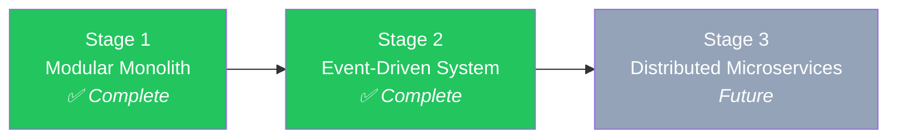

# Chapter 1: Vision & Foundations

[← Table of Contents](./00_TABLE_OF_CONTENTS.md) | [Chapter 2 →](./02_SPRING_BOOT_FUNDAMENTALS.md)

---

## 1.1 What Is MarketCanvas?

**MarketCanvas** is an AI-powered Financial Intelligence Platform. It is a research and monitoring assistant for investors.

The platform answers one single question:

> *"What should I pay attention to right now — and why?"*

That question IS the product.

### 1.1.1 What The Platform IS

MarketCanvas helps investors:
- **Understand markets** — by surfacing context behind price movements
- **Validate their thinking** — by tracking investment theses against real evidence
- **Discover blind spots** — by highlighting information they would otherwise miss

### 1.1.2 What The Platform Is NOT

| ❌ Not This | Why Not |
|------------|---------|
| A brokerage / trading platform | No order execution. Legal and product clarity. |
| A robo-advisor | No automated portfolio management. |
| A financial advisor | No personalized investment recommendations. |
| A prediction engine | No claims of market forecasting. |
| A high-frequency trading system | No sub-second latency requirements. |

These are not just legal precautions — they are **product focus**. The platform serves the underserved layer: **understanding and context**.

### 1.1.3 Real-World Analogy

Imagine you're an investor reading the financial news every morning. You follow 15 stocks, 3 ETFs, and gold. Every day you check:
- Did any CEO sell shares?
- Were any earnings reports released overnight?
- Did any analyst change their target price?
- Is there a macro event affecting my portfolio?

This takes 2-3 hours. MarketCanvas automates this into a 5-minute "Morning Brief" personalized to YOUR portfolio.

---

## 1.2 Target Users

| # | Persona | Description | Willingness to Pay |
|---|---------|-------------|-------------------|
| 1 | Beginner Retail Investor | Overwhelmed by financial news, no signal filter | $5–$15/mo |
| 2 | **Active Investor** ⭐ | Daily monitoring, thesis-driven, 2-3hr/day research | $20–$50/mo |
| 3 | Long-Term Investor | Thesis-driven, quarterly rebalancing | $10–$25/mo |
| 4 | Financial Content Creator | YouTube/Substack analysts needing data | $30–$80/mo |
| 5 | Small RIAs (Financial Advisors) | Managing client portfolios | $100–$300/mo |
| 6 | Investment Clubs | Collaborative research groups | Team pricing |

**Primary MVP persona: The Active Investor (#2)** — highest willingness to pay, daily engagement, clearly defined pain points.

### 1.2.1 Pricing Model

| Tier | Price | Target |
|------|-------|--------|
| Free — "Discover" | $0/mo | Beginners, students, habit formation |
| Pro — "Analyse" | $25/mo ($200/yr) | Active investors, content creators |
| Team — "Collaborate" | $80/mo per seat | Small RIAs, investment clubs |

---

## 1.3 Major Modules (Bounded Contexts)

The system is divided into business capabilities, not technical layers:

| Module | Responsibility | Current Status |
|--------|---------------|----------------|
| `user` | Identity, authentication, subscription, preferences | Placeholder (empty) |
| `watchlist` | Asset monitoring, alert configuration, watchlist CRUD | ✅ Implemented |
| `marketdata` | Ingestion, normalization, distribution of market data | ✅ Consumer implemented |
| `sharedkernel` | Cross-cutting value objects, events, infrastructure | ✅ Implemented |
| `research` | AI research workspace, RAG pipeline | 🔮 Planned |
| `thesis` | Investment thesis lifecycle, scoring | 🔮 Planned |
| `portfolio` | Portfolio analysis, risk calculations | 🔮 Planned |
| `notification` | Multi-channel alert delivery | 🔮 Planned |

---

## 1.4 The Technology Stack — From First Principles

### 1.4.1 Java 21 (LTS)

#### What Is Java?

Java is a **general-purpose, object-oriented programming language** created by James Gosling at Sun Microsystems in 1995. Its key innovation was "Write Once, Run Anywhere" — Java programs compile to **bytecode** that runs on any platform with a Java Virtual Machine (JVM).

#### Why Java 21?

Java 21 is a **Long-Term Support (LTS)** release, meaning it receives security patches and bug fixes for years. Key features used in this project:

| Feature | Java Version | Usage in MarketCanvas |
|---------|-------------|----------------------|
| **Records** | Java 16+ | `UserId`, `AssetId`, `WatchlistItemAddedEvent`, DTOs |
| **Pattern Matching** | Java 17+ | Available for future use |
| **Virtual Threads** | Java 21 | Available for future high-throughput scenarios |
| **Sealed Classes** | Java 17+ | Available for domain modeling |

#### What Are Records?

Before records, creating a simple data class required ~40 lines of boilerplate:

```java
// OLD WAY — Before Java 16
public class UserId {
    private final UUID value;
    
    public UserId(UUID value) { this.value = value; }
    public UUID getValue() { return value; }
    
    @Override
    public boolean equals(Object o) { /* 10 lines */ }
    @Override
    public int hashCode() { /* 5 lines */ }
    @Override
    public String toString() { /* 3 lines */ }
}
```

Records replace this with a single line:

```java
// NEW WAY — Java 16+
public record UserId(UUID value) { }
```

The compiler automatically generates: constructor, getters (`value()` not `getValue()`), `equals()`, `hashCode()`, and `toString()`. Records are **immutable** — once created, their values cannot change. This is critical for Value Objects in DDD.

---

### 1.4.2 Maven — The Build System

#### What Is a Build System?

A build system automates the process of:
1. **Downloading dependencies** (libraries your code needs)
2. **Compiling source code** (`.java` → `.class` bytecode)
3. **Running tests**
4. **Packaging** the application (creating a `.jar` file)

Without a build system, you would manually download every library, place JARs on the classpath, compile with `javac`, and package with `jar`. This is error-prone and unscalable.

#### What Is Maven?

**Apache Maven** is the most widely used build system in the Java ecosystem. Created in 2004, it uses a declarative XML file called `pom.xml` (Project Object Model) to describe the project.

#### The pom.xml — Line by Line

```xml
<!-- Line 1-3: XML declaration and Maven project schema -->
<?xml version="1.0" encoding="UTF-8"?>
<project xmlns="http://maven.apache.org/POM/4.0.0" ...>
    <modelVersion>4.0.0</modelVersion>
```
These three lines are boilerplate. Every Maven project starts with them. `modelVersion 4.0.0` is the only version that exists — it's always `4.0.0`.

```xml
    <!-- Lines 5-10: Parent POM — This is the magic -->
    <parent>
        <groupId>org.springframework.boot</groupId>
        <artifactId>spring-boot-starter-parent</artifactId>
        <version>4.1.0</version>
        <relativePath/>
    </parent>
```

> [!IMPORTANT]
> **This is the most important block in the entire file.** By declaring `spring-boot-starter-parent` as the parent, this project inherits: default dependency versions for 300+ libraries, compiler settings, plugin configurations, and resource filtering. When you see a dependency without a `<version>` tag, Maven looks up the version from this parent.

```xml
    <!-- Lines 11-15: Project coordinates -->
    <groupId>org.workshop</groupId>        <!-- Organization identifier -->
    <artifactId>MarketCanvas</artifactId>  <!-- Project name -->
    <version>0.0.1-SNAPSHOT</version>      <!-- Current version -->
```

`SNAPSHOT` means this is a development version. When released, it would become `1.0.0`.

```xml
    <!-- Lines 29-32: Properties -->
    <properties>
        <java.version>21</java.version>
        <spring-modulith.version>2.1.0</spring-modulith.version>
    </properties>
```

Properties are variables. `<java.version>21</java.version>` tells the compiler plugin to compile for Java 21.

#### Dependencies Explained

Every `<dependency>` block adds a library to the project. Here is every dependency in MarketCanvas and why it exists:

| Dependency | Purpose | Why Needed |
|-----------|---------|------------|
| `spring-boot-starter-data-jpa` | ORM + database access | Provides Hibernate, JPA, Spring Data repositories |
| `spring-boot-starter-security` | Authentication/authorization | Provides the Security Filter Chain |
| `spring-boot-starter-webmvc` | REST API framework | Provides `@RestController`, `DispatcherServlet` |
| `spring-boot-starter-websocket` | WebSocket support | Future real-time price streaming |
| `spring-modulith-starter-core` | Module boundary support | Enforces bounded context isolation |
| `spring-modulith-starter-jpa` | JPA + Modulith integration | Event externalization support |
| `spring-boot-starter-kafka` | Kafka messaging | `KafkaTemplate`, `@KafkaListener` auto-configuration |
| `postgresql` | PostgreSQL JDBC driver | Allows Java to communicate with PostgreSQL |
| `lombok` | Boilerplate reduction | `@Slf4j`, `@Getter`, `@RequiredArgsConstructor` |
| `archunit-junit5` | Architecture testing | Enforces module boundary rules at test time |

> [!NOTE]
> **"Starters" vs raw libraries:** A Spring Boot "starter" is a meta-dependency that pulls in (a) the library itself, (b) auto-configuration classes that read your `application.yml` and create beans automatically. If you use raw `spring-kafka` instead of `spring-boot-starter-kafka`, no `KafkaTemplate` bean will be created — even though the classes are on the classpath. This was a real bug encountered in this project (Session 4).

---

### 1.4.3 Spring Boot 4.1.0

#### What Is Spring?

**Spring Framework** (2003, Rod Johnson) is a Java application framework that solves one fundamental problem: **managing object creation and wiring**.

In a large application, you might have hundreds of objects that depend on each other. Manually creating and connecting them leads to tightly coupled, untestable code. Spring's **Inversion of Control (IoC) container** takes over this responsibility.

#### What Is Spring Boot?

**Spring Boot** (2014, Phil Webb) is a layer on top of Spring Framework that provides:
1. **Auto-configuration** — automatically configures components based on what's on the classpath
2. **Embedded server** — packages the web server inside the application JAR
3. **Opinionated defaults** — sensible settings that work out of the box

Without Spring Boot, configuring a Spring application required dozens of XML files. Spring Boot reduced it to a single `application.yml`.

#### Why Spring Boot 4.1.0?

Spring Boot 4.x is the latest major version. Key changes from 3.x:

| Change | Impact on MarketCanvas |
|--------|----------------------|
| Jackson 3.x integration | `ObjectMapper` moved to `tools.jackson.databind` namespace |
| Java 21+ required | Enables records, virtual threads, pattern matching |
| Improved test starters | Separate test starters for each module |

*(Spring Boot internals are covered in depth in Chapter 2)*

---

### 1.4.4 PostgreSQL 16

#### What Is a Database?

A **database** is a system for storing, retrieving, and managing data. Without a database, data would be lost when the application restarts.

#### Relational vs Non-Relational

| Type | Examples | Data Model | Best For |
|------|----------|-----------|----------|
| Relational (SQL) | PostgreSQL, MySQL | Tables with rows and columns | Structured data, transactions, relationships |
| Document (NoSQL) | MongoDB | JSON documents | Flexible schemas, rapid prototyping |
| Key-Value | Redis | Simple key→value pairs | Caching, sessions |

#### Why PostgreSQL Over MySQL?

This was a deliberate decision (ADR-002):

| Criterion | PostgreSQL | MySQL |
|-----------|-----------|-------|
| `pgvector` extension | ✅ Yes | ❌ No |
| `TimescaleDB` extension | ✅ Yes | ❌ No |
| ACID transactions | ✅ Full | ✅ Full |
| JSON support | ✅ Native JSONB | ⚠️ Limited |

**The deciding factor:** MarketCanvas plans to build an AI Research Workspace using RAG (Retrieval-Augmented Generation). RAG requires storing vector embeddings and performing similarity searches. The `pgvector` extension adds this capability to PostgreSQL. Starting with MySQL would require a full database migration later.

*(PostgreSQL internals are covered in Chapter 7)*

---

### 1.4.5 Apache Kafka

#### What Is Messaging?

When two software components need to communicate, they have two options:

1. **Synchronous** — Component A calls Component B directly and waits for a response (like a phone call)
2. **Asynchronous** — Component A places a message on a shared channel. Component B reads it later (like email)

Asynchronous messaging **decouples** the sender from the receiver. If Component B is temporarily down, the message waits on the channel until B recovers.

#### What Is Kafka?

**Apache Kafka** (2011, LinkedIn) is a **distributed event streaming platform**. It was invented to solve LinkedIn's problem of processing billions of real-time events per day across hundreds of services.

Unlike traditional message queues (RabbitMQ, ActiveMQ), Kafka is designed as a **distributed commit log** — a durable, ordered, append-only sequence of records.

#### Kafka vs Traditional Message Queues

| Feature | Kafka | RabbitMQ |
|---------|-------|----------|
| Storage model | Durable log (persisted to disk) | Queue (message deleted after consumption) |
| Replay | ✅ Consumers can rewind and reread | ❌ Message gone after acknowledgement |
| Throughput | Millions of messages/second | Thousands of messages/second |
| Ordering | ✅ Within a partition | ⚠️ Not guaranteed across queues |
| Consumer groups | ✅ Built-in | ⚠️ Manual configuration |

#### Why Kafka For This Project?

1. **Durability** — Financial events must never be lost. Kafka persists messages to disk.
2. **Replay** — If a consumer has a bug, we can fix it and replay all events from the beginning.
3. **Audit trail** — Every event that ever happened is preserved in the Kafka log.
4. **Decoupling** — The `watchlist` module doesn't need to know that `marketdata` exists.

#### KRaft Mode

Traditionally, Kafka required a separate system called **Apache Zookeeper** to manage cluster metadata (which brokers are alive, which partitions are where). Starting with Kafka 3.3, KRaft mode replaces Zookeeper with Kafka's own built-in consensus protocol. This simplifies deployment from 2 containers to 1.

MarketCanvas uses KRaft mode (ADR-004).

*(Kafka internals, topics, partitions, consumers, and the complete event flow are covered in Chapter 6)*

---

### 1.4.6 Spring Modulith 2.1.0

#### What Is Spring Modulith?

**Spring Modulith** is a framework for structuring Spring Boot applications as **modular monoliths**. It provides:

1. **Module detection** — automatically discovers bounded contexts based on package structure
2. **Boundary enforcement** — verifies that modules don't violate dependency rules
3. **Event externalization** — can automatically publish Spring `ApplicationEvent`s to Kafka (planned for future use)

#### Why Spring Modulith?

In a traditional Spring Boot application, any class can import any other class. There's nothing preventing a controller in the `user` package from directly calling a repository in the `watchlist` package. This creates invisible coupling that makes the codebase impossible to decompose later.

Spring Modulith treats each top-level package under the main application package as a **module** and can enforce that modules only communicate through defined APIs.

---

### 1.4.7 Lombok

#### What Is Lombok?

**Project Lombok** is a Java library that uses **annotation processing** to generate boilerplate code at compile time. Instead of writing getters, setters, constructors, and loggers by hand, you add an annotation and Lombok generates the Java code during compilation.

#### Lombok Annotations Used in MarketCanvas

| Annotation | What It Generates | Used In |
|-----------|------------------|---------|
| `@Getter` | `getXxx()` for every field | `Watchlist`, `OutboxEvent`, `ProcessedEvent` |
| `@Setter` | `setXxx()` for every field | `OutboxEvent` (needed to mark `processed = true`) |
| `@RequiredArgsConstructor` | Constructor with all `final` fields | `WatchlistService`, `WatchlistController`, `OutboxRelay`, `WatchlistOutboxListener`, `WatchlistEventConsumer` |
| `@AllArgsConstructor` | Constructor with ALL fields | `Watchlist`, `OutboxEvent`, `ProcessedEvent` |
| `@NoArgsConstructor(access = AccessLevel.PROTECTED)` | Protected no-arg constructor | `OutboxEvent`, `ProcessedEvent` (JPA requires it) |
| `@Slf4j` | `private static final Logger log = ...` | `WatchlistEventConsumer` |

> [!NOTE]
> Lombok works at **compile time**, not runtime. The `pom.xml` configures the `maven-compiler-plugin` with `annotationProcessorPaths` pointing to Lombok, ensuring it runs during compilation.

---

### 1.4.8 Jackson 3.x (JSON Serialization)

#### What Is JSON?

**JSON (JavaScript Object Notation)** is a text format for representing structured data:

```json
{
  "watchlistId": "a1b2c3d4-...",
  "assetId": "e5f6g7h8-...",
  "timestamp": "2026-07-14T10:30:00Z"
}
```

#### What Is Jackson?

**Jackson** is the most popular Java library for converting Java objects to JSON (serialization) and JSON back to Java objects (deserialization).

#### The Jackson 3.x Namespace Change

> [!WARNING]
> Spring Boot 4.x uses **Jackson 3.x**, which moved its package namespace from `com.fasterxml.jackson.databind` to `tools.jackson.databind`. This means:
> ```java
> // OLD (Spring Boot 3.x / Jackson 2.x)
> import com.fasterxml.jackson.databind.ObjectMapper;
> 
> // NEW (Spring Boot 4.x / Jackson 3.x)
> import tools.jackson.databind.ObjectMapper;
> ```
> Additionally, `writeValueAsString()` now throws a **checked exception** instead of an unchecked one. Every call must be wrapped in try/catch.

---

### 1.4.9 Docker & Docker Compose

#### What Is Docker?

**Docker** (2013, Solomon Hykes) is a platform for running applications inside **containers** — lightweight, isolated environments that package an application with all its dependencies.

**Real-world analogy:** Think of a shipping container. Before containers, loading cargo onto a ship was chaotic — barrels, crates, and sacks of different sizes. Containers standardized this: everything goes inside a standard-sized box. Docker does the same for software.

#### What Is Docker Compose?

**Docker Compose** allows you to define and run **multiple containers** with a single YAML file. For MarketCanvas, this means starting PostgreSQL and Kafka with one command:

```bash
docker compose up -d
```

The `docker-compose.yml` defines two services (covered in detail in Chapter 10).

---

## 1.5 Architecture Evolution Strategy

The project evolves through three deliberate stages:



| Stage | Name | When to Advance | Status |
|-------|------|----------------|--------|
| 1 | Modular Monolith | Until >10K users or clear bottleneck | ✅ Complete |
| 2 | Event-Driven System | When modules need async communication | ✅ Complete |
| 3 | Distributed Microservices | When independent scaling/deployment needed | 🔮 Future |

> [!IMPORTANT]
> **Never skip a stage.** Each stage reduces risk by validating assumptions before adding complexity. Starting with microservices on day one has a 60-70% failure rate for startups.

---

## 1.6 Summary

| Aspect | Choice | Rationale |
|--------|--------|-----------|
| Language | Java 21 | LTS, records, virtual threads |
| Framework | Spring Boot 4.1 | Industry standard, massive ecosystem |
| Database | PostgreSQL 16 | pgvector for AI, TimescaleDB for time-series |
| Messaging | Apache Kafka (KRaft) | Durable log, replay, decoupling |
| Modules | Spring Modulith | Bounded context enforcement |
| Build | Maven | Dependency management, reproducible builds |
| Containers | Docker Compose | Local development orchestration |

---

[← Table of Contents](./00_TABLE_OF_CONTENTS.md) | [Chapter 2: Spring Boot From First Principles →](./02_SPRING_BOOT_FUNDAMENTALS.md)
