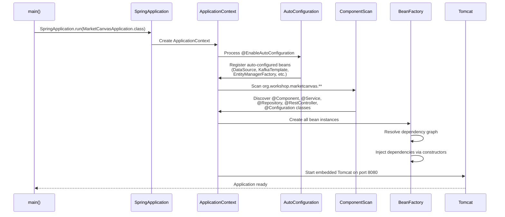
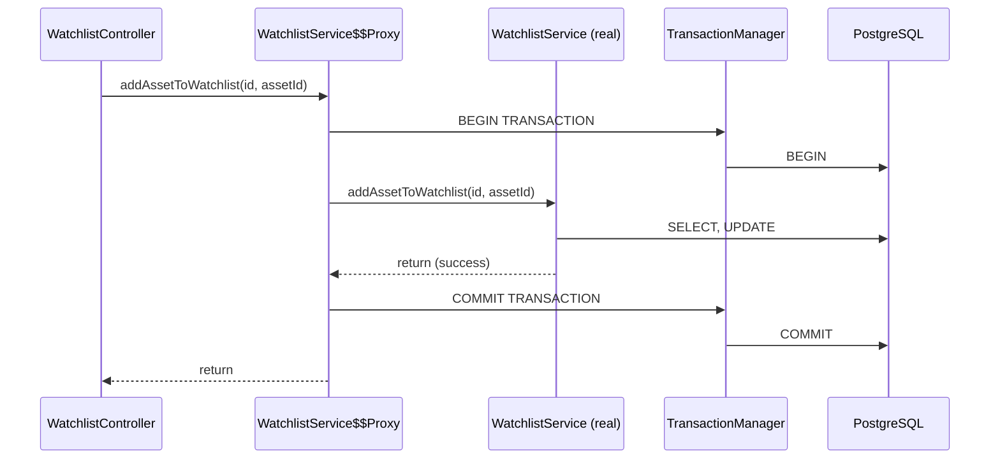
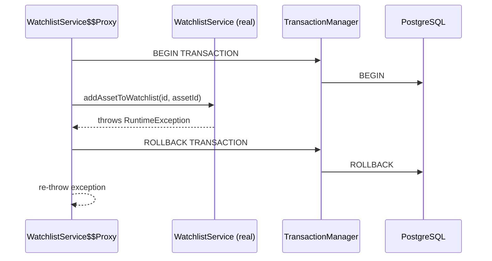
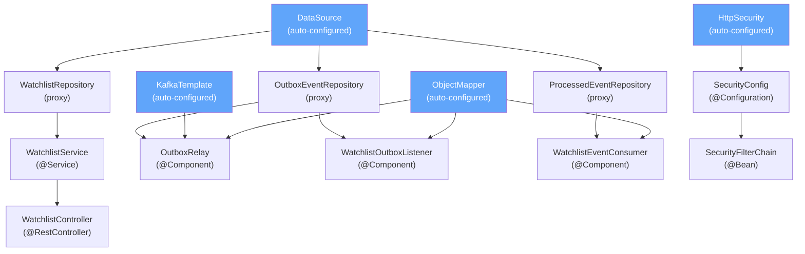

# Chapter 2: Spring Boot From First Principles

[← Chapter 1](./01_VISION_AND_FOUNDATIONS.md) | [Chapter 3 →](./03_DOMAIN_DRIVEN_DESIGN.md)

---

## 2.1 The Problem Spring Solves

Consider a simple application:

```java
// WITHOUT Spring — manual wiring
public class Main {
    public static void main(String[] args) {
        // You must create every object manually
        DataSource dataSource = new PostgresDataSource("localhost", 5433, "postgres");
        WatchlistRepository repo = new WatchlistRepositoryImpl(dataSource);
        KafkaTemplate kafka = new KafkaTemplate(new KafkaConfig("localhost:9092"));
        OutboxRelay relay = new OutboxRelay(repo, kafka);
        WatchlistService service = new WatchlistService(repo);
        WatchlistController controller = new WatchlistController(service);
        HttpServer server = new HttpServer(8080);
        server.register("/api/v1/watchlists", controller);
        server.start();
    }
}
```

Problems:
1. **Tight coupling** — `Main` knows about every class and how to create it
2. **No lifecycle management** — who closes the `DataSource`? Who stops the `HttpServer`?
3. **No flexibility** — switching from PostgreSQL to MySQL requires changing `Main`
4. **Testing nightmare** — you can't substitute mock objects easily

Spring solves ALL of these problems.

---

## 2.2 Inversion of Control (IoC)

### What Is IoC?

**Inversion of Control** reverses who is responsible for creating objects.

| Approach | Who Creates Objects? |
|----------|---------------------|
| Traditional | Your code creates its own dependencies (`new WatchlistRepository(...)`) |
| IoC | A **container** creates objects and gives them to your code |

**Real-world analogy:** Traditional = you build your own furniture from raw wood. IoC = you order furniture from IKEA, and a delivery truck (the container) brings pre-assembled pieces to your door.

### The IoC Container

Spring's IoC container is called the **ApplicationContext**. It is a sophisticated factory that:
1. Scans your code for classes marked with annotations
2. Creates instances (called **beans**) of those classes
3. Wires beans together by injecting dependencies
4. Manages the lifecycle of every bean (creation → use → destruction)

---

## 2.3 Dependency Injection (DI)

### What Is DI?

**Dependency Injection** is the mechanism by which the IoC container provides objects their dependencies. Instead of a class creating what it needs, the container **injects** it.

### Three Types of DI

```java
// 1. CONSTRUCTOR INJECTION (✅ Preferred — used in MarketCanvas)
@RequiredArgsConstructor  // Lombok generates the constructor
public class WatchlistService {
    private final WatchlistRepository watchlistRepository; // Injected by Spring
}

// 2. FIELD INJECTION (⚠️ Discouraged)
public class WatchlistService {
    @Autowired
    private WatchlistRepository watchlistRepository; // Injected via reflection
}

// 3. SETTER INJECTION (Rarely used)
public class WatchlistService {
    private WatchlistRepository watchlistRepository;
    
    @Autowired
    public void setRepository(WatchlistRepository repo) {
        this.watchlistRepository = repo;
    }
}
```

### Why Constructor Injection?

MarketCanvas uses constructor injection everywhere (via Lombok's `@RequiredArgsConstructor`):

| Reason | Explanation |
|--------|-------------|
| **Immutability** | Fields are `final` — cannot be reassigned after construction |
| **Fail-fast** | If a dependency is missing, the app fails at startup, not at runtime |
| **Testability** | You can pass mocks directly via the constructor without Spring |
| **No reflection** | Constructor injection doesn't use `java.lang.reflect` — it's a normal constructor call |

### How @RequiredArgsConstructor Works

When Lombok sees:

```java
@RequiredArgsConstructor
public class WatchlistService {
    private final WatchlistRepository watchlistRepository;
}
```

It generates at compile time:

```java
public class WatchlistService {
    private final WatchlistRepository watchlistRepository;
    
    public WatchlistService(WatchlistRepository watchlistRepository) {
        this.watchlistRepository = watchlistRepository;
    }
}
```

Spring sees this constructor, finds a `WatchlistRepository` bean in the container, and passes it in. No `@Autowired` needed — since Spring 4.3, if a class has exactly one constructor, Spring uses it automatically.

---

## 2.4 Beans and Stereotypes

### What Is a Bean?

A **bean** is any object that Spring creates and manages. You tell Spring to create a bean by marking a class with a **stereotype annotation**:

| Annotation | Meaning | Used In MarketCanvas |
|-----------|---------|---------------------|
| `@Component` | Generic Spring-managed bean | `OutboxRelay`, `WatchlistOutboxListener`, `WatchlistEventConsumer` |
| `@Service` | Business logic bean (semantic alias for `@Component`) | `WatchlistService` |
| `@Repository` | Data access bean (adds exception translation) | `WatchlistRepository`, `OutboxEventRepository`, `ProcessedEventRepository` |
| `@RestController` | REST API endpoint (combines `@Controller` + `@ResponseBody`) | `WatchlistController` |
| `@Configuration` | Declares bean factory methods | `SecurityConfig` |

All of these annotations ultimately mean the same thing: "Spring, please create an instance of this class and manage it." The different names exist for **semantic clarity** — when you see `@Service`, you know it contains business logic.

### How Spring Discovers Beans: Component Scanning

When the application starts, Spring performs a **component scan** — it recursively searches all packages under the main application class for any class with a stereotype annotation.

```java
@SpringBootApplication  // ← Triggers component scan from this package
public class MarketCanvasApplication {
```

`@SpringBootApplication` is a **meta-annotation** that combines three annotations:

```java
@SpringBootConfiguration   // This class provides configuration
@EnableAutoConfiguration   // Enable auto-configuration magic
@ComponentScan             // Scan this package and all sub-packages
```

Since `MarketCanvasApplication` is in package `org.workshop.marketcanvas`, Spring scans:
- `org.workshop.marketcanvas` (finds `SecurityConfig`)
- `org.workshop.marketcanvas.watchlist.application` (finds `WatchlistService`)
- `org.workshop.marketcanvas.watchlist.infrastructure` (finds `WatchlistController`)
- `org.workshop.marketcanvas.sharedkernel.infrastructure` (finds `OutboxRelay`, `WatchlistOutboxListener`)
- `org.workshop.marketcanvas.marketdata.application.messaging` (finds `WatchlistEventConsumer`)
- ...and every other sub-package

---

## 2.5 The Application Startup Process

Here is exactly what happens when `MarketCanvasApplication.main()` runs:



### Step-by-Step Boot Process for MarketCanvas

1. **JVM starts** → calls `MarketCanvasApplication.main()`
2. **`SpringApplication.run()`** → creates the application context
3. **Auto-configuration** reads the classpath and `application.yml`:
   - Sees `spring-boot-starter-data-jpa` → creates `DataSource`, `EntityManagerFactory`
   - Sees `spring-boot-starter-kafka` → creates `KafkaTemplate`, `ConsumerFactory`
   - Sees `spring-boot-starter-webmvc` → creates `DispatcherServlet`, starts Tomcat
4. **Component scan** finds all annotated classes
5. **Bean creation** — Spring builds a dependency graph and creates beans in order:
   - `WatchlistRepository` (interface → Spring Data creates a proxy implementation)
   - `WatchlistService` (needs `WatchlistRepository` → injected)
   - `WatchlistController` (needs `WatchlistService` → injected)
   - `OutboxRelay` (needs `OutboxEventRepository`, `ObjectMapper`, `KafkaTemplate` → all injected)
6. **`@EnableScheduling`** starts the scheduler thread → `OutboxRelay.publish()` runs every 5 seconds
7. **Tomcat starts** listening on port 8080
8. **Application is ready**

---

## 2.6 Auto-Configuration — The Magic

### How Auto-Configuration Works

When Spring Boot sees `spring-boot-starter-data-jpa` on the classpath, it activates `DataSourceAutoConfiguration`, which:

1. Reads `spring.datasource.url` from `application.yml`
2. Creates a `HikariDataSource` connection pool
3. Creates an `EntityManagerFactory` (Hibernate)
4. Creates a `PlatformTransactionManager`

You never wrote any of this code. Spring Boot did it for you.

### MarketCanvas application.yml — Line by Line

```yaml
spring:
  application:
    name: MarketCanvas          # Used in logs, metrics, Kafka consumer group
  kafka:
    bootstrap-servers: localhost:9092    # Kafka broker address
    producer:
      key-serializer: org.apache.kafka.common.serialization.StringSerializer
      value-serializer: org.apache.kafka.common.serialization.StringSerializer
    consumer:
      group-id: market-data             # Consumer group name
      auto-offset-reset: earliest       # Start from beginning if no offset exists
      key-deserializer: org.apache.kafka.common.serialization.StringDeserializer
      value-deserializer: org.apache.kafka.common.serialization.StringDeserializer
  datasource:
    url: jdbc:postgresql://localhost:5433/investment_platform  # Note: port 5433
    username: postgres
    password: postgres
  jpa:
    hibernate:
      ddl-auto: update          # Auto-create/update tables (DEV ONLY!)
    properties:
      hibernate:
        format_sql: true        # Pretty-print SQL in logs
    open-in-view: false         # Disable OSIV anti-pattern
```

> [!WARNING]
> **`ddl-auto: update`** automatically modifies database tables to match your JPA entities. This is convenient for development but **dangerous in production** — it can silently drop columns, lose data, or create unoptimized indexes. Production systems must use **Flyway** or **Liquibase** for explicit, versioned migrations.

> [!IMPORTANT]
> **`open-in-view: false`** disables the "Open Session in View" anti-pattern. By default, Spring Boot keeps a Hibernate session open for the entire HTTP request, allowing lazy loading in views. This hides N+1 query problems and causes unexpected database calls during JSON serialization. MarketCanvas explicitly disables it.

---

## 2.7 @Transactional — How Transactions Work

### What Is a Transaction?

A **transaction** is a group of operations that must either ALL succeed or ALL fail. There is no middle ground.

**Real-world analogy:** A bank transfer from Account A to Account B involves two operations: (1) debit A, (2) credit B. If step 1 succeeds but step 2 fails, money disappears. A transaction ensures both steps happen atomically.

### How @Transactional Works in MarketCanvas

```java
@Service
@RequiredArgsConstructor
public class WatchlistService {

    private final WatchlistRepository watchlistRepository;

    @Transactional  // ← Everything in this method is ONE transaction
    public void addAssetToWatchlist(UUID watchlistId, AssetId assetId) {
        Watchlist watchlist = watchlistRepository.findById(watchlistId)  // SQL SELECT
                .orElseThrow(() -> new IllegalArgumentException("Watchlist not found"));
        watchlist.addAsset(assetId);       // Modifies entity in memory
        watchlistRepository.save(watchlist); // SQL UPDATE + publishes @DomainEvents
    }
    // If ANY exception is thrown → transaction rolls back → no changes in DB
    // If method completes normally → transaction commits → all changes persist
}
```

### The Proxy Pattern Behind @Transactional

Spring doesn't modify your class. Instead, it creates a **proxy** — a wrapper object that intercepts method calls:



If the real method throws an exception:



---

## 2.8 @Scheduled — How the Scheduler Works

```java
@SpringBootApplication
@EnableScheduling        // ← Activates the scheduler
public class MarketCanvasApplication { }
```

When `@EnableScheduling` is present, Spring creates a `TaskScheduler` thread pool. Methods annotated with `@Scheduled` are registered for periodic execution:

```java
@Scheduled(fixedDelay = 5000)  // Run every 5 seconds AFTER the previous run completes
public void publish() throws Exception {
    // Poll outbox table and publish to Kafka
}
```

| Parameter | Meaning |
|-----------|---------|
| `fixedDelay = 5000` | Wait 5000ms after the previous execution **finishes** before starting the next |
| `fixedRate = 5000` | Start a new execution every 5000ms regardless of how long the previous one took |
| `cron = "0 0 * * * *"` | Run at a specific schedule (e.g., every hour) |

MarketCanvas uses `fixedDelay` to prevent overlapping executions — if publishing takes 10 seconds, the next run starts 5 seconds after that, not while it's still running.

---

## 2.9 @Configuration and @Bean

Sometimes you need more control over bean creation than a simple stereotype annotation provides. `@Configuration` classes contain `@Bean` factory methods:

```java
@Configuration
public class SecurityConfig {

    @Bean  // ← Spring calls this method once and stores the return value as a bean
    public SecurityFilterChain filterChain(HttpSecurity http) throws Exception {
        http
            .csrf(csrf -> csrf.disable())
            .authorizeHttpRequests(auth -> auth
                .requestMatchers("/api/**").permitAll()
                .anyRequest().authenticated()
            );
        return http.build();
    }
}
```

Spring calls `filterChain()` during startup, passing in an `HttpSecurity` object (itself a bean created by auto-configuration). The returned `SecurityFilterChain` is registered as a bean and used by the Security Filter Chain.

---

## 2.10 Spring Data JPA — Zero-Implementation Repositories

### The Magic of Interfaces

```java
public interface WatchlistRepository extends JpaRepository<Watchlist, UUID> {
}
```

This interface has **no implementation class**. Yet Spring Data JPA provides:
- `save(Watchlist)` → SQL INSERT or UPDATE
- `findById(UUID)` → SQL SELECT WHERE id = ?
- `findAll()` → SQL SELECT *
- `deleteById(UUID)` → SQL DELETE WHERE id = ?
- Plus 15+ other methods

### How It Works

At startup, Spring Data scans for interfaces extending `JpaRepository`. For each one, it creates a **dynamic proxy** (using `java.lang.reflect.Proxy`) that implements every method by generating SQL queries at runtime.

For custom queries like:

```java
List<OutboxEvent> findTop100ByProcessedFalseOrderByCreatedAt();
```

Spring Data parses the method name:
- `findTop100` → `SELECT ... LIMIT 100`
- `ByProcessedFalse` → `WHERE processed = false`
- `OrderByCreatedAt` → `ORDER BY created_at ASC`

Result: `SELECT * FROM outbox_events WHERE processed = false ORDER BY created_at LIMIT 100`

No SQL written. No implementation class needed.

---

## 2.11 Bean Dependency Graph for MarketCanvas



Blue nodes are auto-configured beans (created by Spring Boot, not by your code). White nodes are your beans.

---

## 2.12 Summary

| Concept | Definition | MarketCanvas Usage |
|---------|-----------|-------------------|
| IoC | Container creates and manages objects | `ApplicationContext` manages all beans |
| DI | Container injects dependencies | Constructor injection via `@RequiredArgsConstructor` |
| Bean | Container-managed object | Every `@Component`, `@Service`, `@Repository`, `@RestController` |
| Auto-configuration | Beans created from classpath + config | `DataSource`, `KafkaTemplate`, `ObjectMapper` |
| `@Transactional` | Wraps method in DB transaction | `WatchlistService` methods |
| `@Scheduled` | Periodic task execution | `OutboxRelay.publish()` every 5s |
| Spring Data | Repository interfaces → proxy implementations | All 3 repository interfaces |

---

[← Chapter 1](./01_VISION_AND_FOUNDATIONS.md) | [Chapter 3: Domain-Driven Design →](./03_DOMAIN_DRIVEN_DESIGN.md)
