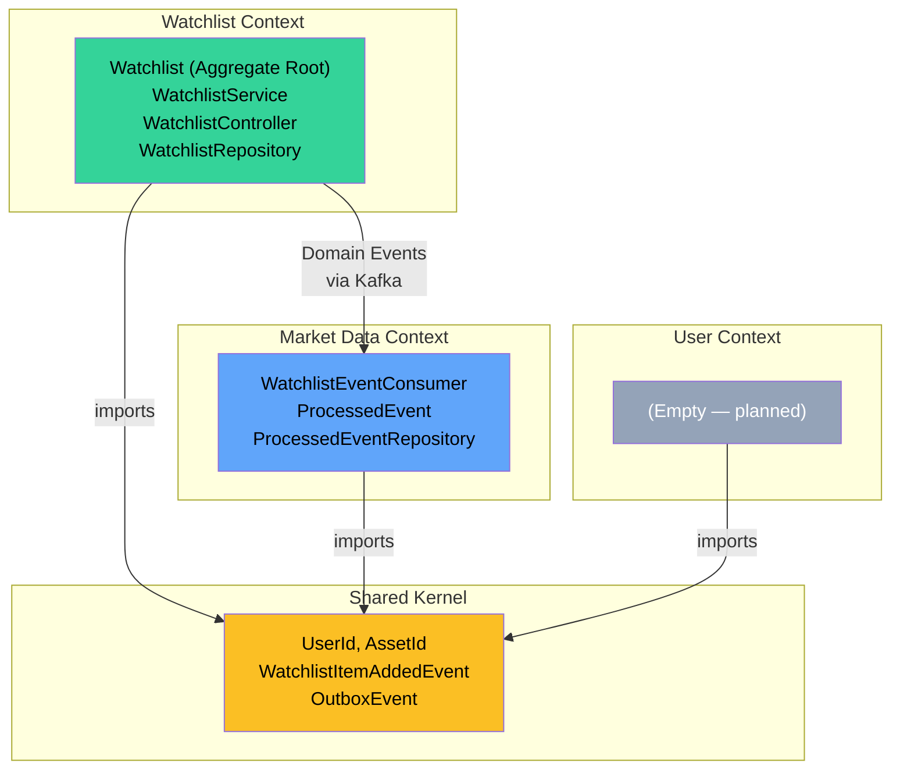
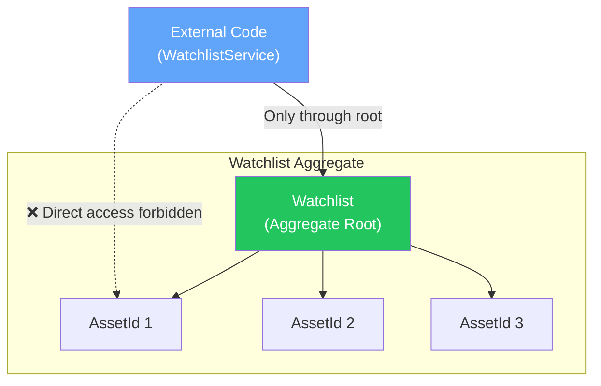
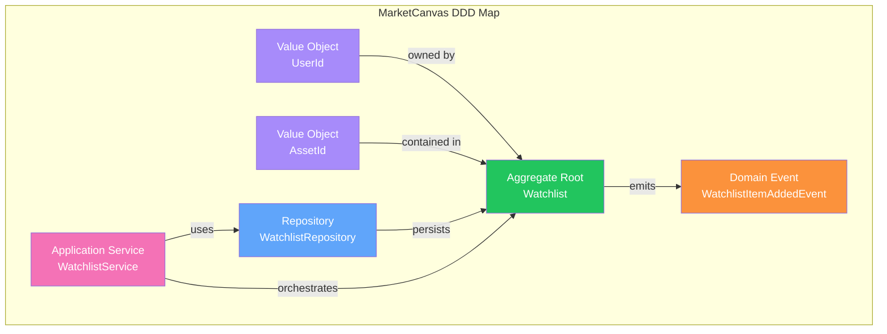

# Chapter 3: Domain-Driven Design

[← Chapter 2](./02_SPRING_BOOT_FUNDAMENTALS.md) | [Chapter 4 →](./04_ARCHITECTURE.md)

---

## 3.1 What Is Domain-Driven Design?

**Domain-Driven Design (DDD)** is an approach to software development that focuses on modeling software around the **business domain** — the real-world problem the software solves.

### History

DDD was introduced by **Eric Evans** in his 2003 book *"Domain-Driven Design: Tackling Complexity in the Heart of Software"*. It emerged from a frustration: enterprise software projects often failed not because of technical problems, but because developers didn't understand the business.

### The Core Insight

> The structure of the code should mirror the structure of the business.

If a financial analyst talks about "watchlists," "assets," and "investment theses," those exact words should appear as classes in your code. Not `DataProcessor`, `ItemManager`, or `EntityHandler`.

### Why DDD Matters for MarketCanvas

MarketCanvas is a financial platform with complex business rules:
- Free-tier users can only have 10 assets in a watchlist
- Asset additions emit events for downstream market data processing
- Investment theses have scoring algorithms and invalidation criteria

These are **domain rules**, not technical plumbing. DDD ensures these rules live in domain objects, not scattered across controllers and services.

---

## 3.2 Strategic Design

Strategic Design is about **dividing the system into pieces** that make business sense.

### 3.2.1 Bounded Contexts

A **Bounded Context** is a boundary within which a particular domain model is consistent and coherent.

**Real-world analogy:** In a hospital, the word "patient" means different things to different departments:
- **Emergency Room:** A patient has a triage level, arrival time, and chief complaint
- **Billing:** A patient has an insurance policy, balance, and payment history
- **Pharmacy:** A patient has allergies, current medications, and dosage schedules

Each department is a Bounded Context. The word "patient" has a different model in each.

### MarketCanvas Bounded Contexts



| Context | Package | Responsibility |
|---------|---------|---------------|
| **Watchlist** | `org.workshop.marketcanvas.watchlist` | Managing user watchlists, enforcing business rules |
| **Market Data** | `org.workshop.marketcanvas.marketdata` | Consuming events, fetching financial data |
| **User** | `org.workshop.marketcanvas.user` | Identity, authentication (planned) |
| **Shared Kernel** | `org.workshop.marketcanvas.sharedkernel` | Types shared across all contexts |

### 3.2.2 The Shared Kernel

A **Shared Kernel** is a small, carefully controlled set of types that multiple bounded contexts share. Changes to the shared kernel affect all contexts, so it must be small and stable.

In MarketCanvas, the shared kernel contains:
- **Value Objects:** `UserId`, `AssetId` — identity types used everywhere
- **Events:** `WatchlistItemAddedEvent` — the contract between producer and consumer
- **Infrastructure:** `OutboxEvent`, `OutboxRelay` — cross-cutting event publishing

> [!IMPORTANT]
> The Shared Kernel is NOT a dumping ground. Only types that genuinely need to be shared belong here. If a type is only used within one context, it stays in that context's package.

### 3.2.3 Context Mapping

Context mapping describes how bounded contexts relate to each other:

| Relationship | Description | MarketCanvas Example |
|-------------|-------------|---------------------|
| **Published Language** | Contexts agree on a shared event format | `WatchlistItemAddedEvent` record |
| **Customer-Supplier** | One context produces data, another consumes | Watchlist (supplier) → Market Data (customer) |
| **Shared Kernel** | Small shared code between contexts | `sharedkernel` package |

---

## 3.3 Tactical Design

Tactical Design is about **modeling the internals** of each bounded context.

### 3.3.1 Value Objects

A **Value Object** is defined by its attributes, not by a unique identity. Two value objects with the same attributes are equal.

**Real-world analogy:** A $10 bill. You don't care which specific $10 bill you have — any $10 bill is interchangeable. The value ($10) defines the object, not its serial number.

#### MarketCanvas Value Objects

```java
// File: sharedkernel/domain/UserId.java
public record UserId(UUID value) {
    public UserId {                          // Compact constructor (validation)
        if (value == null) {
            throw new IllegalArgumentException("UserId cannot be null");
        }
    }
    public static UserId generate() {        // Factory method
        return new UserId(UUID.randomUUID());
    }
}
```

**Properties of Value Objects:**

| Property | How It's Achieved | Why It Matters |
|----------|------------------|----------------|
| **Immutable** | Java `record` — fields are implicitly `final` | Cannot be accidentally modified |
| **Self-validating** | Compact constructor throws on `null` | Invalid value objects cannot exist |
| **Structural equality** | `record` generates `equals()` based on field values | Two `UserId("abc")` are equal |
| **Type safety** | `UserId` vs `AssetId` — not interchangeable raw `UUID`s | Compiler catches mistakes |

Without value objects, a method signature like `addAsset(UUID, UUID, UUID)` is confusing — which UUID is the watchlistId, which is the assetId, which is the ownerId? With value objects: `addAsset(WatchlistId, AssetId)` — clear and type-safe.

### 3.3.2 Entities

An **Entity** is defined by a unique identity that persists through time. Even if all other attributes change, the entity remains the same entity.

**Real-world analogy:** A person. Even if you change your name, address, hair color, and career — you are still YOU. Your identity (e.g., Social Security Number) persists.

#### MarketCanvas Entity: Watchlist

```java
@Entity
public class Watchlist {
    @Id
    private final UUID id;        // ← THIS is the identity. It never changes.
    private String name;          // ← This can change (rename)
    private final Set<AssetId> assets;  // ← This can change (add/remove)
}
```

Two watchlists with the same name are NOT the same watchlist. They have different `id`s.

### 3.3.3 Aggregates and Aggregate Roots

An **Aggregate** is a cluster of domain objects treated as a single unit for data changes. The **Aggregate Root** is the entry point — all external access goes through the root.

**Real-world analogy:** A university is an aggregate. Students, courses, and professors are internal parts. To enroll in a course, you don't talk to the course directly — you go through the university's registration office (the aggregate root).

#### The Watchlist Aggregate



**Rules of the Watchlist Aggregate:**

| Rule | Implementation | Code |
|------|---------------|------|
| Created only via factory method | `Watchlist.create(ownerId, name)` | Private constructor |
| Name must be non-empty and ≤50 chars | `rename()` validates | `if(newName == null \|\| newName.length() > 50)` |
| Max 10 assets (free tier) | `addAsset()` checks size | `if(assets.size() >= 10) throw` |
| No duplicate assets | `Set<AssetId>` enforces uniqueness | `if(assets.contains(assetId)) return` |
| Asset additions emit domain events | `addAsset()` queues event | `domainEvents.add(new WatchlistItemAddedEvent(...))` |

### 3.3.4 Domain Events

A **Domain Event** is a record of something that happened in the domain. Events are always named in **past tense** because they represent facts — things that already occurred.

**Real-world analogy:** A receipt from a store. It records that a purchase happened. You cannot "un-happen" the purchase. The receipt is an immutable fact.

```java
// File: sharedkernel/events/WatchlistItemAddedEvent.java
public record WatchlistItemAddedEvent(
    UUID watchlistId,    // Which watchlist?
    UUID assetId,        // Which asset was added?
    Instant timestamp    // When did it happen?
) {}
```

> [!IMPORTANT]
> **Events use primitive types (UUID, String, Instant) — NOT domain objects (AssetId, UserId).** This is because events cross module boundaries and may be serialized to JSON for Kafka. Using domain objects creates coupling between modules. This was a real lesson learned (TASK-010).

### 3.3.5 Repositories

A **Repository** provides an interface for persisting and retrieving aggregates. It hides the data access technology (SQL, NoSQL, file system) behind a domain-friendly API.

```java
// File: watchlist/infrastructure/WatchlistRepository.java
public interface WatchlistRepository extends JpaRepository<Watchlist, UUID> {
}
```

The domain layer doesn't know (or care) that this uses PostgreSQL. It could be switched to MongoDB by providing a different implementation.

### 3.3.6 Application Services

An **Application Service** orchestrates domain objects to fulfill a use case. It does NOT contain business rules — those live in the aggregate.

```java
// File: watchlist/application/WatchlistService.java
@Service
@RequiredArgsConstructor
public class WatchlistService {
    private final WatchlistRepository watchlistRepository;

    @Transactional
    public void addAssetToWatchlist(UUID watchlistId, AssetId assetId) {
        // 1. Fetch the aggregate
        Watchlist watchlist = watchlistRepository.findById(watchlistId)
            .orElseThrow(() -> new IllegalArgumentException("Watchlist not found"));
        // 2. Delegate to the aggregate (business logic is INSIDE the aggregate)
        watchlist.addAsset(assetId);
        // 3. Persist
        watchlistRepository.save(watchlist);
    }
}
```

**What the service does NOT do:**
- ❌ Check if the watchlist already has 10 assets (that's the aggregate's job)
- ❌ Validate the asset ID (that's the value object's job)
- ❌ Publish domain events (that's the aggregate's `@DomainEvents` mechanism)

### 3.3.7 The Factory Method Pattern

The **Factory Method** is a creational design pattern where object creation is delegated to a static method instead of a constructor.

```java
// ❌ BAD — Public constructor allows invalid state
Watchlist watchlist = new Watchlist(null, null, "");  // No validation!

// ✅ GOOD — Factory method enforces creation rules
Watchlist watchlist = Watchlist.create(ownerId, name);  // Validates everything
```

MarketCanvas enforces this by making the constructor private:

```java
private Watchlist(UUID id, UserId ownerId, String name) {
    this.id = id;
    this.ownerId = ownerId;
    this.assets = new HashSet<>();
    rename(name);  // Reuse validation logic!
}

public static Watchlist create(UserId ownerId, String name) {
    if (ownerId == null) {
        throw new IllegalArgumentException("Owner ID cannot be null");
    }
    return new Watchlist(UUID.randomUUID(), ownerId, name);
}
```

---

## 3.4 DDD Building Blocks Summary



| DDD Concept | MarketCanvas Class | Package |
|-------------|-------------------|---------|
| Value Object | `UserId` | `sharedkernel.domain` |
| Value Object | `AssetId` | `sharedkernel.domain` |
| Aggregate Root / Entity | `Watchlist` | `watchlist.domain` |
| Domain Event | `WatchlistItemAddedEvent` | `sharedkernel.events` |
| Repository | `WatchlistRepository` | `watchlist.infrastructure` |
| Application Service | `WatchlistService` | `watchlist.application` |

---

## 3.5 Common DDD Mistakes (and How MarketCanvas Avoids Them)

| Mistake | What Happens | MarketCanvas Solution |
|---------|-------------|----------------------|
| Anemic Domain Model | Aggregates are just data bags, logic lives in services | Business logic inside `Watchlist.addAsset()` |
| Public setters | Anyone can modify entity state | No setters. State changes via behavior methods. |
| Raw primitives | `addAsset(UUID)` — which UUID? | `addAsset(AssetId)` — type-safe |
| Domain events with domain objects | Coupling between modules | Events use `UUID`, not `AssetId` |
| Business logic in controllers | Controllers grow into God classes | Controllers are thin — delegate to services |

---

[← Chapter 2](./02_SPRING_BOOT_FUNDAMENTALS.md) | [Chapter 4: The Architecture →](./04_ARCHITECTURE.md)
