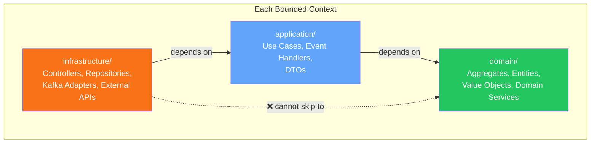
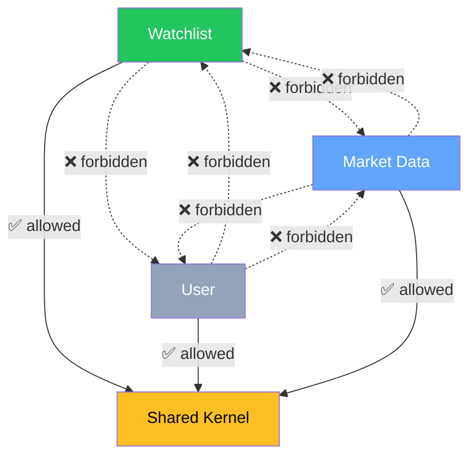
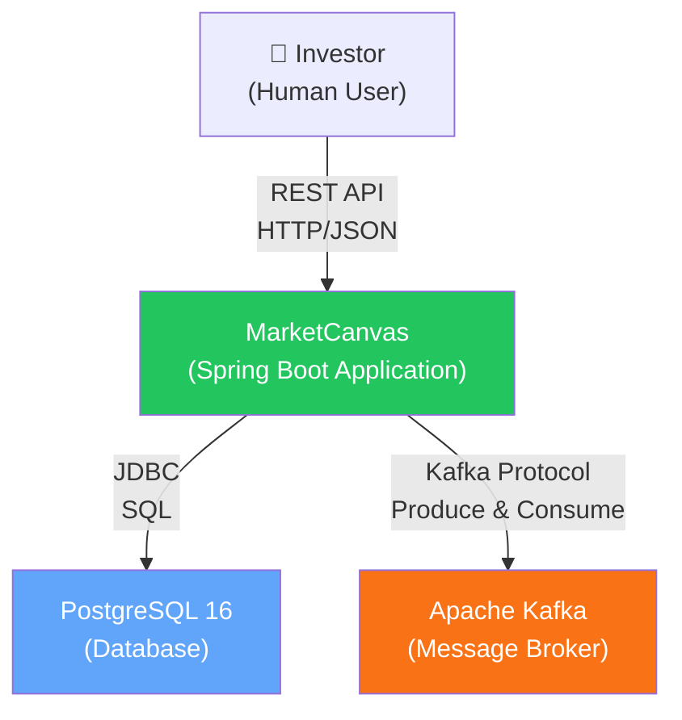
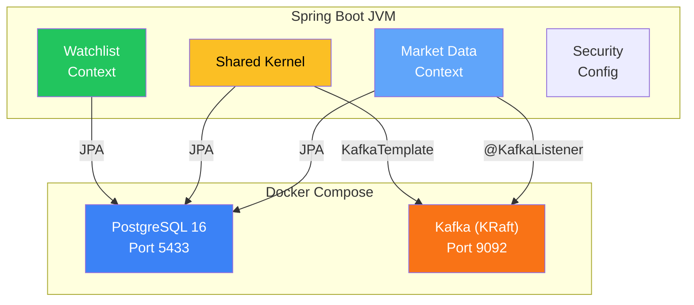
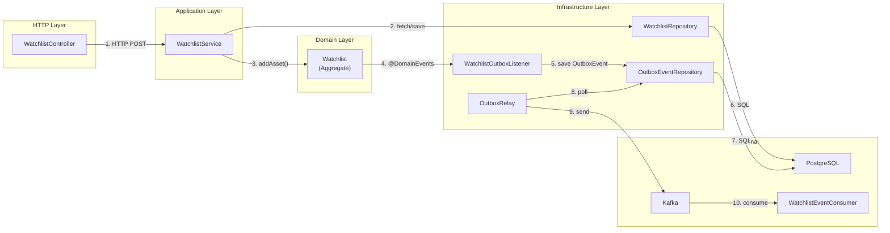
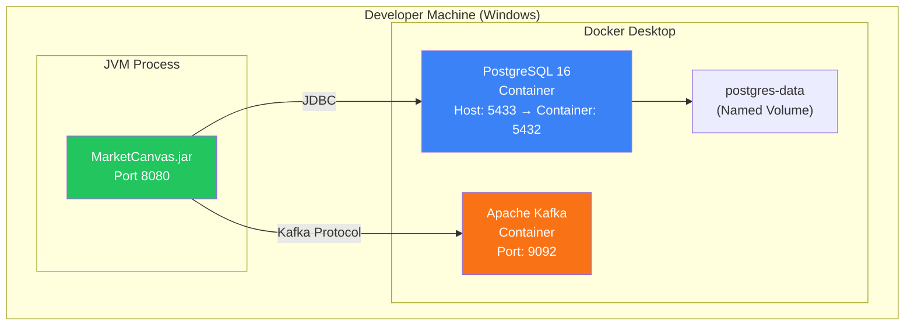

# Chapter 4: The Architecture

[← Chapter 3](./03_DOMAIN_DRIVEN_DESIGN.md) | [Chapter 5 →](./05_DOMAIN_MODEL_WALKTHROUGH.md)

---

## 4.1 The Modular Monolith

### What Is a Monolith?

A **monolith** is a single deployable unit — one JAR file, one JVM process, one deployment pipeline. All code runs together in the same memory space.

### What Is a Microservice?

A **microservice** is a small, independently deployable service that does one thing well. Each has its own database, its own deployment, its own monitoring.

### Why NOT Microservices?

MarketCanvas deliberately chose a Modular Monolith over Microservices (ADR-001):

| Factor | Monolith | Microservices |
|--------|----------|---------------|
| Team size | 1 developer ✅ | 3+ teams per service |
| Domain clarity | Still discovering boundaries | Boundaries must be correct from day one |
| Debugging | Stack trace in one JVM ✅ | Distributed tracing across 5+ services |
| Deployment | One JAR file ✅ | 5+ containers, orchestration |
| Refactoring | Rename a package ✅ | Rewrite network contracts |
| Performance | Method calls (nanoseconds) ✅ | Network calls (milliseconds) |

> [!IMPORTANT]
> **Microservices are an organizational pattern, not a technical one.** They exist to let multiple teams deploy independently. With one developer, they add only complexity.

### What Makes It "Modular"?

The word "modular" means the monolith has **strict internal boundaries**:

1. Each bounded context is a separate package tree
2. Cross-context imports are **forbidden** (enforced by ArchUnit)
3. Cross-context communication uses **events** (not method calls)
4. Each module has its own domain/application/infrastructure layers

This means any module can be extracted to a microservice by moving its package and replacing Spring events/Kafka with network calls.

---

## 4.2 Package Structure

### Complete Package Tree

```
src/main/java/org/workshop/marketcanvas/
│
├── MarketCanvasApplication.java          ← Entry point
├── SecurityConfig.java                   ← Security configuration
│
├── sharedkernel/                         ← SHARED KERNEL
│   ├── domain/
│   │   ├── UserId.java                   ← Value Object
│   │   ├── AssetId.java                  ← Value Object
│   │   └── OutboxEvent.java              ← JPA Entity
│   ├── events/
│   │   └── WatchlistItemAddedEvent.java  ← Domain Event
│   └── infrastructure/
│       ├── UserIdConverter.java          ← JPA Converter
│       ├── AssetIdConverter.java         ← JPA Converter
│       ├── OutboxEventRepository.java    ← JPA Repository
│       ├── OutboxRelay.java              ← Kafka publisher
│       └── WatchlistOutboxListener.java  ← Event interceptor
│
├── watchlist/                            ← WATCHLIST CONTEXT
│   ├── domain/
│   │   └── Watchlist.java                ← Aggregate Root
│   ├── application/
│   │   └── WatchlistService.java         ← Application Service
│   └── infrastructure/
│       ├── WatchlistController.java      ← REST Controller
│       ├── WatchlistRepository.java      ← JPA Repository
│       ├── CreateWatchlistRequest.java   ← Request DTO
│       └── AddAssetRequest.java          ← Request DTO
│
├── marketdata/                           ← MARKET DATA CONTEXT
│   ├── domain/                           ← (empty)
│   ├── application/
│   │   └── messaging/
│   │       └── WatchlistEventConsumer.java ← Kafka Consumer
│   └── infrastructure/
│       └── messaging/
│           ├── ProcessedEvent.java        ← Idempotency Entity
│           └── ProcessedEventRepository.java
│
└── user/                                 ← USER CONTEXT
    ├── domain/                           ← (empty)
    ├── application/                      ← (empty)
    └── infrastructure/                   ← (empty)
```

### Why Package-by-Domain (Not Package-by-Layer)?

Traditional applications organize code by technical layer:

```
❌ Package-by-Layer (DON'T do this)
├── controllers/
│   ├── WatchlistController.java
│   ├── UserController.java
│   └── MarketDataController.java
├── services/
│   ├── WatchlistService.java
│   ├── UserService.java
│   └── MarketDataService.java
├── repositories/
│   ├── WatchlistRepository.java
│   ├── UserRepository.java
│   └── MarketDataRepository.java
```

Problems:
- To understand "Watchlist", you must look in 3+ packages
- Every file in a package depends on every file in the package below
- Extracting "Watchlist" to a microservice requires touching every package

MarketCanvas uses Package-by-Domain (ADR-007):

```
✅ Package-by-Domain (MarketCanvas approach)
├── watchlist/       ← Everything about watchlists lives here
├── marketdata/      ← Everything about market data lives here
├── user/            ← Everything about users lives here
```

Benefits:
- To understand "Watchlist", look in ONE folder
- Extracting to a microservice = move ONE folder
- Dependencies between folders are explicit and enforceable

---

## 4.3 Internal Layer Structure

Each bounded context follows the same three-layer structure:



### The Dependency Rule

Dependencies flow **inward** — infrastructure depends on application, application depends on domain. **Never** the reverse.

| Layer | Contains | May Depend On | May NOT Depend On |
|-------|----------|---------------|-------------------|
| `domain/` | Business logic, aggregates, value objects | Nothing (pure Java) | `application/`, `infrastructure/` |
| `application/` | Use cases, orchestration | `domain/` | `infrastructure/` |
| `infrastructure/` | Controllers, repositories, external adapters | `domain/`, `application/` | — |

### How This Maps to MarketCanvas

| Layer | Watchlist Context | Market Data Context |
|-------|------------------|---------------------|
| `domain/` | `Watchlist.java` | (empty — no domain entities yet) |
| `application/` | `WatchlistService.java` | `WatchlistEventConsumer.java` |
| `infrastructure/` | `WatchlistController.java`, `WatchlistRepository.java`, DTOs | `ProcessedEvent.java`, `ProcessedEventRepository.java` |

---

## 4.4 Module Boundary Enforcement (ArchUnit)

### What Is ArchUnit?

**ArchUnit** is a Java testing library that lets you write **architecture rules as code**. Instead of relying on documentation that nobody reads, you write JUnit tests that fail if the architecture is violated.

### The Enforcement Test

```java
// File: ArchitectureEnforcementTest.java
@AnalyzeClasses(packages = "org.workshop.marketcanvas")
public class ArchitectureEnforcementTest {

    @ArchTest
    static final ArchRule moduleShouldBeIndependent = layeredArchitecture()
        .consideringAllDependencies()
        // Define what constitutes each "layer" (module)
        .layer("User").definedBy("..user..")
        .layer("Watchlist").definedBy("..watchlist..")
        .layer("MarketData").definedBy("..marketdata..")
        .layer("SharedKernel").definedBy("..sharedkernel..")
        // Define the rules
        .whereLayer("Watchlist").mayOnlyAccessLayers("SharedKernel")
        .whereLayer("User").mayOnlyAccessLayers("SharedKernel")
        .whereLayer("MarketData").mayOnlyAccessLayers("SharedKernel")
        .withOptionalLayers(true);
}
```

### Line-by-Line Explanation

| Line | Meaning |
|------|---------|
| `@AnalyzeClasses(packages = "org.workshop.marketcanvas")` | Scan all compiled classes under this package |
| `layeredArchitecture()` | Use ArchUnit's layered architecture DSL |
| `.consideringAllDependencies()` | Check ALL imports, not just direct ones |
| `.layer("Watchlist").definedBy("..watchlist..")` | Any class in a `watchlist` package belongs to the "Watchlist" layer |
| `.whereLayer("Watchlist").mayOnlyAccessLayers("SharedKernel")` | Watchlist code may ONLY import from SharedKernel |
| `.withOptionalLayers(true)` | Don't fail if a defined layer has no classes yet (e.g., `user` is empty) |

### What Violations Look Like

If someone adds this import to `WatchlistService.java`:

```java
import org.workshop.marketcanvas.marketdata.application.messaging.WatchlistEventConsumer;
```

The test fails with:

```
java.lang.AssertionError: Architecture Violation
  Layer 'Watchlist' accesses Layer 'MarketData' in
  WatchlistService.java:5
```

### Module Dependency Diagram



---

## 4.5 System Architecture Diagrams

### System Context Diagram (C4 Level 1)



### Container Diagram (C4 Level 2)



### Component Diagram — Data Flow



### Deployment Diagram



---

## 4.6 Design Patterns Identified

| Pattern | Where Used | Purpose |
|---------|-----------|---------|
| **Factory Method** | `Watchlist.create()` | Enforce valid aggregate creation |
| **Repository** | `WatchlistRepository`, `OutboxEventRepository`, `ProcessedEventRepository` | Abstract data access |
| **Observer** | `@DomainEvents` + `@TransactionalEventListener` | Decouple aggregate from side effects |
| **Transactional Outbox** | `WatchlistOutboxListener` + `OutboxRelay` | Reliable event publishing |
| **Idempotent Consumer** | `WatchlistEventConsumer` + `ProcessedEvent` | Exactly-once processing |
| **DTO (Data Transfer Object)** | `CreateWatchlistRequest`, `AddAssetRequest` | Decouple API contract from domain |
| **Converter** | `UserIdConverter`, `AssetIdConverter` | Bridge domain types ↔ database types |
| **Proxy** | Spring Data repository proxies, `@Transactional` proxies | Transparent interception |

---

## 4.7 Architecture Decision Records (ADRs)

Every significant technical decision is recorded:

| ADR | Decision | Date |
|-----|---------|------|
| ADR-001 | Modular Monolith over Microservices | 2026-06-22 |
| ADR-002 | PostgreSQL over MySQL | 2026-06-26 |
| ADR-003 | Transactional Outbox over direct Kafka publish | 2026-06-26 |
| ADR-004 | Kafka KRaft mode over Zookeeper | 2026-06-26 |
| ADR-005 | Gradual Spring Events → Kafka migration | 2026-06-22 |
| ADR-006 | Idempotent Consumer via database table | 2026-07-05 |
| ADR-007 | Package-by-domain over package-by-layer | 2026-06-22 |
| ADR-008 | Two-tier exception handling in Kafka consumers | 2026-07-05 |

---

[← Chapter 3](./03_DOMAIN_DRIVEN_DESIGN.md) | [Chapter 5: Domain Model Walkthrough →](./05_DOMAIN_MODEL_WALKTHROUGH.md)
