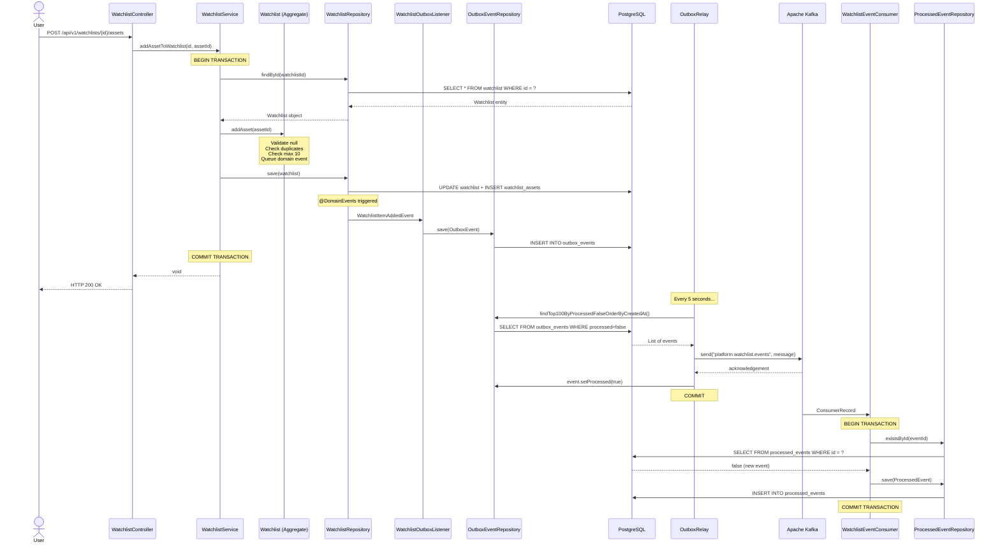

# Chapter 5: The Domain Model — Complete Code Walkthrough

[← Chapter 4](./04_ARCHITECTURE.md) | [Chapter 6 →](./06_EVENT_DRIVEN_KAFKA.md)

---

> This chapter walks through every important class in the codebase. Every annotation, every field, every method is explained.

---

## 5.1 Watchlist.java — The Aggregate Root

This is the most important class in the entire project. It is the **Aggregate Root** of the Watchlist bounded context.

```java
package org.workshop.marketcanvas.watchlist.domain;         // 1

import jakarta.persistence.*;                                // 2
import lombok.*;                                             // 3
import org.jmolecules.event.annotation.DomainEvent;         // 4
import org.springframework.data.domain.AfterDomainEventPublication; // 5
import org.springframework.data.domain.DomainEvents;         // 6
import org.workshop.marketcanvas.sharedkernel.domain.AssetId; // 7
import org.workshop.marketcanvas.sharedkernel.domain.UserId;  // 8
import org.workshop.marketcanvas.sharedkernel.events.WatchlistItemAddedEvent; // 9

import java.time.Instant;                                    // 10
import java.util.*;                                          // 11
```

| Line | Import | Why |
|------|--------|-----|
| 2 | `jakarta.persistence.*` | JPA annotations (`@Entity`, `@Id`, `@Column`, etc.) |
| 3 | `lombok.*` | `@AllArgsConstructor`, `@Getter` |
| 4 | `org.jmolecules` | Semantic annotation `@DomainEvent` (documentation only) |
| 5-6 | `@DomainEvents`, `@AfterDomainEventPublication` | Spring Data's mechanism for publishing events from aggregates |
| 7-8 | `AssetId`, `UserId` | Shared kernel value objects |
| 9 | `WatchlistItemAddedEvent` | The domain event this aggregate emits |

```java
@Entity                                                      // 12
@AllArgsConstructor                                          // 13
@Getter                                                      // 14
public class Watchlist {                                     // 15
```

| Annotation | Purpose |
|-----------|---------|
| `@Entity` | Tells JPA/Hibernate: "This class maps to a database table" |
| `@AllArgsConstructor` | Lombok generates a constructor with ALL fields |
| `@Getter` | Lombok generates `getXxx()` for every field |

```java
    @Id                                                      // 16
    private final UUID id;                                   // 17
```

`@Id` marks this field as the **primary key**. `final` means it cannot change after construction — identity is immutable.

```java
    @Column(nullable = false)                                // 18
    private final UserId ownerId;                            // 19
```

`@Column(nullable = false)` generates a `NOT NULL` constraint in the database. `UserId` is a value object — JPA uses the `UserIdConverter` (auto-applied) to convert it to/from a `UUID` column.

```java
    @Column(nullable = false, length = 50)                   // 20
    private String name;                                     // 21
```

`length = 50` generates `VARCHAR(50)` in the database. `name` is NOT `final` — it can be renamed.

```java
    @ElementCollection                                       // 22
    @CollectionTable(                                        // 23
            name = "watchlist_assets",                        // 24
            joinColumns = @JoinColumn(name = "watchlist_id")  // 25
    )                                                        // 26
    @Column(name = "asset_id")                               // 27
    private final Set<AssetId> assets;                       // 28
```

This is one of the most complex JPA mappings in the project:

| Annotation | Meaning |
|-----------|---------|
| `@ElementCollection` | "This collection is stored in a separate table, not as a `@OneToMany` relationship" |
| `@CollectionTable(name = "watchlist_assets")` | The separate table is called `watchlist_assets` |
| `@JoinColumn(name = "watchlist_id")` | The foreign key column in `watchlist_assets` pointing back to `watchlist` |
| `@Column(name = "asset_id")` | The column storing each `AssetId` value |

This creates:

```sql
CREATE TABLE watchlist (
    id UUID PRIMARY KEY,
    owner_id UUID NOT NULL,
    name VARCHAR(50) NOT NULL
);

CREATE TABLE watchlist_assets (
    watchlist_id UUID REFERENCES watchlist(id),
    asset_id UUID
);
```

```java
    protected Watchlist() {                                  // 29
        this.id = null;                                      // 30
        this.ownerId = null;                                 // 31
        this.assets = new HashSet<>();                       // 32
    }                                                        // 33
```

**JPA requires a no-argument constructor.** Hibernate uses it to create "empty" entity instances that it then populates with data from the database. It's `protected` so application code can't use it — only Hibernate and subclasses can.

```java
    @Transient                                               // 34
    private List<Object> domainEvents = new ArrayList<>();   // 35
```

`@Transient` means this field is NOT persisted to the database. Domain events are temporary — they exist only in memory until they're published. After `@AfterDomainEventPublication`, this list is cleared.

```java
    private Watchlist(UUID id, UserId ownerId, String name) { // 36
        this.id = id;                                        // 37
        this.ownerId = ownerId;                              // 38
        this.assets = new HashSet<>();                       // 39
        rename(name);  // Reuse the validation logic!        // 40
    }                                                        // 41
```

**The real constructor is private.** This enforces the Factory Method pattern — you MUST use `Watchlist.create()`. Note line 40: `rename(name)` reuses validation instead of duplicating it.

```java
    // Factory Method
    public static Watchlist create(UserId ownerId, String name) { // 42
        if (ownerId == null) {                               // 43
            throw new IllegalArgumentException("Owner ID cannot be null"); // 44
        }                                                    // 45
        return new Watchlist(UUID.randomUUID(), ownerId, name); // 46
    }                                                        // 47
```

The only way to create a Watchlist. It validates the owner, generates a random UUID, and delegates to the private constructor.

```java
    public void rename(String newName) {                     // 48
        if(newName == null || newName.trim().isEmpty()){      // 49
            throw new IllegalArgumentException("name can't be null"); // 50
        } else if (newName.length() > 50) {                  // 51
            throw new IllegalArgumentException("name must be less than 50 characters"); // 52
        }                                                    // 53
         this.name = newName;                                // 54
    }                                                        // 55
```

Business rule enforcement: names must be non-null, non-empty, and ≤50 characters. Notice there's no `setName()` — the only way to change the name is through `rename()`, which enforces invariants.

```java
    public void addAsset(AssetId assetId) {                  // 56
        if(assetId == null){                                 // 57
            throw new IllegalArgumentException("AssetId cannot be null"); // 58
        }                                                    // 59
        if(assets.contains(assetId)){                        // 60
            return;  // Idempotent — adding the same asset twice is a no-op // 61
        }                                                    // 62
        if(this.assets.size() >= 10){                        // 63
            throw new IllegalStateException(                 // 64
                "Free-Tier Watchlists can hold a maximum of 10 Assets"); // 65
        }                                                    // 66
        this.assets.add(assetId);                            // 67
        this.domainEvents.add(                               // 68
            new WatchlistItemAddedEvent(this.id, assetId.value(), Instant.now())); // 69
    }                                                        // 70
```

This method contains the richest business logic:

| Line | Logic | DDD Concept |
|------|-------|-------------|
| 57-59 | Null guard | Input validation |
| 60-62 | Duplicate check (idempotent) | Set semantics |
| 63-66 | **Free-tier limit: max 10 assets** | Business invariant |
| 67 | Mutate state | State change |
| 68-69 | **Queue domain event** | Domain event pattern |

Note line 69: `assetId.value()` extracts the raw `UUID` from the value object. Events use primitives, not domain objects.

```java
    @DomainEvents                                            // 71
    Collection<Object> domainEvents() {                      // 72
        return domainEvents;                                 // 73
    }                                                        // 74
    @AfterDomainEventPublication                             // 75
    void clearEvents() {                                     // 76
        domainEvents.clear();                                // 77
    }                                                        // 78
```

**This is Spring Data's domain event mechanism:**

1. When `repository.save(watchlist)` is called, Spring Data calls the `@DomainEvents` method to get queued events
2. Spring publishes each event via `ApplicationEventPublisher`
3. After publication, Spring calls `@AfterDomainEventPublication` to clear the queue

---

## 5.2 WatchlistService.java — Application Service

```java
@Service                                                     // 1
@RequiredArgsConstructor                                     // 2
public class WatchlistService {                              // 3
    private final WatchlistRepository watchlistRepository;   // 4

    @Transactional                                           // 5
    public UUID createWatchlist(UserId ownerId, String name){ // 6
        Watchlist watchlist = Watchlist.create(ownerId,name); // 7 — Delegate to factory
        Watchlist saved = watchlistRepository.save(watchlist); // 8 — Persist + publish events
        return saved.getId();                                 // 9 — Return the generated ID
    }                                                        // 10

    @Transactional                                           // 11
    public void addAssetToWatchlist(UUID watchlistId, AssetId assetId){ // 12
        Watchlist watchlist = watchlistRepository.findById(watchlistId) // 13
            .orElseThrow(() -> new IllegalArgumentException("Watchlist not found")); // 14
        watchlist.addAsset(assetId);                         // 15 — Business logic in aggregate
        watchlistRepository.save(watchlist);                 // 16 — Persist + publish events
    }                                                        // 17
}
```

**Key insight:** The service is **thin**. It does three things:
1. Fetch/create the aggregate
2. Call a method on the aggregate
3. Save the aggregate

ALL business logic is inside `Watchlist`. The service is just orchestration.

Line 8 and 16 (`repository.save()`) is where the magic happens — it triggers `@DomainEvents`, which triggers `WatchlistOutboxListener`, which saves an `OutboxEvent` — all in the **same database transaction**.

---

## 5.3 WatchlistController.java — REST Controller

```java
@RequiredArgsConstructor                                     // 1
@RestController                                              // 2
@RequestMapping("/api/v1/watchlists")                        // 3
public class WatchlistController {                           // 4
    private final WatchlistService watchlistService;         // 5

    @PostMapping                                             // 6
    public ResponseEntity<UUID> createWatchlist(              // 7
            @RequestBody CreateWatchlistRequest watchlistRequest) { // 8
        UserId owner = new UserId(watchlistRequest.ownerId()); // 9 — Convert primitive to VO
        UUID id = watchlistService.createWatchlist(owner, watchlistRequest.name()); // 10
        return ResponseEntity.ok(id);                        // 11 — HTTP 200 + UUID in body
    }                                                        // 12

    @PostMapping("/{id}/assets")                             // 13
    public ResponseEntity<Void> addAsset(                    // 14
            @PathVariable UUID id,                           // 15
            @RequestBody AddAssetRequest request) {          // 16
        AssetId asset = new AssetId(request.assetId());      // 17 — Convert primitive to VO
        watchlistService.addAssetToWatchlist(id, asset);     // 18
        return ResponseEntity.ok().build();                  // 19 — HTTP 200, no body
    }                                                        // 20
}
```

**The controller is even thinner than the service.** It:
1. Deserializes JSON → Java objects (`@RequestBody`)
2. Converts primitives to value objects (lines 9, 17)
3. Delegates to the service
4. Returns HTTP response

---

## 5.4 Request DTOs

```java
// CreateWatchlistRequest.java
public record CreateWatchlistRequest(UUID ownerId, String name) { }

// AddAssetRequest.java
public record AddAssetRequest(UUID assetId) { }
```

Java records are perfect for DTOs — immutable data carriers with no behavior. Jackson automatically deserializes JSON into these records.

---

## 5.5 JPA AttributeConverters

### How Value Objects Map to Database Columns

JPA doesn't know how to store a `UserId` record in a database column. `AttributeConverter` teaches it:

```java
@Converter(autoApply = true)      // Apply automatically wherever UserId is used
public class UserIdConverter
implements AttributeConverter<UserId, UUID> {

    @Override
    public UUID convertToDatabaseColumn(UserId attribute) {
        return attribute == null ? null : attribute.value();  // UserId → UUID
    }

    @Override
    public UserId convertToEntityAttribute(UUID dbData) {
        return dbData == null ? null : new UserId(dbData);    // UUID → UserId
    }
}
```

`autoApply = true` means this converter is used **everywhere** JPA encounters a `UserId` field — no need to annotate each field individually.

---

## 5.6 WatchlistOutboxListener.java — Event Interceptor

```java
@Component
@RequiredArgsConstructor
public class WatchlistOutboxListener {
    private final ObjectMapper mapper;
    private final OutboxEventRepository repository;

    @TransactionalEventListener(phase = TransactionPhase.BEFORE_COMMIT) // KEY!
    public void on(WatchlistItemAddedEvent event) {
        try {
            OutboxEvent outboxEvent = new OutboxEvent(
                UUID.randomUUID(),                    // Unique event ID
                "Watchlist",                          // Aggregate type
                event.watchlistId().toString(),        // Aggregate ID
                event.getClass().getSimpleName(),      // Event type name
                mapper.writeValueAsString(event),      // JSON payload
                Instant.now(),                        // Timestamp
                false                                 // Not yet processed
            );
            repository.save(outboxEvent);
        } catch (Exception e) {
            throw new RuntimeException("System error: Failed to serialize domain event", e);
        }
    }
}
```

> [!IMPORTANT]
> **`BEFORE_COMMIT` is critical.** This listener runs INSIDE the same database transaction as `WatchlistService`. If the outbox save fails, the entire transaction (including the watchlist update) rolls back. This guarantees atomicity — you never have a watchlist change without a corresponding outbox event.

---

## 5.7 OutboxRelay.java — Kafka Publisher

```java
@Component
@RequiredArgsConstructor
public class OutboxRelay {
    private final OutboxEventRepository repository;
    private final ObjectMapper objectMapper;
    private final KafkaTemplate<String, String> kafkaTemplate;

    @Scheduled(fixedDelay = 5000)  // Every 5 seconds
    @Transactional
    public void publish() throws Exception {
        List<OutboxEvent> events =
            repository.findTop100ByProcessedFalseOrderByCreatedAt(); // Batch of 100

        for (OutboxEvent event : events) {
            ObjectNode envelope = objectMapper.createObjectNode();
            envelope.put("eventId", event.getId().toString());
            envelope.put("payload", event.getPayload());

            String kafkaMessage = objectMapper.writeValueAsString(envelope);
            kafkaTemplate
                .send("platform.watchlist.events", kafkaMessage)
                .get();  // BLOCKING — waits for Kafka acknowledgement

            event.setProcessed(true);  // Mark as sent
        }
    }
}
```

**Key design decisions:**
1. **Batch processing** (`findTop100`) — balances throughput and memory
2. **`.get()` blocking call** — ensures Kafka actually received the message before marking as processed
3. **`@Transactional`** — if the method fails mid-batch, already-marked events roll back
4. **`fixedDelay = 5000`** — waits 5 seconds after completion, preventing overlap

---

## 5.8 WatchlistEventConsumer.java — Kafka Consumer

```java
@Component
@RequiredArgsConstructor
@Slf4j
public class WatchlistEventConsumer {
    private final ProcessedEventRepository processedEventRepository;
    private final ObjectMapper objectMapper;

    @KafkaListener(topics = "platform.watchlist.events", groupId = "market-data-group")
    @Transactional
    public void consume(ConsumerRecord<String, String> record) {
        try {
            // 1. Parse the envelope
            JsonNode envelope = objectMapper.readTree(record.value());
            UUID eventId = UUID.fromString(envelope.get("eventId").asText());
            
            // 2. Parse the nested payload
            JsonNode payload = objectMapper.readTree(envelope.get("payload").asText());
            String assetId = payload.get("assetId").asText();
            
            // 3. Idempotency check
            if (processedEventRepository.existsById(eventId)) {
                log.info("Idempotency hit: Ignored duplicate event [{}]", eventId);
                return;
            }
            
            // 4. Business logic (future: fetch market data for this asset)
            log.info("Market Data reacting to new watchlist asset: [{}]", assetId);
            
            // 5. Record as processed
            processedEventRepository.save(new ProcessedEvent(eventId, Instant.now()));
            log.info("Successfully processed and recorded event [{}]", eventId);
            
        } catch (IllegalArgumentException e) {
            // POISON PILL — skip it
            log.error("Poison Pill detected! Payload: {}", record.value(), e);
        } catch (Exception e) {
            // TRANSIENT ERROR — re-throw for Kafka retry
            log.error("Transient error. Triggering Kafka retry.", e);
            throw new RuntimeException("Kafka retry triggered", e);
        }
    }
}
```

*(The complete Kafka flow and error handling strategy are covered in Chapter 6)*

---

## 5.9 Complete Request Flow — Sequence Diagram



---

[← Chapter 4](./04_ARCHITECTURE.md) | [Chapter 6: Event-Driven Architecture & Kafka →](./06_EVENT_DRIVEN_KAFKA.md)
