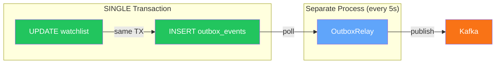
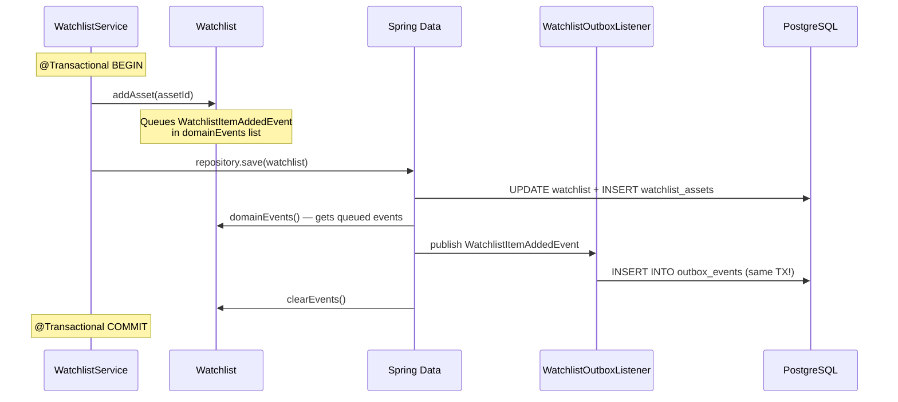
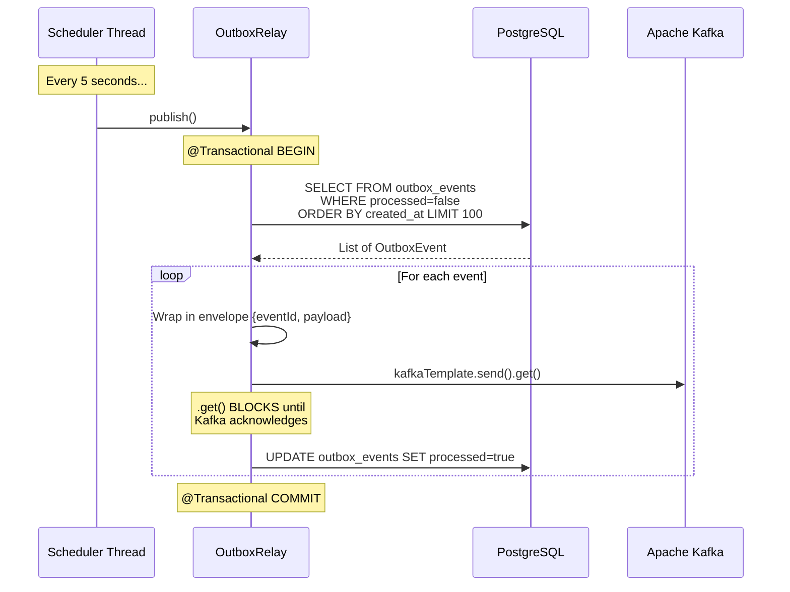
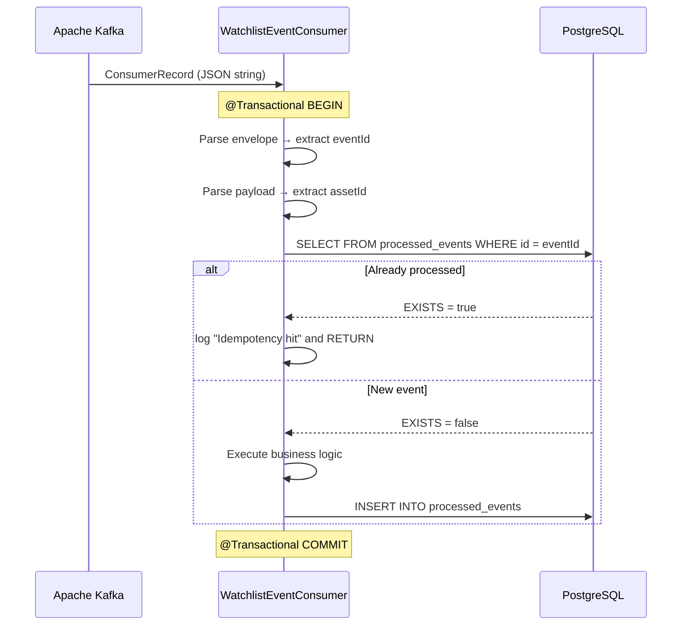
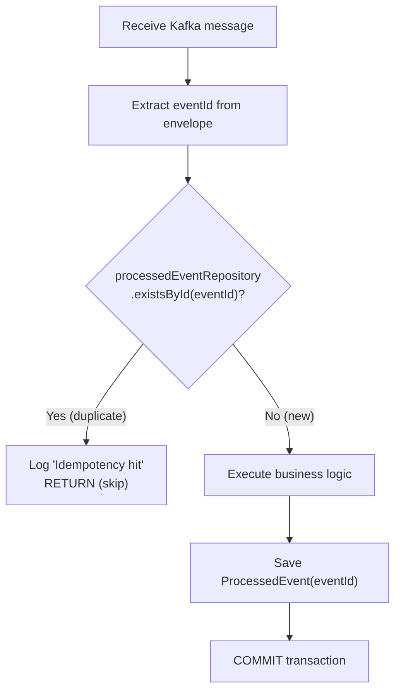
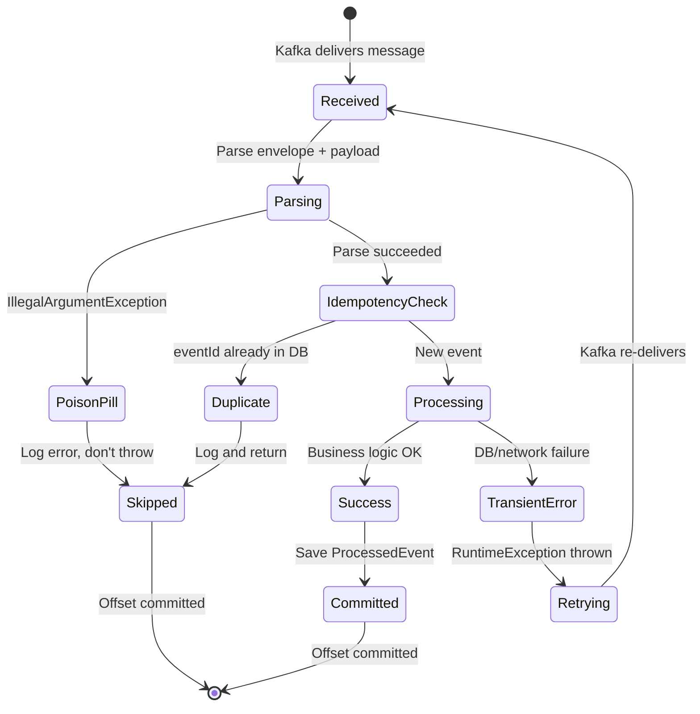
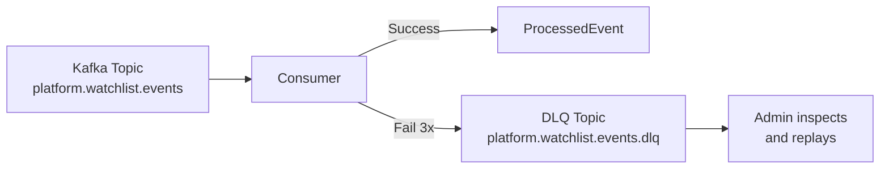

# Chapter 6: Event-Driven Architecture & Apache Kafka

[← Chapter 5](./05_DOMAIN_MODEL_WALKTHROUGH.md) | [Chapter 7 →](./07_DATABASE_AND_PERSISTENCE.md)

---

## 6.1 Why Event-Driven Architecture?

### The Coupling Problem

In a traditional monolith, when a user adds an asset to a watchlist, you might write:

```java
// ❌ TIGHT COUPLING
public void addAsset(AssetId assetId) {
    watchlist.addAsset(assetId);
    watchlistRepository.save(watchlist);
    marketDataService.fetchPriceData(assetId);    // Direct call!
    notificationService.notifyUser(ownerId);       // Direct call!
    analyticsService.trackEvent("asset_added");    // Direct call!
}
```

Problems:
- `WatchlistService` **knows about** MarketData, Notification, and Analytics
- If any downstream service is slow, the entire request is slow
- If any downstream service fails, the entire request fails
- Adding a new consumer requires modifying WatchlistService

### The Event-Driven Solution

```java
// ✅ DECOUPLED — Event-Driven
public void addAsset(AssetId assetId) {
    watchlist.addAsset(assetId);           // Queues a domain event internally
    watchlistRepository.save(watchlist);   // Publishes the event
    // That's it! WatchlistService has no idea who's listening.
}
```

Now MarketData, Notification, and Analytics each **independently subscribe** to the event. Watchlist doesn't know they exist. New consumers can be added without changing a single line in the Watchlist code.

---

## 6.2 Apache Kafka — From First Principles

### 6.2.1 What Is a Message Broker?

A **message broker** is an intermediary that receives messages from producers and delivers them to consumers. Think of it as a post office — senders drop off letters, the post office sorts them, and carriers deliver them to recipients.

### 6.2.2 Queue vs Pub/Sub

| Model | Behavior | Use Case |
|-------|----------|----------|
| **Queue** | Each message delivered to ONE consumer | Task distribution (e.g., email sending) |
| **Pub/Sub** | Each message delivered to ALL subscribers | Event broadcasting |

Kafka supports BOTH patterns through **consumer groups**.

### 6.2.3 Core Kafka Concepts

#### Topics

A **topic** is a named channel for messages. Think of it as a TV channel — producers broadcast to a topic, consumers tune in.

MarketCanvas has one topic:

| Topic Name | Purpose |
|-----------|---------|
| `platform.watchlist.events` | Watchlist domain events |

#### Partitions

Each topic is divided into **partitions** — parallel lanes for messages. Partitions enable:
- **Parallelism** — multiple consumers read different partitions simultaneously
- **Ordering** — messages within a single partition are strictly ordered

```
Topic: platform.watchlist.events
┌─────────────────────────┐
│ Partition 0: [msg1][msg3][msg5] │
├─────────────────────────┤
│ Partition 1: [msg2][msg4][msg6] │
└─────────────────────────┘
```

#### Offsets

An **offset** is a sequential number assigned to each message in a partition. It's like a page number — consumers track which offset they've read up to.

```
Partition 0: [offset 0][offset 1][offset 2][offset 3]
                                            ↑ consumer is here
```

If a consumer crashes and restarts, it resumes from the last committed offset.

#### Consumer Groups

A **consumer group** is a set of consumers that divide the work of reading from a topic. Each partition is assigned to exactly one consumer in the group.

MarketCanvas uses consumer group `market-data-group`.

```
Topic: platform.watchlist.events (3 partitions)

Consumer Group: market-data-group
├── Consumer A reads Partition 0
├── Consumer B reads Partition 1
└── Consumer C reads Partition 2
```

### 6.2.4 Delivery Guarantees

| Guarantee | Meaning | Risk |
|-----------|---------|------|
| **At-most-once** | Messages may be lost, never duplicated | Data loss |
| **At-least-once** | Messages are never lost, may be duplicated | Duplicate processing |
| **Exactly-once** | Messages delivered exactly once | Complex to implement |

Kafka provides **at-least-once** by default. MarketCanvas achieves **effectively exactly-once** processing through the idempotent consumer pattern (ProcessedEvent table).

### 6.2.5 KRaft Mode

Historically, Kafka required **Apache Zookeeper** — a separate distributed coordination service — to manage cluster metadata. Starting with Kafka 3.3, **KRaft** (Kafka Raft) replaces Zookeeper with Kafka's own built-in consensus protocol.

MarketCanvas uses KRaft mode because:
- One container instead of two
- Simpler Docker Compose setup
- Zookeeper is deprecated and will be removed from future Kafka versions

---

## 6.3 The Dual-Write Problem

### The Problem

When a user adds an asset, two things must happen:
1. Save the updated watchlist to PostgreSQL
2. Send an event to Kafka

But these are **two separate systems** with **no shared transaction**:

```
Scenario 1: DB succeeds, Kafka fails
  → Watchlist updated but no event sent
  → Market Data never learns about the new asset
  → System is INCONSISTENT

Scenario 2: Kafka succeeds, DB fails
  → Event sent but watchlist not updated
  → Market Data processes a phantom event
  → System is INCONSISTENT
```

There is no way to atomically write to two different systems. This is the **Dual-Write Problem**.

### The Solution: Transactional Outbox Pattern

Instead of writing to PostgreSQL AND Kafka, we write to PostgreSQL ONLY — but we write TWO things in the same transaction:

1. The business entity (Watchlist)
2. An outbox record (OutboxEvent)

Both are in the same database, so they share one ACID transaction. If either fails, both roll back.

A separate background process (the Outbox Relay) then reads the outbox table and publishes to Kafka.



---

## 6.4 The Complete Event Flow

### Phase 1: Event Capture (Synchronous)



### Phase 2: Event Publishing (Asynchronous)



### Phase 3: Event Consumption (Asynchronous)



---

## 6.5 The Kafka Message Format

### The Envelope Pattern

Messages on `platform.watchlist.events` are wrapped in an **envelope** containing metadata:

```json
{
  "eventId": "a1b2c3d4-e5f6-7890-abcd-ef1234567890",
  "payload": "{\"watchlistId\":\"...\",\"assetId\":\"...\",\"timestamp\":\"...\"}"
}
```

| Field | Type | Purpose |
|-------|------|---------|
| `eventId` | String (UUID) | Unique identifier for idempotency |
| `payload` | String (JSON) | The serialized domain event |

Note that `payload` is a **string** containing JSON, not a nested JSON object. This means the consumer must parse it twice: once for the envelope, once for the payload. This was a deliberate design decision in the OutboxRelay to keep the Kafka message schema simple.

---

## 6.6 Idempotent Consumer Pattern

### Why Idempotency Is Required

Kafka guarantees **at-least-once** delivery. This means:
- If a consumer processes a message but crashes before committing the offset, Kafka re-delivers the message
- Network issues can cause duplicate deliveries
- Rebalancing (when consumers join/leave a group) can cause re-delivery

Without idempotency, the same event could be processed multiple times.

### How MarketCanvas Implements Idempotency



The `ProcessedEvent` table is simple:

```sql
CREATE TABLE processed_events (
    event_id UUID PRIMARY KEY,
    processed_at TIMESTAMP
);
```

---

## 6.7 Error Handling — The Two-Tier Strategy

### Poison Pills vs Transient Errors

| Error Type | Cause | Example | Action |
|-----------|-------|---------|--------|
| **Poison Pill** | Malformed message that can NEVER be processed | Invalid JSON, missing fields, wrong UUID format | **Skip** (log and move on) |
| **Transient** | Temporary infrastructure failure | DB connection timeout, network blip | **Retry** (re-throw to trigger Kafka retry) |

### Why Two Tiers?

If you treat all errors the same way, you get one of two bad outcomes:

1. **Retry everything** → Poison pills retry forever, blocking the partition
2. **Skip everything** → Legitimate transient errors are silently lost

The two-tier approach gives the best of both worlds.

### Code Implementation

```java
try {
    // Parse and process...
} catch (IllegalArgumentException e) {
    // TIER 1: POISON PILL
    // This message is malformed. Retrying won't fix it.
    log.error("Poison Pill detected! Payload: {}", record.value(), e);
    // DON'T throw — let Kafka commit the offset and move on
    
} catch (Exception e) {
    // TIER 2: TRANSIENT ERROR
    // This might work on retry (DB back up, network recovered)
    log.error("Transient error. Triggering Kafka retry.", e);
    throw new RuntimeException("Kafka retry triggered", e);
    // DO throw — Kafka will re-deliver the message
}
```

### State Diagram



---

## 6.8 Kafka Configuration in MarketCanvas

### application.yml

```yaml
spring:
  kafka:
    bootstrap-servers: localhost:9092    # Where to find Kafka
    producer:
      key-serializer: ...StringSerializer    # Keys are strings
      value-serializer: ...StringSerializer  # Values are JSON strings
    consumer:
      group-id: market-data                  # Consumer group name
      auto-offset-reset: earliest            # If no offset exists, start from beginning
      key-deserializer: ...StringDeserializer
      value-deserializer: ...StringDeserializer
```

| Property | Value | Why |
|---------|-------|-----|
| `bootstrap-servers` | `localhost:9092` | Kafka's default port |
| `group-id` | `market-data` | All consumers in this group share partitions |
| `auto-offset-reset` | `earliest` | On first start, read ALL messages (not just new ones) |
| Serializers | `StringSerializer` | All messages are JSON strings (not Avro/Protobuf) |

### docker-compose.yml Kafka Configuration

```yaml
kafka:
  image: apache/kafka:3.9.2
  container_name: kafka
  ports:
    - "9092:9092"
  environment:
    KAFKA_NODE_ID: 1
    KAFKA_PROCESS_ROLES: broker,controller      # KRaft: same node is both
    KAFKA_LISTENERS: PLAINTEXT://0.0.0.0:9092,CONTROLLER://0.0.0.0:9093
    KAFKA_ADVERTISED_LISTENERS: PLAINTEXT://localhost:9092
    KAFKA_CONTROLLER_LISTENER_NAMES: CONTROLLER
    KAFKA_CONTROLLER_QUORUM_VOTERS: 1@localhost:9093
    KAFKA_OFFSETS_TOPIC_REPLICATION_FACTOR: 1    # Single-node: no replication
    KAFKA_TRANSACTION_STATE_LOG_REPLICATION_FACTOR: 1
    KAFKA_TRANSACTION_STATE_LOG_MIN_ISR: 1
```

| Setting | Purpose |
|--------|---------|
| `PROCESS_ROLES: broker,controller` | KRaft mode: this node acts as both broker and controller |
| `REPLICATION_FACTOR: 1` | Single-node setup — no replication possible |
| `ADVERTISED_LISTENERS: localhost:9092` | Tells clients to connect via `localhost:9092` |

---

## 6.9 Future: Dead Letter Queue (DLQ)

Currently, poison pills are logged and skipped. They are silently lost.

The next step (TASK-015) is to route failed messages to a **Dead Letter Queue** — a special Kafka topic (`platform.watchlist.events.dlq`) where failed messages are preserved for manual inspection.



---

[← Chapter 5](./05_DOMAIN_MODEL_WALKTHROUGH.md) | [Chapter 7: PostgreSQL & Data Persistence →](./07_DATABASE_AND_PERSISTENCE.md)
