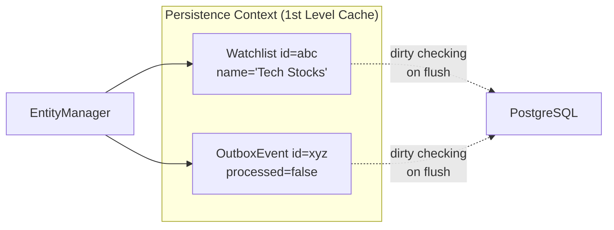
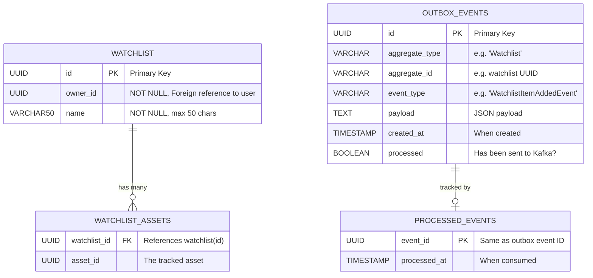
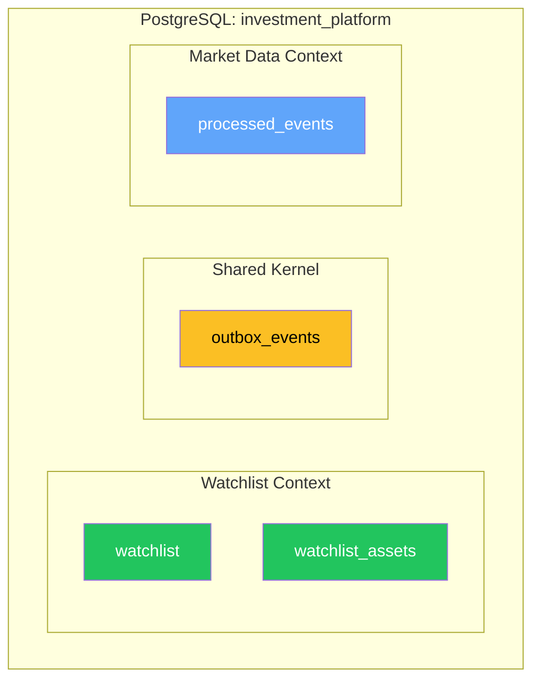
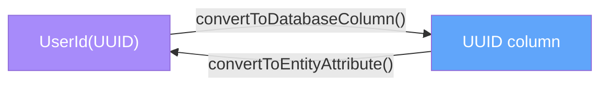

# Chapter 7: PostgreSQL & Data Persistence

[← Chapter 6](./06_EVENT_DRIVEN_KAFKA.md) | [Chapter 8 →](./08_REST_API_AND_SECURITY.md)

---

## 7.1 PostgreSQL — From First Principles

### What Is PostgreSQL?

**PostgreSQL** (often called "Postgres") is an open-source **object-relational database management system (ORDBMS)** with over 35 years of development. It was originally developed at UC Berkeley in 1986 as "POSTGRES" (post-Ingres).

PostgreSQL is known for:
- Strict **ACID** compliance (critical for financial data)
- Extensibility (custom types, functions, extensions)
- Advanced features (JSONB, full-text search, window functions)

### 7.1.1 ACID Properties

ACID is a set of guarantees that database transactions must satisfy:

| Property | Meaning | MarketCanvas Example |
|----------|---------|---------------------|
| **A**tomicity | All operations in a transaction succeed or all fail | Watchlist update + OutboxEvent save are atomic |
| **C**onsistency | Transaction moves DB from one valid state to another | NOT NULL constraints prevent invalid data |
| **I**solation | Concurrent transactions don't interfere | Two users adding assets simultaneously |
| **D**urability | Committed data survives crashes | Once COMMIT returns, data is on disk |

### 7.1.2 MVCC (Multi-Version Concurrency Control)

PostgreSQL uses **MVCC** to handle concurrent access. Instead of locking rows when they're read, PostgreSQL keeps **multiple versions** of each row. Each transaction sees a snapshot of the database as it existed when the transaction started.

This means:
- Readers never block writers
- Writers never block readers
- Only writers can block other writers (on the same row)

### 7.1.3 Isolation Levels

| Level | Dirty Read | Non-Repeatable Read | Phantom Read | PostgreSQL Default |
|-------|-----------|-------------------|-------------|-------------------|
| Read Uncommitted | ⚠️ | ⚠️ | ⚠️ | No (treated as Read Committed) |
| **Read Committed** | ✅ Safe | ⚠️ | ⚠️ | **Yes (default)** |
| Repeatable Read | ✅ Safe | ✅ Safe | ⚠️ | No |
| Serializable | ✅ Safe | ✅ Safe | ✅ Safe | No |

MarketCanvas uses the default **Read Committed** level, which is sufficient for its current workload.

---

## 7.2 JPA and Hibernate

### What Is ORM?

**Object-Relational Mapping (ORM)** is a technique for converting between Java objects and database tables. Without ORM, you write raw SQL:

```java
// WITHOUT ORM
String sql = "INSERT INTO watchlist (id, owner_id, name) VALUES (?, ?, ?)";
PreparedStatement stmt = connection.prepareStatement(sql);
stmt.setObject(1, watchlist.getId());
stmt.setObject(2, watchlist.getOwnerId().value());
stmt.setString(3, watchlist.getName());
stmt.executeUpdate();
```

With JPA/Hibernate, this becomes:

```java
// WITH JPA
repository.save(watchlist);  // That's it.
```

### What Is JPA?

**Java Persistence API (JPA)** is a **specification** — a set of interfaces and annotations that define how Java objects map to database tables. JPA is NOT an implementation; it's a contract.

### What Is Hibernate?

**Hibernate** is the most popular **implementation** of JPA. When you use `@Entity` and `@Id`, you're writing JPA code. Hibernate is the engine that executes it.

```
JPA (specification) ← defines the rules
  └── Hibernate (implementation) ← executes the rules
      └── JDBC Driver (PostgreSQL) ← talks to the database
```

### The Persistence Context

Hibernate maintains a **Persistence Context** — an in-memory cache of entities being managed. When you call `repository.findById()`, the returned entity is "managed" — Hibernate tracks changes to it.



**Dirty checking:** At the end of a transaction, Hibernate compares the current state of managed entities with their original state. If anything changed, Hibernate automatically generates `UPDATE` SQL. This is why `event.setProcessed(true)` in `OutboxRelay` works without explicitly calling `save()`.

---

## 7.3 Database Schema

### Entity-Relationship Diagram



### Table Definitions

#### `watchlist` (Owner: Watchlist Context)

| Column | Type | Constraints | Source |
|--------|------|-------------|--------|
| `id` | `UUID` | `PRIMARY KEY` | `@Id` on `Watchlist.id` |
| `owner_id` | `UUID` | `NOT NULL` | `@Column(nullable=false)` on `Watchlist.ownerId` |
| `name` | `VARCHAR(50)` | `NOT NULL` | `@Column(nullable=false, length=50)` |

#### `watchlist_assets` (Owner: Watchlist Context)

| Column | Type | Constraints | Source |
|--------|------|-------------|--------|
| `watchlist_id` | `UUID` | `FOREIGN KEY → watchlist(id)` | `@JoinColumn(name="watchlist_id")` |
| `asset_id` | `UUID` | | `@Column(name="asset_id")` |

#### `outbox_events` (Owner: Shared Kernel)

| Column | Type | Constraints | Source |
|--------|------|-------------|--------|
| `id` | `UUID` | `PRIMARY KEY` | `@Id` on `OutboxEvent.id` |
| `aggregate_type` | `VARCHAR(255)` | | Field: always `"Watchlist"` |
| `aggregate_id` | `VARCHAR(255)` | | The watchlist UUID |
| `event_type` | `VARCHAR(255)` | | Class name of the event |
| `payload` | `TEXT` | `@Lob` | JSON-serialized domain event |
| `created_at` | `TIMESTAMP` | | `Instant.now()` at creation |
| `processed` | `BOOLEAN` | Default: `false` | Flipped to `true` by OutboxRelay |

#### `processed_events` (Owner: Market Data Context)

| Column | Type | Constraints | Source |
|--------|------|-------------|--------|
| `event_id` | `UUID` | `PRIMARY KEY` | Same as outbox event ID |
| `processed_at` | `TIMESTAMP` | | When the consumer processed it |

### Schema Ownership

Each bounded context **owns its tables**, even though they share the same PostgreSQL database:



---

## 7.4 AttributeConverters — Bridging Domain and Database

JPA doesn't know how to persist a `UserId` record. The `AttributeConverter` teaches it:



The `autoApply = true` flag means JPA automatically uses this converter wherever it encounters a `UserId` type. You don't need to annotate each field individually.

---

## 7.5 Spring Data Query Methods

Spring Data JPA generates SQL from method names:

| Method Name | Generated SQL |
|------------|--------------|
| `findById(UUID)` | `SELECT * FROM watchlist WHERE id = ?` |
| `existsById(UUID)` | `SELECT COUNT(*) > 0 FROM processed_events WHERE event_id = ?` |
| `findTop100ByProcessedFalseOrderByCreatedAt()` | `SELECT * FROM outbox_events WHERE processed = false ORDER BY created_at LIMIT 100` |

### Method Name Parsing Rules

| Part | Meaning |
|------|---------|
| `find` | SELECT query |
| `Top100` | LIMIT 100 |
| `By` | WHERE clause begins |
| `Processed` | Column name: `processed` |
| `False` | Value: `= false` |
| `OrderBy` | ORDER BY clause begins |
| `CreatedAt` | Column name: `created_at` |
| (no suffix) | ASC (default) |

---

## 7.6 The Open Session in View Anti-Pattern

### What It Is

By default, Spring Boot keeps a Hibernate session open for the **entire HTTP request lifecycle** — from the moment the controller method starts until the response is serialized to JSON.

This means lazy-loaded collections can be fetched **during JSON serialization**, outside any `@Transactional` boundary. While convenient, it hides N+1 query problems.

### Why MarketCanvas Disables It

```yaml
spring:
  jpa:
    open-in-view: false  # ← Explicitly disabled
```

With this disabled, any lazy loading outside a `@Transactional` method throws a `LazyInitializationException`. This forces developers to think about data fetching explicitly — a best practice for production applications.

---

## 7.7 Technical Debt: Schema Management

> [!WARNING]
> **`hibernate.ddl-auto: update` must be replaced with Flyway before production.** Hibernate's auto-DDL:
> - Never drops columns (even if you remove a field from the entity)
> - Creates unoptimized indexes
> - Cannot handle complex migrations (rename column, split table, data backfill)
> - Provides no version history or rollback capability

The planned migration path: `ddl-auto: update` → **Flyway** (versioned SQL migration scripts).

---

## 7.8 Recommended Indexes (Not Yet Created)

| Table | Index | Purpose |
|-------|-------|---------|
| `outbox_events` | `(processed, created_at)` | Optimize OutboxRelay polling query |
| `watchlist_assets` | `(watchlist_id)` | Already created by foreign key |
| `processed_events` | Primary key on `event_id` | Already exists |

---

[← Chapter 6](./06_EVENT_DRIVEN_KAFKA.md) | [Chapter 8: REST API & Spring Security →](./08_REST_API_AND_SECURITY.md)
