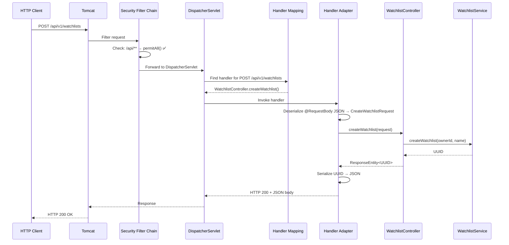

# Chapter 8: REST API & Spring Security

[← Chapter 7](./07_DATABASE_AND_PERSISTENCE.md) | [Chapter 9 →](./09_TESTING_AND_QUALITY.md)

---

## 8.1 REST — From First Principles

### What Is REST?

**REST (Representational State Transfer)** is an architectural style for building web APIs. It was defined by Roy Fielding in his 2000 PhD dissertation. REST defines a set of constraints for how clients and servers communicate over HTTP.

### Core REST Principles

| Principle | Meaning | MarketCanvas |
|-----------|---------|-------------|
| **Stateless** | Each request contains all info needed | No server-side sessions |
| **Client-Server** | Separation of concerns | Frontend (future) ↔ Backend |
| **Uniform Interface** | Standardized HTTP methods and URLs | `POST /api/v1/watchlists` |
| **Resource-Based** | Everything is a resource with a URL | Watchlist = `/api/v1/watchlists/{id}` |

### HTTP Methods

| Method | Purpose | Safe? | Idempotent? | MarketCanvas |
|--------|---------|-------|-------------|-------------|
| `GET` | Read resource | ✅ | ✅ | Not yet implemented |
| `POST` | Create resource | ❌ | ❌ | Create watchlist, add asset |
| `PUT` | Replace resource | ❌ | ✅ | Not yet implemented |
| `PATCH` | Partial update | ❌ | ❌ | Not yet implemented |
| `DELETE` | Remove resource | ❌ | ✅ | Not yet implemented |

### HTTP Status Codes

| Code | Meaning | When Used |
|------|---------|-----------|
| `200 OK` | Success | Currently used for all successful responses |
| `201 Created` | Resource created | Should be used for POST (future improvement) |
| `400 Bad Request` | Invalid input | When validation fails |
| `404 Not Found` | Resource not found | When watchlist ID doesn't exist |
| `500 Internal Server Error` | Server failure | Unhandled exceptions |

---

## 8.2 The HTTP Request Lifecycle in Spring



---

## 8.3 API Documentation

### Endpoint 1: Create Watchlist

| Property | Value |
|----------|-------|
| **Method** | `POST` |
| **URL** | `/api/v1/watchlists` |
| **Authentication** | None (development) |
| **Content-Type** | `application/json` |

#### Request Body

```json
{
  "ownerId": "550e8400-e29b-41d4-a716-446655440000",
  "name": "Tech Stocks"
}
```

| Field | Type | Required | Validation |
|-------|------|----------|------------|
| `ownerId` | UUID | Yes | Must not be null |
| `name` | String | Yes | 1-50 chars, not blank |

#### Success Response (HTTP 200)

```json
"a1b2c3d4-e5f6-7890-abcd-ef1234567890"
```

#### Error Cases

| Scenario | Response Code | Cause |
|----------|--------------|-------|
| `ownerId` is null | 500 | `IllegalArgumentException` in factory method |
| `name` is empty | 500 | `IllegalArgumentException` in `rename()` |
| `name` > 50 chars | 500 | `IllegalArgumentException` in `rename()` |

> [!NOTE]
> Currently, domain exceptions result in HTTP 500 because there is no global exception handler (`@ControllerAdvice`). A production system should map `IllegalArgumentException` → HTTP 400 and `IllegalStateException` → HTTP 409.

#### Example cURL

```bash
curl.exe -X POST http://localhost:8080/api/v1/watchlists \
  -H "Content-Type: application/json" \
  -d "{\"ownerId\": \"550e8400-e29b-41d4-a716-446655440000\", \"name\": \"Tech Stocks\"}"
```

---

### Endpoint 2: Add Asset to Watchlist

| Property | Value |
|----------|-------|
| **Method** | `POST` |
| **URL** | `/api/v1/watchlists/{id}/assets` |
| **Authentication** | None (development) |
| **Content-Type** | `application/json` |

#### Request Body

```json
{
  "assetId": "660e8400-e29b-41d4-a716-446655440000"
}
```

#### Success Response (HTTP 200)

Empty body.

#### Error Cases

| Scenario | Response Code | Cause |
|----------|--------------|-------|
| Watchlist not found | 500 | `IllegalArgumentException`: "Watchlist not found" |
| 11th asset | 500 | `IllegalStateException`: "max 10 Assets" |
| `assetId` is null | 500 | `IllegalArgumentException` in `addAsset()` |

#### Example cURL

```bash
curl.exe -X POST http://localhost:8080/api/v1/watchlists/a1b2c3d4-.../assets \
  -H "Content-Type: application/json" \
  -d "{\"assetId\": \"660e8400-e29b-41d4-a716-446655440000\"}"
```

---

## 8.4 Spring Security — From First Principles

### 8.4.1 Authentication vs Authorization

| Concept | Question | Example |
|---------|----------|---------|
| **Authentication** | "Who are you?" | Login with username/password |
| **Authorization** | "What can you do?" | Free users can't access Pro features |

### 8.4.2 The Security Filter Chain

Spring Security works as a chain of **servlet filters** that intercept every HTTP request:


### 8.4.3 SecurityConfig — Line by Line

```java
@Configuration                                               // 1
public class SecurityConfig {                                // 2
                                                             
    @Bean                                                    // 3
    public SecurityFilterChain filterChain(HttpSecurity http) // 4
            throws Exception {                               // 5
        http                                                 // 6
            .csrf(csrf -> csrf.disable())                    // 7
            .authorizeHttpRequests(auth -> auth              // 8
                .requestMatchers("/api/**").permitAll()       // 9
                .anyRequest().authenticated()                 // 10
            );                                               // 11
        return http.build();                                 // 12
    }                                                        // 13
}
```

| Line | What It Does | Why |
|------|-------------|-----|
| 1 | `@Configuration` | Registers this as a Spring config class |
| 3-4 | `@Bean` + `SecurityFilterChain` | Replaces the default security config |
| 7 | `csrf.disable()` | REST APIs don't use CSRF tokens (they use Authorization headers) |
| 9 | `.requestMatchers("/api/**").permitAll()` | ALL `/api/` endpoints are public (DEV ONLY) |
| 10 | `.anyRequest().authenticated()` | Everything else requires authentication |

### 8.4.4 What Is CSRF?

**Cross-Site Request Forgery (CSRF)** is an attack where a malicious website tricks a user's browser into making requests to your server using the user's existing session cookies.

CSRF protection works by including a random token in forms that the server validates. REST APIs that use **Authorization headers** (not cookies) are immune to CSRF, so it's safe to disable.

### 8.4.5 Production Security Plan

| Feature | Current State | Production Plan |
|---------|--------------|-----------------|
| Authentication | None | OAuth2 + OIDC (Google/Apple/Microsoft) |
| Token Format | None | JWT with short expiry (15 min) + refresh tokens |
| Authorization | `permitAll()` | RBAC: FREE_USER, PRO_USER, TEAM_ADMIN, PLATFORM_ADMIN |
| CSRF | Disabled | Remains disabled (REST + JWT) |
| Password Storage | N/A | BCrypt hashing (via delegated auth providers) |
| Rate Limiting | None | Redis-based rate limiting |

---

## 8.5 Error Handling (Current Gaps)

Currently, the API has no global exception handler. All exceptions become HTTP 500.

**Planned improvement** — a `@ControllerAdvice`:

```java
// FUTURE: Global exception handler
@ControllerAdvice
public class GlobalExceptionHandler {
    
    @ExceptionHandler(IllegalArgumentException.class)
    public ResponseEntity<String> handleBadRequest(IllegalArgumentException e) {
        return ResponseEntity.badRequest().body(e.getMessage());
    }
    
    @ExceptionHandler(IllegalStateException.class)
    public ResponseEntity<String> handleConflict(IllegalStateException e) {
        return ResponseEntity.status(409).body(e.getMessage());
    }
}
```

---

[← Chapter 7](./07_DATABASE_AND_PERSISTENCE.md) | [Chapter 9: Testing & Quality →](./09_TESTING_AND_QUALITY.md)
