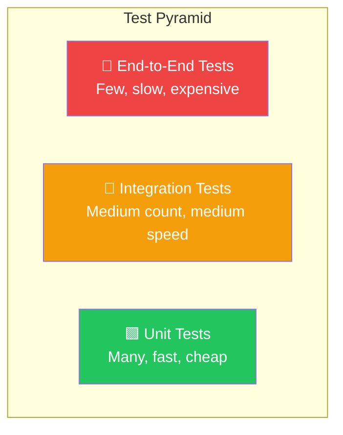
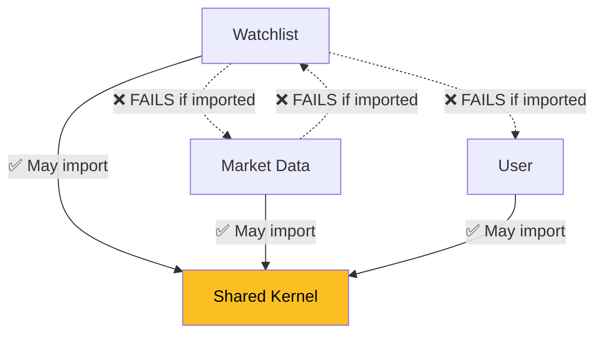

# Chapter 9: Testing & Quality

[← Chapter 8](./08_REST_API_AND_SECURITY.md) | [Chapter 10 →](./10_DEVOPS_AND_PRODUCTION.md)

---

## 9.1 Why We Test

### The Cost of Bugs

| When Bug is Found | Relative Cost to Fix |
|-------------------|---------------------|
| During coding | 1x |
| During testing | 10x |
| In production | 100x |
| After data corruption in a financial platform | 💀 |

### The Test Pyramid



| Type | Speed | Scope | MarketCanvas Status |
|------|-------|-------|-------------------|
| **Unit** | Milliseconds | Single class | ✅ WatchlistTest |
| **Architecture** | Seconds | Package structure | ✅ ArchitectureEnforcementTest |
| **Integration** | Seconds | Multiple components | ⚠️ MarketCanvasApplicationTests (context only) |
| **End-to-End** | Minutes | Full system | ✅ Manual (cURL verified) |

---

## 9.2 JUnit 5 — From First Principles

### What Is JUnit?

**JUnit** is the standard testing framework for Java. JUnit 5 (released 2017) is the latest version, consisting of three components:

| Component | Purpose |
|-----------|---------|
| **JUnit Platform** | Foundation for running tests |
| **JUnit Jupiter** | New programming model and annotations |
| **JUnit Vintage** | Backward compatibility with JUnit 4 |

### The Arrange-Act-Assert Pattern

Every test follows three steps:

```java
@Test
void testSomething() {
    // 1. ARRANGE — Set up test data
    UserId owner = new UserId(UUID.randomUUID());
    Watchlist watchlist = Watchlist.create(owner, "Test List");
    
    // 2. ACT — Perform the action being tested
    watchlist.addAsset(new AssetId(UUID.randomUUID()));
    
    // 3. ASSERT — Verify the result
    assertEquals(1, watchlist.getAssets().size());
}
```

---

## 9.3 Test 1: WatchlistTest — Unit Test

This test verifies the **business invariant** that free-tier watchlists cannot hold more than 10 assets.

```java
package org.workshop.marketcanvas;

import org.junit.jupiter.api.Test;
import org.workshop.marketcanvas.sharedkernel.domain.AssetId;
import org.workshop.marketcanvas.sharedkernel.domain.UserId;
import org.workshop.marketcanvas.watchlist.domain.Watchlist;
import java.util.UUID;
import static org.junit.jupiter.api.Assertions.assertEquals;
import static org.junit.jupiter.api.Assertions.assertThrows;

public class WatchlistTest {

    @Test
    void addAsset_throwsException_whenAddingEleventhAsset() {
        // 1. ARRANGE: Create a watchlist using the factory method
        UserId dummyOwnerId = new UserId(UUID.randomUUID());
        Watchlist watchlist = Watchlist.create(dummyOwnerId, "Watch list 1");

        // Fill to maximum capacity (10 assets)
        for (int i = 0; i < 10; i++) {
            watchlist.addAsset(new AssetId(UUID.randomUUID()));
        }

        // 2. ACT & ASSERT: The 11th attempt must throw
        IllegalStateException exception = assertThrows(
                IllegalStateException.class,
                () -> watchlist.addAsset(new AssetId(UUID.randomUUID())),
                "Expected addAsset to throw, but it didn't"
        );

        // 3. VERIFY: Check the exact error message
        assertEquals(
            "Free-Tier Watchlists can hold a maximum of 10 Assets",
            exception.getMessage()
        );
    }
}
```

### Key Design Decisions

| Decision | Why |
|----------|-----|
| Uses `Watchlist.create()` (not constructor) | Tests the real creation path, not internal implementation |
| Tests behavior, not state | Verifies what happens when a rule is violated |
| Checks exact message | Ensures we caught the RIGHT exception |
| No Spring context needed | Pure unit test — runs in milliseconds |
| No mocking needed | Aggregate has no dependencies |

### What This Test Proves

- ✅ Free-tier limit of 10 assets is enforced
- ✅ The aggregate throws `IllegalStateException` (not `IllegalArgumentException`)
- ✅ The error message is user-friendly and descriptive
- ✅ The factory method correctly creates a valid watchlist

### What This Test Does NOT Cover (Gaps)

- ❌ Adding a null asset
- ❌ Adding a duplicate asset
- ❌ Renaming with invalid input
- ❌ Creating with null owner
- ❌ Domain event emission

---

## 9.4 Test 2: ArchitectureEnforcementTest — Architecture Test

```java
@AnalyzeClasses(packages = "org.workshop.marketcanvas")
public class ArchitectureEnforcementTest {

    @ArchTest
    static final ArchRule moduleShouldBeIndependent = layeredArchitecture()
        .consideringAllDependencies()
        .layer("User").definedBy("..user..")
        .layer("Watchlist").definedBy("..watchlist..")
        .layer("MarketData").definedBy("..marketdata..")
        .layer("SharedKernel").definedBy("..sharedkernel..")
        .whereLayer("Watchlist").mayOnlyAccessLayers("SharedKernel")
        .whereLayer("User").mayOnlyAccessLayers("SharedKernel")
        .whereLayer("MarketData").mayOnlyAccessLayers("SharedKernel")
        .withOptionalLayers(true);
}
```

### What This Test Enforces



### How ArchUnit Works Internally

1. **Class analysis** — ArchUnit reads compiled `.class` files (not source code)
2. **Dependency extraction** — For each class, it identifies all imported classes
3. **Rule evaluation** — It checks if any import violates the declared rules
4. **Report** — Violations are reported as test failures with exact file and line

### Why This Matters

Without this test, a developer might accidentally add:

```java
// In WatchlistService.java
import org.workshop.marketcanvas.marketdata.application.messaging.WatchlistEventConsumer;
```

This would create a **hidden dependency** between two contexts that should be decoupled. The ArchUnit test catches this at build time.

---

## 9.5 Test 3: MarketCanvasApplicationTests — Smoke Test

```java
@SpringBootTest
class MarketCanvasApplicationTests {

    @Test
    void contextLoads() {
    }
}
```

### What This Does

This is a **smoke test** — it verifies that the entire Spring application context starts without errors. If any bean fails to create (missing dependency, configuration error, database connection failure), this test fails.

### What It Proves

- ✅ All beans can be created
- ✅ All auto-configuration works
- ✅ No circular dependencies
- ✅ Database connection is valid
- ✅ Kafka connection configuration is valid

> [!WARNING]
> This test requires a running PostgreSQL and Kafka instance. It will fail if Docker Compose is not running. This is an integration test, not a unit test.

---

## 9.6 Testing Gaps & Recommendations

### Current Coverage Matrix

| Component | Unit Test | Integration Test | Status |
|-----------|-----------|-----------------|--------|
| `Watchlist` aggregate (happy path) | ❌ | ❌ | ⚠️ Missing |
| `Watchlist` aggregate (max 10 rule) | ✅ | ❌ | Partial |
| `Watchlist` aggregate (null handling) | ❌ | ❌ | ⚠️ Missing |
| `Watchlist` aggregate (domain events) | ❌ | ❌ | ⚠️ Missing |
| `WatchlistService` | ❌ | ❌ | ⚠️ Missing |
| `WatchlistController` | ❌ | ❌ | ⚠️ Missing |
| `WatchlistEventConsumer` | ❌ | ❌ | ⚠️ Missing |
| `OutboxRelay` | ❌ | ❌ | ⚠️ Missing |
| `WatchlistOutboxListener` | ❌ | ❌ | ⚠️ Missing |
| Module boundaries | ✅ | N/A | ✅ Complete |
| Context loads | N/A | ✅ | ✅ Complete |

### Recommended Additional Tests

#### Unit Tests (No Spring)

```java
// Test: Creating a watchlist
@Test
void create_succeeds_withValidInput() {
    Watchlist w = Watchlist.create(UserId.generate(), "My List");
    assertNotNull(w.getId());
    assertEquals("My List", w.getName());
}

// Test: Null owner rejected
@Test
void create_throws_whenOwnerIsNull() {
    assertThrows(IllegalArgumentException.class,
        () -> Watchlist.create(null, "My List"));
}

// Test: Domain event emitted on addAsset
@Test
void addAsset_emitsDomainEvent() {
    Watchlist w = Watchlist.create(UserId.generate(), "Test");
    w.addAsset(AssetId.generate());
    assertEquals(1, w.domainEvents().size());
}

// Test: Duplicate assets are idempotent
@Test
void addAsset_isIdempotent_forDuplicates() {
    AssetId asset = AssetId.generate();
    Watchlist w = Watchlist.create(UserId.generate(), "Test");
    w.addAsset(asset);
    w.addAsset(asset);  // Should not throw or add twice
    assertEquals(1, w.getAssets().size());
}
```

#### Integration Tests (With Spring)

```java
// Test: Controller returns 200 for valid request
@WebMvcTest(WatchlistController.class)
class WatchlistControllerTest {
    @Autowired MockMvc mockMvc;
    @MockBean WatchlistService service;
    
    @Test
    void createWatchlist_returns200() throws Exception {
        when(service.createWatchlist(any(), any())).thenReturn(UUID.randomUUID());
        
        mockMvc.perform(post("/api/v1/watchlists")
            .contentType(MediaType.APPLICATION_JSON)
            .content("{\"ownerId\":\"...\",\"name\":\"Test\"}"))
            .andExpect(status().isOk());
    }
}
```

---

## 9.7 Testing Conventions

| Convention | Reason |
|-----------|--------|
| Test class name: `ClassNameTest` | Consistent naming |
| Test method name: `methodName_expectedBehavior_condition` | Self-documenting |
| Use factory methods, not constructors | Test the real creation path |
| No `@SpringBootTest` for unit tests | Unit tests must be fast (< 100ms) |
| Test through public API only | Don't access private fields/methods |

---

[← Chapter 8](./08_REST_API_AND_SECURITY.md) | [Chapter 10: DevOps & Production Readiness →](./10_DEVOPS_AND_PRODUCTION.md)
