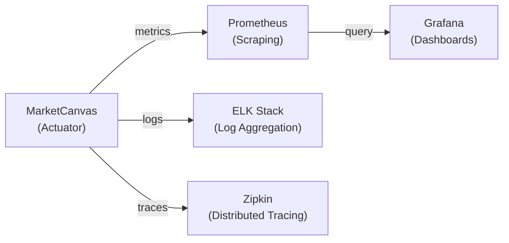
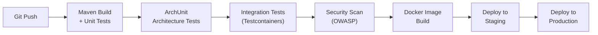

# Chapter 10: DevOps, Deployment & Production Readiness

[← Chapter 9](./09_TESTING_AND_QUALITY.md) | [Table of Contents](./00_TABLE_OF_CONTENTS.md)

---

## 10.1 Docker — From First Principles

### What Is Containerization?

Before Docker, deploying software was often described as "it works on my machine." One developer's laptop might have Java 11, another has Java 21. One has PostgreSQL 14, another has 16. Docker eliminates this by packaging everything into a standardized container.

**A container is:**
- An isolated process on the host OS
- Has its own filesystem, network, and process tree
- Shares the host OS kernel (unlike a virtual machine)

### Docker vs Virtual Machines

| Feature | Docker Container | Virtual Machine |
|---------|-----------------|-----------------|
| Start time | Seconds | Minutes |
| Size | Megabytes | Gigabytes |
| Isolation | Process-level | Hardware-level |
| Overhead | Minimal | Significant |
| OS | Shares host kernel | Full guest OS |

---

## 10.2 docker-compose.yml — Complete Walkthrough

```yaml
version: '3.8'                    # Compose file format version
```

### PostgreSQL Service

```yaml
services:
  postgres:
    image: postgres:16             # Official PostgreSQL 16 image
    container_name: marketcanvas-db
    ports:
      - "5433:5432"                # Host:Container port mapping
    environment:
      POSTGRES_DB: investment_platform    # Auto-create this database
      POSTGRES_USER: postgres             # Default superuser
      POSTGRES_PASSWORD: postgres         # Default password
    volumes:
      - postgres-data:/var/lib/postgresql/data  # Persist data across restarts
```

| Configuration | Value | Why |
|--------------|-------|-----|
| `image: postgres:16` | Official PostgreSQL 16 | LTS version, pgvector compatible |
| `ports: "5433:5432"` | Host port 5433 → Container port 5432 | **Port 5432 is used by native Windows PostgreSQL** |
| `POSTGRES_DB` | `investment_platform` | Matches `application.yml` JDBC URL |
| `volumes` | Named volume `postgres-data` | Data survives `docker compose down` |

> [!IMPORTANT]
> **Port 5433:** This is the most common operational issue. PostgreSQL's default port is 5432, but many developers have a native PostgreSQL installation on Windows that already uses 5432. MarketCanvas maps to 5433 to avoid conflicts. The `application.yml` JDBC URL must match: `jdbc:postgresql://localhost:5433/investment_platform`

### Kafka Service

```yaml
  kafka:
    image: apache/kafka:3.9.2      # Official Apache Kafka image
    container_name: kafka
    ports:
      - "9092:9092"
    environment:
      KAFKA_NODE_ID: 1
      KAFKA_PROCESS_ROLES: broker,controller     # KRaft: single-node mode
      KAFKA_LISTENERS: PLAINTEXT://0.0.0.0:9092,CONTROLLER://0.0.0.0:9093
      KAFKA_ADVERTISED_LISTENERS: PLAINTEXT://localhost:9092
      KAFKA_CONTROLLER_LISTENER_NAMES: CONTROLLER
      KAFKA_CONTROLLER_QUORUM_VOTERS: 1@localhost:9093
      KAFKA_OFFSETS_TOPIC_REPLICATION_FACTOR: 1
      KAFKA_TRANSACTION_STATE_LOG_REPLICATION_FACTOR: 1
      KAFKA_TRANSACTION_STATE_LOG_MIN_ISR: 1
      CLUSTER_ID: 'MkU3OEVBNTcwNTJENDM2Qk'     # Pre-generated cluster ID
```

| Configuration | Purpose |
|--------------|---------|
| `PROCESS_ROLES: broker,controller` | KRaft mode: same process handles both roles |
| `ADVERTISED_LISTENERS` | Tells Spring Boot to connect via `localhost:9092` |
| `REPLICATION_FACTOR: 1` | Single-node: no replicas possible |
| `CLUSTER_ID` | Pre-generated UUID for KRaft consensus |

### Volumes

```yaml
volumes:
  postgres-data:                   # Named volume — persists across container restarts
```

Named volumes persist data even when containers are removed. `docker compose down` keeps the volume. `docker compose down -v` **deletes** it (including all database data).

---

## 10.3 Developer Setup Guide

### Prerequisites

| Tool | Version | Verification Command |
|------|---------|---------------------|
| Java JDK | 21+ | `java -version` |
| Maven | 3.9+ | `mvn -version` |
| Docker Desktop | Latest | `docker --version` |
| Git | Any | `git --version` |

### Step 1: Start Infrastructure

```bash
# From the project root directory
docker compose up -d
```

`-d` runs containers in the background (detached mode).

### Step 2: Verify Infrastructure

```bash
# Check containers are running
docker compose ps

# Expected output:
# NAME               STATUS   PORTS
# marketcanvas-db    Up       0.0.0.0:5433->5432/tcp
# kafka              Up       0.0.0.0:9092->9092/tcp
```

### Step 3: Start the Application

```bash
# From the project root directory
mvn spring-boot:run
```

Expected output:
```
Started MarketCanvasApplication in 3.5 seconds
```

### Step 4: Verify the Application

```bash
# Create a watchlist (Windows: use curl.exe, not curl)
curl.exe -X POST http://localhost:8080/api/v1/watchlists ^
  -H "Content-Type: application/json" ^
  -d "{\"ownerId\": \"550e8400-e29b-41d4-a716-446655440000\", \"name\": \"Tech Stocks\"}"

# Expected: a UUID string like "a1b2c3d4-..."
```

### Step 5: Verify the Full Event Flow

```bash
# Add an asset (replace {watchlist-id} with the UUID from Step 4)
curl.exe -X POST http://localhost:8080/api/v1/watchlists/{watchlist-id}/assets ^
  -H "Content-Type: application/json" ^
  -d "{\"assetId\": \"660e8400-e29b-41d4-a716-446655440000\"}"

# Check application logs for:
# "Market Data reacting to new watchlist asset: [660e8400...]"
# "Successfully processed and recorded event [...]"
```

### Stopping Everything

```bash
docker compose down      # Stop containers, keep data
docker compose down -v   # Stop containers AND delete data
```

---

## 10.4 Known Operational Issues

| Issue | Symptom | Fix |
|-------|---------|-----|
| Port 5432 in use | `Bind for 0.0.0.0:5432 failed` | We use port 5433 |
| Windows `curl` alias | `curl` invokes PowerShell `Invoke-WebRequest` | Use `curl.exe` |
| `spring-kafka` vs `spring-boot-starter-kafka` | `KafkaTemplate` bean not found | Must use the `starter` variant |
| Jackson 3.x namespace | `ClassNotFoundException: com.fasterxml.jackson` | Use `tools.jackson.databind` |
| Docker not running | `Cannot connect to Docker daemon` | Start Docker Desktop first |

---

## 10.5 Technical Debt Inventory

| ID | Issue | Severity | Fix |
|----|-------|----------|-----|
| TD-001 | `ddl-auto: update` in production | 🔴 Critical | Migrate to Flyway |
| TD-002 | No `@ControllerAdvice` exception handler | 🟡 Medium | Add global error handler |
| TD-003 | `processed_events` table grows forever | 🟡 Medium | Add retention/cleanup job |
| TD-004 | Security permits all traffic | 🔴 Critical | Implement OAuth2/OIDC |
| TD-005 | Hardcoded Kafka topic strings | 🟢 Low | Centralize in constants class |
| TD-006 | No DLQ for poison pills | 🟡 Medium | Add `DefaultErrorHandler` + `DeadLetterPublishingRecoverer` |
| TD-007 | No health check endpoints | 🟢 Low | Add Spring Boot Actuator |

---

## 10.6 Production Readiness Checklist

| Category | Item | Status |
|----------|------|--------|
| **Database** | Flyway migrations | ❌ |
| **Database** | Connection pooling (HikariCP) | ✅ (auto-configured) |
| **Database** | Backup strategy | ❌ |
| **Security** | OAuth2/OIDC authentication | ❌ |
| **Security** | RBAC authorization | ❌ |
| **Security** | Rate limiting | ❌ |
| **Security** | Input validation | ⚠️ Partial (domain only) |
| **Monitoring** | Health endpoints (Actuator) | ❌ |
| **Monitoring** | Metrics (Prometheus) | ❌ |
| **Monitoring** | Distributed tracing | ❌ |
| **Monitoring** | Log aggregation | ❌ |
| **Resilience** | Dead Letter Queue | ❌ |
| **Resilience** | Circuit breakers | ❌ |
| **Resilience** | Retry policies | ⚠️ Partial (Kafka only) |
| **API** | OpenAPI/Swagger documentation | ❌ |
| **API** | Global exception handler | ❌ |
| **Testing** | Unit test coverage > 80% | ❌ |
| **Testing** | Integration test suite | ❌ |

---

## 10.7 Monitoring Strategy (Planned)



### Key Metrics to Monitor

| Metric | Why |
|--------|-----|
| `outbox_events_pending_count` | If this grows, OutboxRelay is failing |
| `kafka_consumer_lag` | If this grows, consumers are falling behind |
| `http_request_duration` | API response time |
| `jvm_memory_used` | Memory leaks |
| `db_connection_pool_active` | Connection exhaustion |

---

## 10.8 CI/CD Pipeline (Planned)



---

## 10.9 Project Evolution Roadmap

### Stage 3: Microservices Extraction (Future)

When the time comes to extract microservices, the modular monolith structure makes it straightforward:

| Step | Action |
|------|--------|
| 1 | Move `watchlist/` package to a new Spring Boot project |
| 2 | Move `marketdata/` package to a new Spring Boot project |
| 3 | Replace `ApplicationEvent` publishing with Kafka-only |
| 4 | Each service gets its own PostgreSQL schema |
| 5 | Add API Gateway (e.g., Spring Cloud Gateway) |
| 6 | Add service discovery (e.g., Consul or Eureka) |

### Planned Modules

| Module | Priority | Description |
|--------|----------|-------------|
| Research Workspace | P0 | AI RAG-powered research with pgvector |
| Investment Thesis | P0 | Thesis lifecycle management |
| Portfolio Overlay | P1 | Holdings analysis, risk metrics |
| Notification Engine | P1 | Multi-channel alerting |
| Admin Dashboard | P2 | Platform administration |

---

## 10.10 Glossary

| Term | Definition |
|------|-----------|
| **Aggregate** | Cluster of domain objects treated as one unit |
| **Aggregate Root** | The entry point to an aggregate |
| **ACID** | Atomicity, Consistency, Isolation, Durability |
| **Bean** | Object managed by the Spring IoC container |
| **Bounded Context** | A boundary for a consistent domain model |
| **Consumer Group** | Set of Kafka consumers sharing partition workload |
| **DDD** | Domain-Driven Design |
| **DI** | Dependency Injection |
| **DLQ** | Dead Letter Queue — where failed messages go |
| **DTO** | Data Transfer Object — carries data between layers |
| **Entity** | Object with a unique identity |
| **Factory Method** | Static method that creates objects with validation |
| **Idempotent** | Operation that produces the same result when repeated |
| **IoC** | Inversion of Control |
| **JPA** | Java Persistence API |
| **KRaft** | Kafka Raft — Zookeeper replacement |
| **MVCC** | Multi-Version Concurrency Control |
| **ORM** | Object-Relational Mapping |
| **Outbox Pattern** | Store events in DB, relay to broker asynchronously |
| **Partition** | Subdivision of a Kafka topic for parallelism |
| **Poison Pill** | Message that can never be successfully processed |
| **REST** | Representational State Transfer |
| **Shared Kernel** | Small set of types shared between bounded contexts |
| **Transient Error** | Temporary failure that may succeed on retry |
| **Value Object** | Object defined by its attributes, not identity |

---

## End of Handbook

You have now completed the MarketCanvas Engineering Handbook. You understand:

- ✅ Every package and its purpose
- ✅ Every class and its role
- ✅ Every method and its behavior
- ✅ Why the architecture exists
- ✅ Why every framework was chosen
- ✅ How every component communicates
- ✅ How every design pattern works
- ✅ How every infrastructure component operates
- ✅ How requests flow through the system
- ✅ How data moves
- ✅ How failures are handled
- ✅ How the project can be extended

Welcome to the team. 🚀

---

[← Chapter 9](./09_TESTING_AND_QUALITY.md) | [Table of Contents](./00_TABLE_OF_CONTENTS.md)
