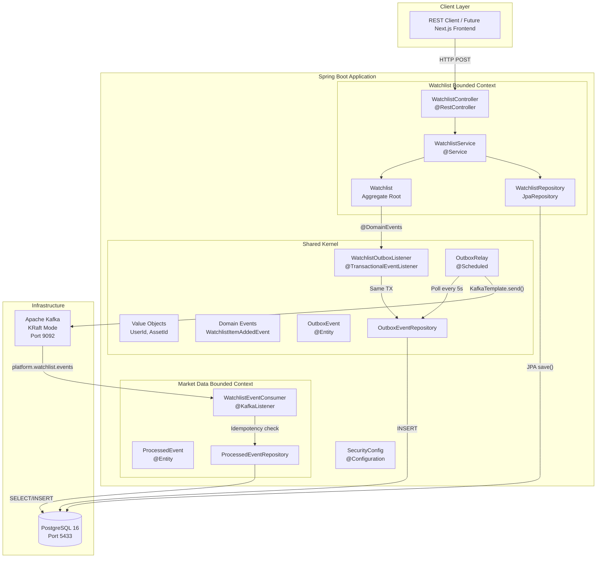
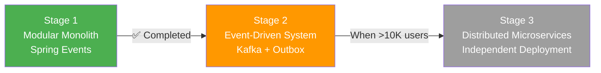
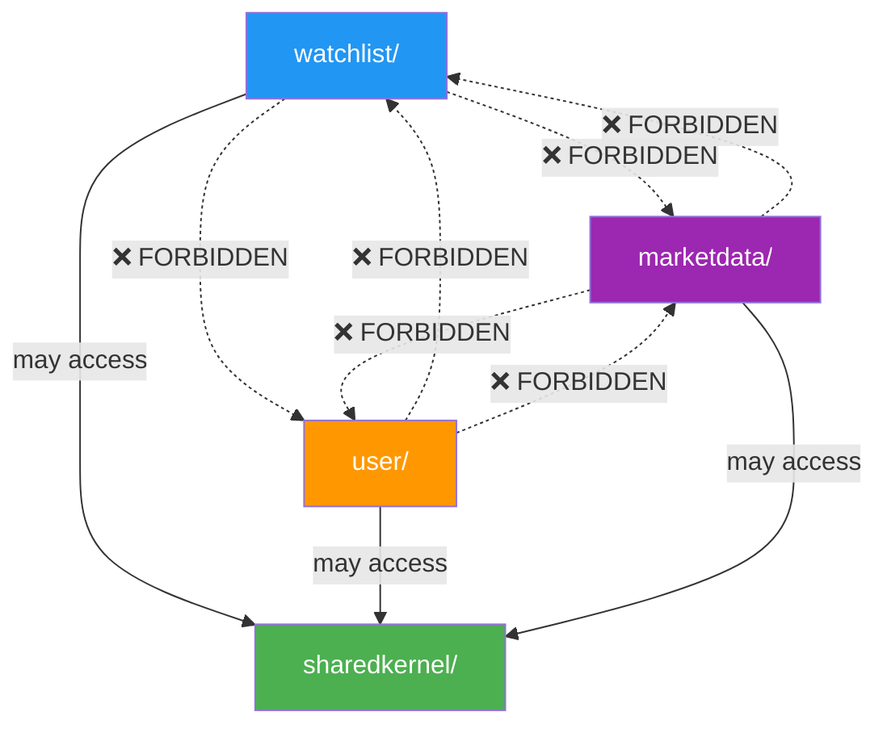
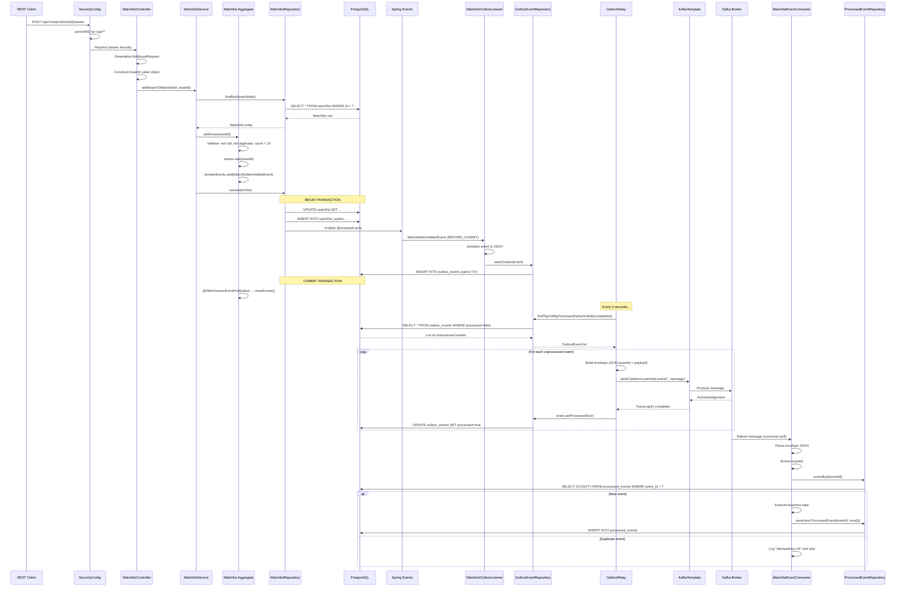

# MarketCanvas Engineering Handbook

## Part 1: Foundation & Architecture Overview

> **Version:** 1.0 — July 2026
> **Audience:** Engineers with basic Java knowledge joining the MarketCanvas team.
> **Philosophy:** This handbook explains everything from first principles. No prior knowledge of Spring, Kafka, DDD, or distributed systems is assumed.

---

## Master Table of Contents (All Parts)

| Part | Title | Topics |
|------|-------|--------|
| **1** | **Foundation & Architecture Overview** | Project vision, tech stack, system architecture, package map |
| **2** | Spring Boot & Dependency Injection Deep Dive | IoC, beans, auto-configuration, component scan, lifecycle |
| **3** | Domain-Driven Design Implementation | Aggregates, value objects, entities, bounded contexts, domain events |
| **4** | The Shared Kernel | Cross-cutting value objects, event contracts, JPA converters |
| **5** | Event-Driven Architecture & Apache Kafka | Messaging fundamentals, Kafka internals, consumers, producers |
| **6** | The Transactional Outbox Pattern | Dual-write problem, outbox entity, relay, listener |
| **7** | Database, JPA & PostgreSQL | ACID, MVCC, Hibernate, entity mapping, schema |
| **8** | REST API, Security & Request Flow | HTTP, controllers, security filter chain, end-to-end sequence |
| **9** | Testing, DevOps & Infrastructure | JUnit, ArchUnit, Docker, Compose, CI/CD |
| **10** | Design Patterns, Performance & Evolution | Factory Method, Observer, patterns catalog, roadmap |

---

## Chapter 1: What Is MarketCanvas?

### 1.1 The Problem

Every day, financial markets generate millions of data points — earnings reports, price movements, analyst ratings, macroeconomic indicators, SEC filings, news articles. An active investor spending 2-3 hours per day researching cannot possibly process all of this information.

The result is a **signal-to-noise problem**: important information is buried under irrelevant noise.

### 1.2 The Solution

**MarketCanvas** is an AI-powered Financial Intelligence Platform. It answers one question:

> *"What should I pay attention to right now — and why?"*

It is **not** a brokerage, robo-advisor, or prediction engine. It focuses on the underserved layer between raw data and investment decisions: **understanding and context**.

### 1.3 Business Model

| Tier | Price | Target User |
|------|-------|-------------|
| Free — "Discover" | $0/mo | Beginners, students — habit formation |
| Pro — "Analyse" | $25/mo ($200/yr) | Active investors, content creators |
| Team — "Collaborate" | $80/mo per seat | Small RIAs, investment clubs |

**Primary MVP persona:** The Active Investor — daily monitoring, thesis-driven, 2-3hr/day research, $20-50/mo willingness to pay.

### 1.4 Core Product Principles

| Principle | Meaning |
|-----------|---------|
| Explainable | Every AI output must show reasoning and sources |
| Trustworthy | Surface uncertainty. Never present delayed data as real-time |
| Personalized | Context-aware based on user profile and risk tolerance |
| Multi-Asset | Equities, ETFs, gold, real estate, bonds — unified layer |
| AI-Assisted, Not AI-Dependent | Core features work without the LLM |

---

## Chapter 2: Technology Stack — From First Principles

### 2.1 Java 21 (LTS)

#### What is Java?
Java is a general-purpose, object-oriented programming language created by Sun Microsystems in 1995. It runs on the **Java Virtual Machine (JVM)**, which means "write once, run anywhere" — compiled Java bytecode executes on any platform with a JVM.

#### Why Java 21?
Java 21 is a **Long-Term Support (LTS)** release, meaning it receives security updates and bug fixes for years. Key features used in this project:

| Feature | Java Version | Used In MarketCanvas |
|---------|-------------|---------------------|
| Records | 16+ | `UserId`, `AssetId`, `WatchlistItemAddedEvent`, DTOs |
| Sealed classes | 17+ | Available for future domain modeling |
| Pattern matching | 21 | Available for switch expressions |
| Virtual threads | 21 | Available for high-concurrency Kafka consumers |

#### What is a Record?
A `record` is a special Java class introduced in Java 16 that is:
- **Immutable** — fields cannot be changed after creation
- **Transparent** — auto-generates `equals()`, `hashCode()`, `toString()`
- **Compact** — eliminates boilerplate

```java
// Traditional class: 30+ lines
public class UserId {
    private final UUID value;
    public UserId(UUID value) { this.value = value; }
    public UUID value() { return value; }
    @Override public boolean equals(Object o) { /* ... */ }
    @Override public int hashCode() { /* ... */ }
    @Override public String toString() { /* ... */ }
}

// Record: 1 line (equivalent)
public record UserId(UUID value) {}
```

MarketCanvas uses records for **Value Objects** and **Domain Events** — concepts we'll explore deeply in Part 3.

---

### 2.2 Spring Boot 4.1.0

#### What is Spring?
Spring is a **framework** — a pre-built skeleton that provides structure and utilities for building Java applications. Without Spring, you would need to manually:
- Create and wire together objects
- Manage database connections
- Handle HTTP requests
- Configure security
- Manage transactions

Spring automates all of this.

#### What is Spring Boot?
Spring Boot is an **opinionated layer on top of Spring** that provides:
1. **Auto-configuration** — sensible defaults based on your dependencies
2. **Embedded server** — no external Tomcat installation needed
3. **Starter dependencies** — curated dependency bundles that work together

#### Why version 4.1.0?
Spring Boot 4.x brings significant changes from 3.x:
- Jakarta EE namespace (`jakarta.*` instead of `javax.*`)
- Jackson 3.x with new package namespace (`tools.jackson.*`)
- Enhanced Kafka auto-configuration requiring `spring-boot-starter-kafka`

> [!IMPORTANT]
> Spring Boot 4.x uses `tools.jackson.databind.ObjectMapper` — NOT the legacy `com.fasterxml.jackson.databind.ObjectMapper`. The `writeValueAsString()` method now throws **checked exceptions**.

#### The Spring Boot Starters Used

| Starter | Purpose in MarketCanvas |
|---------|------------------------|
| `spring-boot-starter-data-jpa` | ORM layer — maps Java objects to PostgreSQL tables |
| `spring-boot-starter-security` | Authentication/authorization framework |
| `spring-boot-starter-webmvc` | REST API handling (embedded Tomcat, `@RestController`) |
| `spring-boot-starter-websocket` | Real-time push (planned for price streaming) |
| `spring-boot-starter-kafka` | Kafka producer/consumer auto-configuration |

---

### 2.3 Spring Modulith 2.1.0

#### What is Modularity?
In software, **modularity** means dividing a system into independent, interchangeable parts (modules). Each module:
- Has a **clear boundary** — you know what's inside and what's outside
- Has a **defined interface** — other modules interact through it, not by reaching into internals
- Can be **developed independently** — changes inside one module don't break others

#### What is Spring Modulith?
Spring Modulith is a library that helps you build **Modular Monoliths** — applications deployed as a single unit (monolith) but structured internally as independent modules.

It provides:
1. **Module boundary verification** — detects illegal cross-module dependencies
2. **Event externalization** — can automatically publish Spring events to Kafka
3. **Documentation generation** — auto-generates module dependency diagrams

#### Why a Modular Monolith instead of Microservices?

| Criterion | Modular Monolith | Microservices |
|-----------|-----------------|---------------|
| Team size | 1 developer ✅ | Multiple autonomous teams |
| Deployment | Single JAR ✅ | Dozens of containers |
| Debugging | One process ✅ | Distributed tracing needed |
| Refactoring | Move packages ✅ | Rebuild services |
| Scaling | Single JVM | Independent scaling per service |
| Failure rate | Low | 60-70% failure rate for startups |

> [!NOTE]
> MarketCanvas uses a Modular Monolith because domain boundaries are still being discovered. Wrong boundaries are cheap to fix in a monolith, expensive in microservices. The architecture is designed for future extraction — each module maps 1:1 to a potential microservice.

---

### 2.4 PostgreSQL 16

#### What is a Relational Database?
A relational database stores data in **tables** (rows and columns). Tables can reference each other through **foreign keys**, creating relationships. You query data using **SQL** (Structured Query Language).

#### What is PostgreSQL?
PostgreSQL (often called "Postgres") is an open-source relational database created in 1986 at UC Berkeley. It is known for:
- **ACID compliance** — guarantees data integrity (explained in Part 7)
- **Extensibility** — supports custom types, functions, and extensions
- **Concurrency** — uses MVCC (Multi-Version Concurrency Control) for high performance

#### Why PostgreSQL over MySQL or MongoDB?

| Feature | PostgreSQL | MySQL | MongoDB |
|---------|-----------|-------|---------|
| ACID transactions | ✅ Full | ✅ Full | Partial |
| `pgvector` (AI embeddings) | ✅ Native | ❌ | ❌ |
| `TimescaleDB` (time-series) | ✅ Extension | ❌ | ❌ |
| JSON support | ✅ `jsonb` | Limited | ✅ Native |
| Financial data integrity | ✅ | ✅ | ⚠️ Risky |

MarketCanvas chose PostgreSQL because the **roadmap requires** `pgvector` for AI RAG features and `TimescaleDB` for price history. Starting with MySQL would force a painful migration later.

---

### 2.5 Apache Kafka

#### What is Messaging?
When two parts of a system need to communicate, they can do so:
- **Synchronously** — the sender waits for the receiver to respond (like a phone call)
- **Asynchronously** — the sender drops off a message and continues working (like email)

**Messaging systems** enable asynchronous communication by acting as intermediaries.

#### What is Kafka?
Apache Kafka is a **distributed event streaming platform** created at LinkedIn in 2011. Unlike traditional message queues (RabbitMQ, ActiveMQ), Kafka:
- **Stores messages permanently** (configurable retention) — you can replay history
- **Scales horizontally** — add more brokers to handle more throughput
- **Guarantees ordering** within a partition
- **Supports multiple consumers** — each reads at their own pace

Kafka is covered in depth in **Part 5**.

#### Why Kafka over RabbitMQ or AWS SQS?

| Feature | Kafka | RabbitMQ | AWS SQS |
|---------|-------|----------|---------|
| Message replay | ✅ | ❌ | ❌ |
| Event sourcing | ✅ | ❌ | ❌ |
| Audit trail | ✅ Built-in | ❌ | ❌ |
| Vendor lock-in | ❌ Open source | ❌ Open source | ✅ AWS only |
| Throughput | Millions/sec | Thousands/sec | Variable |

#### KRaft Mode
Kafka historically required **Apache ZooKeeper** — a separate service for cluster coordination. As of Kafka 3.3+, **KRaft mode** eliminates ZooKeeper entirely. MarketCanvas uses KRaft for a simpler single-container setup.

---

### 2.6 Project Lombok

#### What is Boilerplate?
In Java, you often write repetitive code: getters, setters, constructors, `toString()`, `equals()`, `hashCode()`, logger declarations. This is called **boilerplate**.

#### What is Lombok?
Lombok is a compile-time annotation processor that **generates boilerplate code for you**. It reads annotations on your source code and generates the corresponding bytecode during compilation.

| Annotation | What It Generates | Used In |
|-----------|-------------------|---------|
| `@Getter` | Getter methods for all fields | `Watchlist`, `OutboxEvent`, `ProcessedEvent` |
| `@Setter` | Setter methods for all fields | `OutboxEvent` |
| `@RequiredArgsConstructor` | Constructor for `final` fields | `WatchlistService`, `WatchlistController`, `OutboxRelay` |
| `@NoArgsConstructor` | No-argument constructor | `OutboxEvent` (required by JPA) |
| `@AllArgsConstructor` | Constructor with all fields | `Watchlist`, `OutboxEvent`, `ProcessedEvent` |
| `@Slf4j` | Logger field: `private static final Logger log` | `WatchlistEventConsumer` |

---

### 2.7 Build Tool: Apache Maven

#### What is a Build Tool?
A build tool automates:
1. **Dependency management** — downloading libraries your code needs
2. **Compilation** — turning `.java` files into `.class` bytecode
3. **Testing** — running unit and integration tests
4. **Packaging** — creating deployable artifacts (JAR files)

#### What is Maven?
Maven is a build tool that uses a `pom.xml` (Project Object Model) file to declare:
- Project metadata (group, artifact, version)
- Dependencies (libraries)
- Plugins (build steps)
- Parent POMs (inheritance)

MarketCanvas uses the **Maven Wrapper** (`mvnw` / `mvnw.cmd`) — a script that downloads and uses the correct Maven version automatically, ensuring all developers use the same build tool version.

---

## Chapter 3: System Architecture

### 3.1 High-Level Architecture Diagram



### 3.2 Architecture Evolution Strategy

The platform evolves through three deliberate stages:



**Current Stage: Stage 2 — Event-Driven Modular Monolith (End-to-End Verified)**

| Stage | Name | Trigger to Advance |
|-------|------|--------------------|
| 1 ✅ | Modular Monolith | Modules need async communication |
| 2 🔄 | Event-Driven System | >10K users or clear scaling bottleneck |
| 3 | Distributed Microservices | Independent scaling/deployment needed |

---

### 3.3 Package Organization

```
src/main/java/org/workshop/marketcanvas/
├── MarketCanvasApplication.java         ← Application entry point
├── SecurityConfig.java                  ← Spring Security configuration
│
├── sharedkernel/                        ← Cross-cutting concerns
│   ├── domain/
│   │   ├── UserId.java                  ← Value Object (record)
│   │   ├── AssetId.java                 ← Value Object (record)
│   │   └── OutboxEvent.java             ← JPA Entity (outbox table)
│   ├── events/
│   │   └── WatchlistItemAddedEvent.java ← Domain Event (record)
│   └── infrastructure/
│       ├── AssetIdConverter.java         ← JPA AttributeConverter
│       ├── UserIdConverter.java          ← JPA AttributeConverter
│       ├── OutboxEventRepository.java   ← Spring Data JPA Repository
│       ├── OutboxRelay.java             ← @Scheduled Kafka publisher
│       └── WatchlistOutboxListener.java ← @TransactionalEventListener
│
├── watchlist/                           ← Watchlist Bounded Context
│   ├── application/
│   │   └── WatchlistService.java        ← Application Service
│   ├── domain/
│   │   └── Watchlist.java               ← Aggregate Root (JPA Entity)
│   └── infrastructure/
│       ├── AddAssetRequest.java          ← Request DTO (record)
│       ├── CreateWatchlistRequest.java   ← Request DTO (record)
│       ├── WatchlistController.java      ← REST Controller
│       └── WatchlistRepository.java      ← Spring Data JPA Repository
│
└── marketdata/                          ← Market Data Bounded Context
    ├── application/
    │   └── messaging/
    │       └── WatchlistEventConsumer.java ← Kafka consumer (idempotent)
    └── infrastructure/
        └── messaging/
            ├── ProcessedEvent.java        ← Idempotency tracking entity
            └── ProcessedEventRepository.java
```

#### Why "Package-by-Domain" instead of "Package-by-Layer"?

Most Java tutorials teach this structure (package-by-layer):
```
src/main/java/
├── controllers/     ← ALL controllers from ALL domains
├── services/        ← ALL services from ALL domains
├── repositories/    ← ALL repositories from ALL domains
└── models/          ← ALL models from ALL domains
```

MarketCanvas rejects this. Instead, it uses **package-by-domain**:
```
src/main/java/
├── watchlist/       ← Everything about watchlists
├── marketdata/      ← Everything about market data
├── user/            ← Everything about users
└── sharedkernel/    ← Shared types
```

| Criterion | Package-by-Layer | Package-by-Domain |
|-----------|-----------------|-------------------|
| Cohesion | Low — related code is scattered | High — related code is together |
| Microservice extraction | Painful — must pick from every layer | Easy — move the whole package |
| Boundary enforcement | Impossible | ArchUnit enforces it |
| Navigation | "Where is the watchlist logic?" Everywhere. | In `/watchlist/`. |

---

### 3.4 Module Boundary Rules

Modules communicate through **events only**. Direct cross-module class imports are **forbidden**:



These rules are **automatically enforced** by ArchUnit tests (see Part 9). If a developer adds `import org.workshop.marketcanvas.watchlist.domain.Watchlist` inside the `marketdata` package, the build fails.

---

### 3.5 Data Flow: Complete End-to-End Sequence

This diagram shows what happens when a user adds an asset to a watchlist — from HTTP request to Kafka consumption:



---

### 3.6 File Inventory

Every source file in the project with its purpose:

| # | File | Package | Purpose |
|---|------|---------|---------|
| 1 | `MarketCanvasApplication.java` | root | Spring Boot entry point, enables scheduling |
| 2 | `SecurityConfig.java` | root | HTTP security configuration |
| 3 | `UserId.java` | sharedkernel.domain | Value Object for user identity |
| 4 | `AssetId.java` | sharedkernel.domain | Value Object for asset identity |
| 5 | `OutboxEvent.java` | sharedkernel.domain | JPA entity for outbox table |
| 6 | `WatchlistItemAddedEvent.java` | sharedkernel.events | Domain event record |
| 7 | `AssetIdConverter.java` | sharedkernel.infrastructure | JPA converter: AssetId ↔ UUID |
| 8 | `UserIdConverter.java` | sharedkernel.infrastructure | JPA converter: UserId ↔ UUID |
| 9 | `OutboxEventRepository.java` | sharedkernel.infrastructure | Repository for outbox events |
| 10 | `OutboxRelay.java` | sharedkernel.infrastructure | Scheduled Kafka publisher |
| 11 | `WatchlistOutboxListener.java` | sharedkernel.infrastructure | Transactional event listener |
| 12 | `WatchlistService.java` | watchlist.application | Application service (use cases) |
| 13 | `Watchlist.java` | watchlist.domain | Aggregate Root (JPA entity) |
| 14 | `AddAssetRequest.java` | watchlist.infrastructure | DTO for add-asset endpoint |
| 15 | `CreateWatchlistRequest.java` | watchlist.infrastructure | DTO for create-watchlist endpoint |
| 16 | `WatchlistController.java` | watchlist.infrastructure | REST controller |
| 17 | `WatchlistRepository.java` | watchlist.infrastructure | Spring Data JPA repository |
| 18 | `WatchlistEventConsumer.java` | marketdata.application.messaging | Kafka consumer |
| 19 | `ProcessedEvent.java` | marketdata.infrastructure.messaging | Idempotency tracking entity |
| 20 | `ProcessedEventRepository.java` | marketdata.infrastructure.messaging | Repository for processed events |

---

*Continue to Part 2: Spring Boot & Dependency Injection Deep Dive →*
