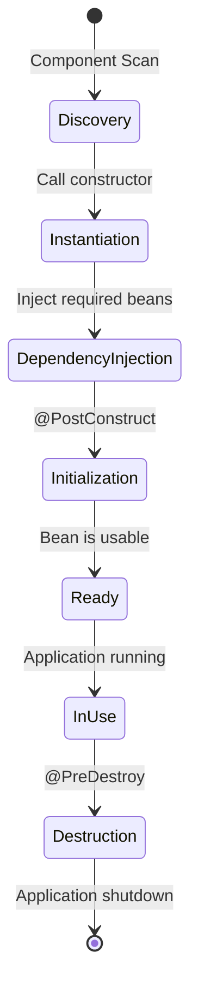
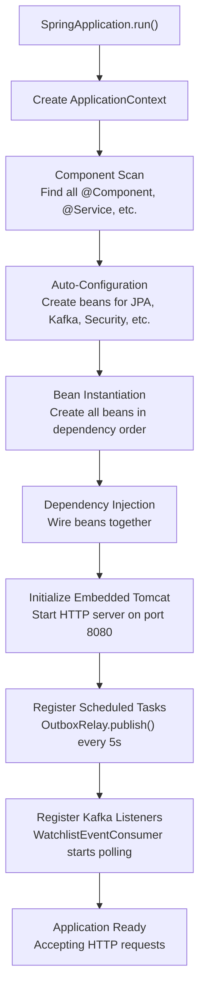
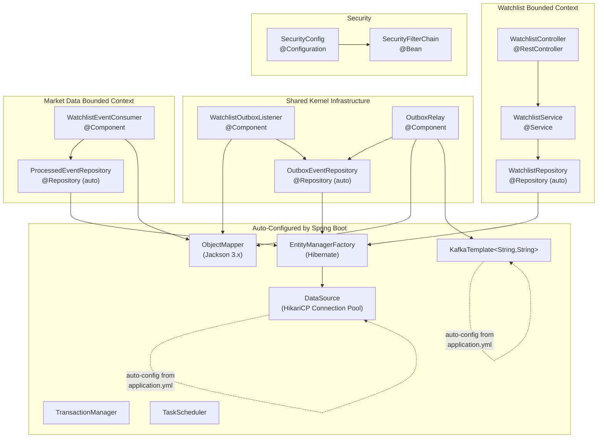

# MarketCanvas Engineering Handbook

## Part 2: Spring Boot & Dependency Injection Deep Dive

---

## Chapter 4: Inversion of Control (IoC) — The Foundation of Spring

### 4.1 The Problem: Manual Object Creation

Without Spring, you must create and wire objects yourself:

```java
// Without Spring — manual wiring
public class Main {
    public static void main(String[] args) {
        // You must know the ENTIRE dependency graph
        WatchlistRepository repo = new WatchlistRepositoryImpl(dataSource);
        WatchlistService service = new WatchlistService(repo);
        WatchlistController controller = new WatchlistController(service);
        // ... start HTTP server, register controller, etc.
    }
}
```

Problems with this approach:
1. **Tight coupling** — `Main` must know every class and its dependencies
2. **Hard to test** — can't substitute mock implementations
3. **Hard to change** — swapping a repository means editing `Main`
4. **Cascading changes** — adding a new dependency to `WatchlistService` breaks `Main`

### 4.2 What is Inversion of Control?

**Inversion of Control (IoC)** is a design principle where **you don't create objects yourself**. Instead, a **container** creates them for you and **injects** the dependencies.

**Real-world analogy:** Think of a restaurant kitchen. Without IoC, you (the chef) must go to the market, buy ingredients, bring them back, prepare them, AND cook. With IoC, ingredients are **delivered to your station** — you just cook.

### 4.3 What is a Bean?

In Spring, a **bean** is any object that Spring creates and manages. When you annotate a class with `@Component`, `@Service`, `@Controller`, `@Repository`, or `@Configuration`, Spring:
1. Discovers the class during **component scanning**
2. Creates an instance (calls the constructor)
3. Injects dependencies (provides constructor arguments)
4. Stores the instance in the **ApplicationContext** (the container)
5. Makes it available to other beans that need it

### 4.4 The Bean Lifecycle



### 4.5 Dependency Injection — How Spring Wires Objects

**Dependency Injection (DI)** is the mechanism by which Spring provides dependencies to a bean. There are three types:

#### Constructor Injection (✅ Recommended — used in MarketCanvas)

```java
@Service
@RequiredArgsConstructor  // Lombok generates the constructor
public class WatchlistService {
    private final WatchlistRepository watchlistRepository;  // injected via constructor
}
```

What happens at startup:
1. Spring sees `@Service` → registers `WatchlistService` as a bean
2. Spring sees `WatchlistRepository` is a constructor parameter
3. Spring looks up `WatchlistRepository` in the ApplicationContext
4. Spring calls `new WatchlistService(watchlistRepository)`

#### Field Injection (⚠️ Not recommended)
```java
@Service
public class WatchlistService {
    @Autowired  // Spring uses reflection to set this field
    private WatchlistRepository watchlistRepository;
}
```

#### Why Constructor Injection is Better

| Criterion | Constructor Injection | Field Injection |
|-----------|---------------------|-----------------|
| Immutability | ✅ Fields can be `final` | ❌ Cannot be `final` |
| Testability | ✅ Pass mocks via constructor | ❌ Needs reflection |
| Required deps | ✅ Fails fast if missing | ❌ NPE at runtime |
| Framework coupling | ❌ No Spring annotations needed | ✅ Requires `@Autowired` |

MarketCanvas uses `@RequiredArgsConstructor` from Lombok on every service class. Lombok generates a constructor that accepts all `final` fields, which Spring then uses for injection.

---

## Chapter 5: How Spring Creates Every Bean in MarketCanvas

### 5.1 The Application Entry Point

```java
// File: MarketCanvasApplication.java
package org.workshop.marketcanvas;

import org.springframework.boot.SpringApplication;
import org.springframework.boot.autoconfigure.SpringBootApplication;
import org.springframework.scheduling.annotation.EnableScheduling;

@SpringBootApplication  // Line 7
@EnableScheduling        // Line 8
public class MarketCanvasApplication {
    public static void main(String[] args) {
        SpringApplication.run(MarketCanvasApplication.class, args);  // Line 12
    }
}
```

#### Line-by-Line Explanation

**Line 7: `@SpringBootApplication`**
This single annotation is a shortcut that combines THREE annotations:

| Hidden Annotation | Purpose |
|-------------------|---------|
| `@Configuration` | This class itself is a bean factory — it can define `@Bean` methods |
| `@EnableAutoConfiguration` | Activates Spring Boot's auto-configuration magic |
| `@ComponentScan` | Tells Spring to scan `org.workshop.marketcanvas` and all sub-packages for beans |

**Line 8: `@EnableScheduling`**
Activates Spring's task scheduling framework. Without this annotation, the `@Scheduled` annotation on `OutboxRelay.publish()` would be **silently ignored** — the relay would never run.

**Line 12: `SpringApplication.run(...)`**
This single line triggers the entire Spring Boot startup sequence:



### 5.2 Complete Bean Dependency Graph

This diagram shows every Spring-managed bean in MarketCanvas and how they depend on each other:



### 5.3 Bean Creation Order

Spring resolves dependencies automatically using a **topological sort**. Here's the actual creation order for MarketCanvas:

| Order | Bean | Why This Order |
|-------|------|----------------|
| 1 | `DataSource` (HikariCP) | No dependencies — connects to PostgreSQL |
| 2 | `EntityManagerFactory` | Depends on DataSource |
| 3 | `TransactionManager` | Depends on EntityManagerFactory |
| 4 | `ObjectMapper` | No dependencies — Jackson JSON processor |
| 5 | `KafkaTemplate` | Auto-configured from `application.yml` |
| 6 | `WatchlistRepository` | Depends on EntityManagerFactory |
| 7 | `OutboxEventRepository` | Depends on EntityManagerFactory |
| 8 | `ProcessedEventRepository` | Depends on EntityManagerFactory |
| 9 | `WatchlistService` | Depends on WatchlistRepository |
| 10 | `WatchlistOutboxListener` | Depends on ObjectMapper, OutboxEventRepository |
| 11 | `OutboxRelay` | Depends on OutboxEventRepository, ObjectMapper, KafkaTemplate |
| 12 | `WatchlistEventConsumer` | Depends on ProcessedEventRepository, ObjectMapper |
| 13 | `WatchlistController` | Depends on WatchlistService |
| 14 | `SecurityFilterChain` | Configured by SecurityConfig |

---

## Chapter 6: Auto-Configuration — Spring Boot's Magic

### 6.1 What is Auto-Configuration?

When you add `spring-boot-starter-data-jpa` to your `pom.xml`, Spring Boot automatically:
1. Detects the Hibernate classes on the classpath
2. Reads `spring.datasource.*` from `application.yml`
3. Creates a `DataSource` bean (HikariCP connection pool)
4. Creates an `EntityManagerFactory` bean (Hibernate session factory)
5. Creates a `TransactionManager` bean
6. Enables JPA repositories (interfaces extending `JpaRepository`)

You write **zero configuration code** for any of this. It "just works."

### 6.2 How Auto-Configuration Reads `application.yml`

```yaml
# File: src/main/resources/application.yml

spring:
  application:
    name: MarketCanvas              # Application name for logging/monitoring

  kafka:
    bootstrap-servers: localhost:9092  # → KafkaTemplate connects here
    producer:
      key-serializer: org.apache.kafka.common.serialization.StringSerializer
      value-serializer: org.apache.kafka.common.serialization.StringSerializer
    consumer:
      group-id: market-data           # → Consumer group for offset tracking
      auto-offset-reset: earliest     # → Start from beginning if no offset
      key-deserializer: org.apache.kafka.common.serialization.StringDeserializer
      value-deserializer: org.apache.kafka.common.serialization.StringDeserializer

  datasource:
    url: jdbc:postgresql://localhost:5433/investment_platform  # → DataSource URL
    username: postgres
    password: postgres

  jpa:
    hibernate:
      ddl-auto: update                # → Auto-create/update tables from entities
    properties:
      hibernate:
        format_sql: true              # → Pretty-print SQL in logs
    open-in-view: false               # → Disable OSIV anti-pattern
```

#### Key Configuration Decisions

| Property | Value | Why |
|----------|-------|-----|
| `bootstrap-servers: localhost:9092` | Kafka broker address | Single-node dev setup |
| `auto-offset-reset: earliest` | Start from beginning | Don't miss events after restart |
| `datasource.url` port `5433` | Non-standard port | Native Windows PostgreSQL occupies `5432` |
| `ddl-auto: update` | Auto-schema updates | Development convenience (⚠️ never in production — use Flyway) |
| `open-in-view: false` | Disable OSIV | Prevents lazy-loading in view layer — a known anti-pattern |

> [!WARNING]
> `hibernate.ddl-auto: update` is a **development-only** setting. In production, it can silently alter table schemas, potentially destroying data. Production deployments must use **Flyway** or **Liquibase** for controlled, versioned migrations.

> [!IMPORTANT]
> The `spring-boot-starter-kafka` dependency is critical. In Spring Boot 4.x, using raw `spring-kafka` instead of the starter results in **no auto-configuration** — `KafkaTemplate` won't be created, causing `NoSuchBeanDefinitionException` at startup.

---

## Chapter 7: The `@Component` Annotation Family

Spring uses **stereotype annotations** to classify beans:

| Annotation | Semantic Meaning | Technical Behavior | Used In MarketCanvas |
|-----------|------------------|-------------------|---------------------|
| `@Component` | Generic bean | Registered in ApplicationContext | `OutboxRelay`, `WatchlistOutboxListener`, `WatchlistEventConsumer` |
| `@Service` | Business logic | Same as `@Component` | `WatchlistService` |
| `@Repository` | Data access | Same as `@Component` + exception translation | Auto-generated by Spring Data |
| `@RestController` | HTTP endpoint | `@Controller` + `@ResponseBody` | `WatchlistController` |
| `@Configuration` | Bean factory | Allows `@Bean` methods | `SecurityConfig` |

All five annotations are functionally equivalent — Spring treats them identically. The distinction is **semantic** (communicates intent to other developers).

---

## Chapter 8: How `@RequiredArgsConstructor` Works

Lombok's `@RequiredArgsConstructor` generates a constructor for all `final` fields. Let's trace exactly what happens with `WatchlistService`:

### What You Write

```java
@Service
@RequiredArgsConstructor
public class WatchlistService {
    private final WatchlistRepository watchlistRepository;
}
```

### What Lombok Generates (at compile time)

```java
@Service
public class WatchlistService {
    private final WatchlistRepository watchlistRepository;

    // Generated by Lombok
    public WatchlistService(WatchlistRepository watchlistRepository) {
        this.watchlistRepository = watchlistRepository;
    }
}
```

### What Spring Does (at runtime)

1. Component scan finds `WatchlistService` (annotated with `@Service`)
2. Spring inspects the constructor: needs a `WatchlistRepository`
3. Spring looks up `WatchlistRepository` in the ApplicationContext
4. Spring Data JPA has already created a proxy implementation of `WatchlistRepository`
5. Spring calls: `new WatchlistService(watchlistRepositoryProxy)`
6. The bean is stored in the ApplicationContext

### Every Class Using This Pattern

| Class | Final Fields (Injected) |
|-------|------------------------|
| `WatchlistService` | `WatchlistRepository` |
| `WatchlistController` | `WatchlistService` |
| `WatchlistOutboxListener` | `ObjectMapper`, `OutboxEventRepository` |
| `OutboxRelay` | `OutboxEventRepository`, `ObjectMapper`, `KafkaTemplate<String,String>` |
| `WatchlistEventConsumer` | `ProcessedEventRepository`, `ObjectMapper` |

---

*Continue to Part 3: Domain-Driven Design Implementation →*
