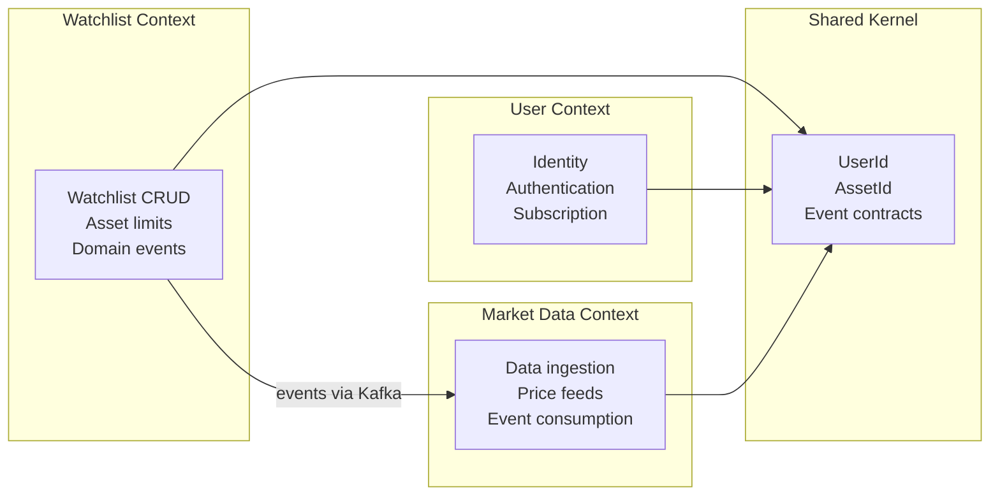
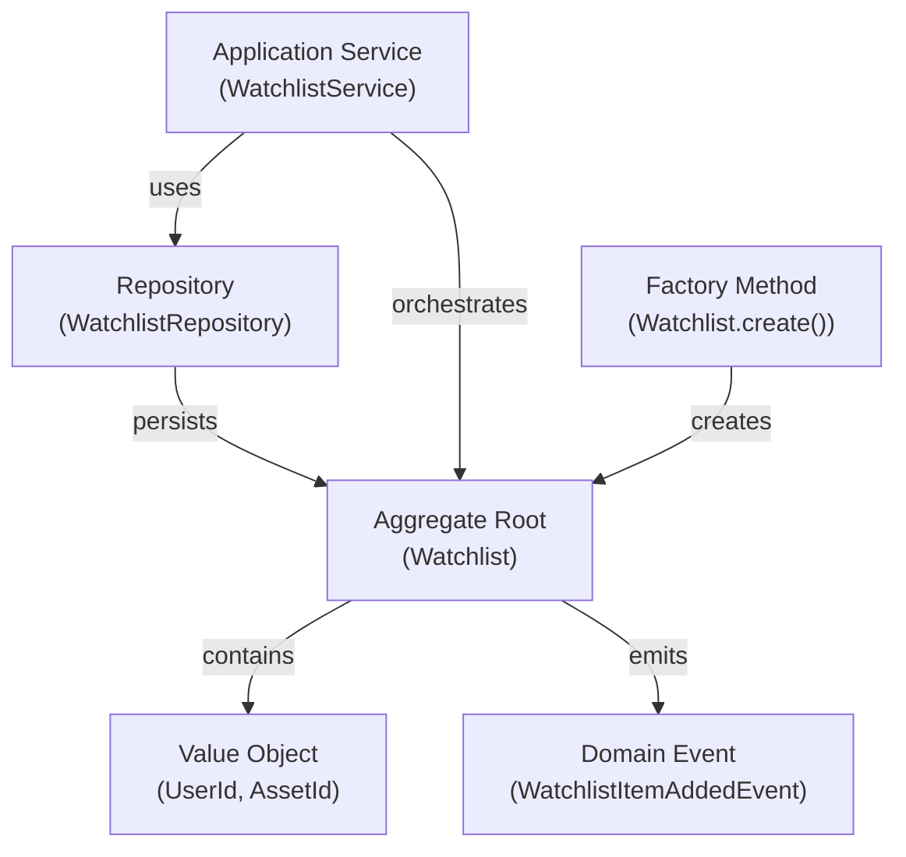
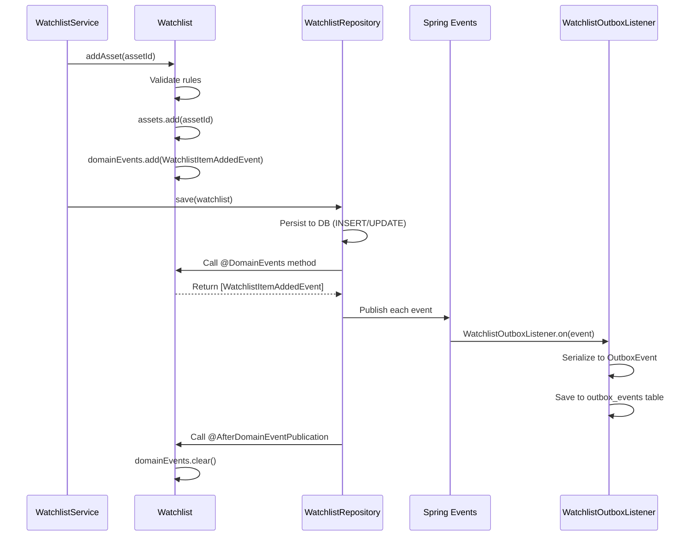

# MarketCanvas Engineering Handbook

## Part 3: Domain-Driven Design Implementation

---

## Chapter 9: What is Domain-Driven Design?

### 9.1 History and Purpose

Domain-Driven Design (DDD) was introduced by Eric Evans in his 2003 book *"Domain-Driven Design: Tackling Complexity in the Heart of Software."* Before DDD, most software was organized by **technical concerns** (controllers, services, repositories). DDD argues that software should be organized by **business concerns** (watchlists, users, market data).

**Real-world analogy:** Imagine organizing a hospital. The "technical layer" approach would group all nurses together, all doctors together, all receptionists together — regardless of department. DDD groups by department: Cardiology has its own doctors, nurses, and reception. Each department speaks its own medical language and has its own procedures.

### 9.2 Strategic Design — The Big Picture

Strategic Design answers: "How do we divide this large system into manageable parts?"

#### Bounded Context
A **Bounded Context** is a boundary within which a specific domain model applies. The same word can mean different things in different contexts:

| Term | In `user` Context | In `watchlist` Context | In `marketdata` Context |
|------|-------------------|----------------------|------------------------|
| "User" | Full profile with email, password, subscription | Just a `UserId` — who owns the watchlist | Irrelevant — market data has no concept of users |
| "Asset" | Irrelevant | An ID in a watchlist set | A financial instrument with price data |

MarketCanvas has **four bounded contexts**:



#### Ubiquitous Language
Every bounded context uses a **shared vocabulary** between developers and domain experts. In MarketCanvas:

| Term | Definition |
|------|-----------|
| Watchlist | A user-curated list of monitored financial assets |
| Asset | A financial instrument (equity, ETF, commodity) |
| Free Tier | Subscription level limited to 10 assets per watchlist |
| Thesis | A structured investment rationale with invalidation criteria |
| Signal | Meaningful information worth acting on |
| Noise | Irrelevant information that distracts from decisions |

---

### 9.3 Tactical Design — The Building Blocks

Tactical Design provides specific patterns for implementing the domain model:



---

## Chapter 10: Value Objects

### 10.1 What is a Value Object?

A **Value Object** is an object that:
1. Has **no identity** — it is defined entirely by its attributes
2. Is **immutable** — once created, it cannot be changed
3. Has **structural equality** — two value objects with the same attributes are equal

**Real-world analogy:** A $10 bill is a value object. You don't care *which specific* $10 bill you have — any $10 bill has the same value. You can't change a $10 bill into a $20 bill — you replace it with a different bill.

### 10.2 `UserId` — Complete Code Walkthrough

```java
// File: src/main/java/org/workshop/marketcanvas/sharedkernel/domain/UserId.java
package org.workshop.marketcanvas.sharedkernel.domain;  // Line 1

import java.util.UUID;  // Line 3

public record UserId(UUID value) {  // Line 5
    public UserId{  // Line 6
        if(value == null){  // Line 7
            throw new IllegalArgumentException("UserId cannot be null");  // Line 8
        }
    }
    public static UserId generate(){  // Line 11
        return new UserId(UUID.randomUUID());  // Line 12
    }
}
```

#### Line-by-Line

**Line 1** — Package declaration. This is in `sharedkernel.domain` because `UserId` is used by multiple bounded contexts.

**Line 3** — `UUID` (Universally Unique Identifier) is a 128-bit identifier. Example: `550e8400-e29b-41d4-a716-446655440000`. UUIDs are generated randomly and are practically guaranteed to be unique across all systems globally.

**Line 5** — `public record UserId(UUID value)` — This declares a Java record with one field called `value` of type `UUID`. The record automatically provides:
- A constructor: `new UserId(someUUID)`
- An accessor: `userId.value()`
- `equals()`: Two `UserId` instances with the same UUID are equal
- `hashCode()`: Consistent with equals
- `toString()`: `UserId[value=550e8400-...]`

**Line 6** — `public UserId{` — This is a **compact constructor**. It runs inside the auto-generated constructor, BEFORE the field is assigned. It's the ideal place for validation.

**Line 7-8** — Null guard. A `UserId` with a null value makes no sense. By throwing an exception here, we guarantee that **no `UserId` instance can ever exist with a null value**. This is called an **invariant** — a rule that is always true.

**Line 11-12** — Static factory method. Instead of making callers write `new UserId(UUID.randomUUID())`, we provide a convenient `UserId.generate()`. This encapsulates the ID generation strategy.

### 10.3 `AssetId` — Identical Pattern

```java
// File: src/main/java/org/workshop/marketcanvas/sharedkernel/domain/AssetId.java
public record AssetId(UUID value) {
    public AssetId{
        if(value == null){
            throw new IllegalArgumentException("Asset ID can't be null");
        }
    }
    public static AssetId generate(){
        return new AssetId(UUID.randomUUID());
    }
}
```

The structure is identical to `UserId`. This is intentional — every identity value object follows the same pattern.

### 10.4 Why Not Just Use UUID Directly?

You could write `UUID ownerId` instead of `UserId ownerId`. But:

```java
// Without value objects — easy to mix up arguments
void addAsset(UUID watchlistId, UUID assetId, UUID userId) { ... }
// Can you spot the bug?
addAsset(userId, watchlistId, assetId);  // Compiles! All are UUID. Runtime disaster.

// With value objects — the compiler catches mistakes
void addAsset(UUID watchlistId, AssetId assetId, UserId userId) { ... }
// This won't compile:
addAsset(userId, watchlistId, assetId);  // ❌ Type mismatch
```

Value objects provide **type safety at compile time**.

---

## Chapter 11: The Aggregate Root — `Watchlist`

### 11.1 What is an Aggregate?

An **Aggregate** is a cluster of domain objects treated as a single unit for data changes. It has:
1. An **Aggregate Root** — the only entry point for external access
2. **Invariants** — business rules that must always be true
3. A **transactional boundary** — the entire aggregate is saved or rolled back as one unit

**Real-world analogy:** A shopping cart is an aggregate. The cart itself is the root. Cart items are internal. You can't directly modify an item — you go through the cart (add item, remove item, update quantity). The cart enforces rules: "quantity must be positive," "total can't exceed credit limit."

### 11.2 Complete Code Walkthrough — `Watchlist.java`

```java
// File: src/main/java/org/workshop/marketcanvas/watchlist/domain/Watchlist.java
package org.workshop.marketcanvas.watchlist.domain;  // Line 1

import jakarta.persistence.*;  // Line 3
import lombok.*;  // Line 4
import org.jmolecules.event.annotation.DomainEvent;  // Line 5
import org.springframework.data.domain.AfterDomainEventPublication;  // Line 6
import org.springframework.data.domain.DomainEvents;  // Line 7
import org.workshop.marketcanvas.sharedkernel.domain.AssetId;  // Line 8
import org.workshop.marketcanvas.sharedkernel.domain.UserId;  // Line 9
import org.workshop.marketcanvas.sharedkernel.events.WatchlistItemAddedEvent;  // Line 10

import java.time.Instant;  // Line 12
import java.util.*;  // Line 13
```

**Lines 3-13: Imports Analysis**

| Import | Framework | Purpose |
|--------|-----------|---------|
| `jakarta.persistence.*` | JPA (Hibernate) | Database mapping annotations |
| `lombok.*` | Lombok | Boilerplate reduction |
| `org.jmolecules.event.annotation.DomainEvent` | jMolecules | Semantic annotation for domain events |
| `org.springframework.data.domain.DomainEvents` | Spring Data | Marks method that returns events to publish |
| `org.springframework.data.domain.AfterDomainEventPublication` | Spring Data | Marks method to clear events after publishing |
| `sharedkernel.domain.AssetId` | MarketCanvas | Value Object for asset identity |
| `sharedkernel.domain.UserId` | MarketCanvas | Value Object for owner identity |
| `sharedkernel.events.WatchlistItemAddedEvent` | MarketCanvas | Domain event record |

```java
@Entity  // Line 15
@AllArgsConstructor  // Line 16
@Getter  // Line 17
public class Watchlist {  // Line 18
```

**Line 15: `@Entity`** — Tells JPA (Hibernate) "this class maps to a database table." Hibernate will:
- Create a table called `watchlist` (lowercase class name by default)
- Map each field to a column
- Generate SQL for `INSERT`, `UPDATE`, `SELECT`, `DELETE`

**Line 16: `@AllArgsConstructor`** — Lombok generates a constructor that accepts ALL fields. Used by Hibernate when reconstructing entities from the database.

**Line 17: `@Getter`** — Lombok generates getter methods for all fields. Note: there is NO `@Setter`. This is intentional — state changes happen through **behavior methods** (`addAsset()`, `rename()`), not through setters. This protects business invariants.

```java
    @Id  // Line 19
    private final UUID id;  // Line 20
    @Column(nullable = false)  // Line 21
    private final UserId ownerId;  // Line 22
    @Column(nullable = false, length = 50)  // Line 23
    private String name;  // Line 24
```

**Line 19-20: `@Id` and `id` field** — Every JPA entity must have a primary key. `@Id` marks the `id` field as the primary key. It's `final` because once a watchlist is created, its ID never changes.

**Line 21-22: `ownerId`** — The user who owns this watchlist. `@Column(nullable = false)` adds a `NOT NULL` constraint in the database. The type is `UserId` (our value object), which Hibernate converts to a UUID column via `UserIdConverter` (covered in Part 4).

**Line 23-24: `name`** — The watchlist name. `length = 50` adds a `VARCHAR(50)` constraint. This field is NOT `final` because it can be changed via the `rename()` method.

```java
    @ElementCollection  // Line 25
    @CollectionTable(  // Line 26
            name = "watchlist_assets",  // Line 27
            joinColumns = @JoinColumn(name = "watchlist_id")  // Line 28
    )
    @Column(name = "asset_id")  // Line 30
    private final Set<AssetId> assets;  // Line 31
```

**Lines 25-31: The asset collection** — This is one of the most important JPA mappings in the project.

`@ElementCollection` tells Hibernate: "This collection should be stored in a **separate table**, not in the watchlist table itself." This is because a `Set<AssetId>` has variable cardinality — a watchlist can have 0 to 10 assets.

The resulting database tables:

```
┌─────────────────────────┐     ┌─────────────────────────────┐
│      watchlist          │     │     watchlist_assets        │
├─────────────────────────┤     ├─────────────────────────────┤
│ id (UUID, PK)           │──┐  │ watchlist_id (UUID, FK)     │
│ owner_id (UUID, NOT NULL│  └──│ asset_id (UUID)             │
│ name (VARCHAR(50))      │     └─────────────────────────────┘
└─────────────────────────┘
```

Using a `Set` (not `List`) enforces **uniqueness** — you can't add the same asset twice.

```java
    protected Watchlist() {  // Line 32
        this.id = null;  // Line 33
        this.ownerId = null;  // Line 34
        this.assets = new HashSet<>();  // Line 35
    }
```

**Lines 32-35: JPA no-arg constructor** — JPA/Hibernate requires a no-argument constructor to create entity instances when loading from the database. It's `protected` (not `public`) to prevent application code from using it — only Hibernate should call it.

```java
    @Transient  // Line 37
    private List<Object> domainEvents = new ArrayList<>();  // Line 38
```

**Lines 37-38: Domain event queue** — `@Transient` tells Hibernate "do NOT persist this field to the database." This list temporarily holds domain events that will be published after the entity is saved. It exists only in memory during the transaction.

```java
    private Watchlist(UUID id, UserId ownerId, String name) {  // Line 39
        this.id = id;
        this.ownerId = ownerId;
        this.assets = new HashSet<>();
        rename(name);  // Reuse the validation logic!  // Line 43
    }
```

**Lines 39-43: Private constructor** — This constructor is **private**. External code cannot call `new Watchlist(...)` directly. This is the **Factory Method pattern** — creation is forced through `Watchlist.create()`, ensuring invariants are always checked.

**Line 43** is particularly clever — instead of duplicating validation, it calls `rename()` which already validates the name. This is the DRY (Don't Repeat Yourself) principle applied to invariant enforcement.

```java
    // Factory Method
    public static Watchlist create(UserId ownerId, String name) {  // Line 46
        if (ownerId == null) {  // Line 47
            throw new IllegalArgumentException("Owner ID cannot be null");  // Line 48
        }
        return new Watchlist(UUID.randomUUID(), ownerId, name);  // Line 50
    }
```

**Lines 46-50: Factory Method** — The ONLY way to create a `Watchlist`. It:
1. Validates the owner is not null (Line 47-48)
2. Generates a new random UUID for the watchlist ID (Line 50)
3. Delegates to the private constructor which validates the name

```java
    public void addAsset(AssetId assetId) {  // Line 63
        if(assetId == null){  // Line 64
            throw new IllegalArgumentException("AssetId cannot be null");  // Line 65
        }
        if(assets.contains(assetId)){  // Line 67
           return;  // Line 68 — Idempotent: adding same asset twice is a no-op
        }
        if(this.assets.size() >= 10){  // Line 71
            throw new IllegalStateException(  // Line 72
                "Free-Tier Watchlists can hold a maximum of 10 Assets");
        }
        this.assets.add(assetId);  // Line 74
        this.domainEvents.add(  // Line 75
            new WatchlistItemAddedEvent(this.id, assetId.value(), Instant.now()));
    }
```

**Lines 63-76: The Core Business Method** — This encapsulates ALL business rules for adding an asset:

| Line | Rule | Type |
|------|------|------|
| 64 | Asset ID cannot be null | Input validation |
| 67-68 | Adding duplicate is idempotent (no error, just skip) | Idempotency |
| 71-72 | Maximum 10 assets per free-tier watchlist | Business invariant |
| 74 | Mutate state | State change |
| 75 | Queue domain event | Event sourcing |

**Line 75** is crucial. When an asset is added, the aggregate doesn't immediately publish an event. It **queues** the event internally. The event is published later when Spring Data saves the aggregate (via `@DomainEvents`).

```java
    @DomainEvents  // Line 83
    Collection<Object> domainEvents() {  // Line 84
        return domainEvents;
    }
    @AfterDomainEventPublication  // Line 87
    void clearEvents() {  // Line 88
        domainEvents.clear();
    }
```

**Lines 83-89: Spring Data Event Integration**

`@DomainEvents` (Line 83) — When Spring Data's `repository.save(watchlist)` is called, Spring inspects the entity for a method annotated with `@DomainEvents`. It calls this method and **publishes every object in the returned collection** via `ApplicationEventPublisher`.

`@AfterDomainEventPublication` (Line 87) — After all events have been published, Spring calls this method to clear the queue. This prevents events from being published again on subsequent saves.



---

## Chapter 12: Domain Events

### 12.1 What is a Domain Event?

A **Domain Event** represents something that **happened** in the domain. It is:
- Named in **past tense** (something already occurred)
- **Immutable** — once created, it cannot be changed (it's a fact)
- **Self-contained** — contains all data needed to understand what happened

### 12.2 `WatchlistItemAddedEvent` Walkthrough

```java
// File: src/main/java/org/workshop/marketcanvas/sharedkernel/events/WatchlistItemAddedEvent.java
package org.workshop.marketcanvas.sharedkernel.events;

import java.time.Instant;
import java.util.UUID;

public record WatchlistItemAddedEvent(
    UUID watchlistId,    // Which watchlist was modified
    UUID assetId,        // Which asset was added
    Instant timestamp    // When it happened
) {}
```

#### Why Primitive Types (UUID) Instead of Value Objects (AssetId)?

Events cross bounded context boundaries. If this event used `AssetId`:
```java
// ❌ BAD — couples consumers to the Watchlist domain's value objects
public record WatchlistItemAddedEvent(UUID watchlistId, AssetId assetId, ...)
```

The `marketdata` module would need to import `AssetId` from `sharedkernel`, but more critically, serializing `AssetId` to JSON creates a nested structure (`{"value": "uuid"}`) instead of a flat UUID string. Using primitive `UUID` directly produces clean JSON:

```json
{
  "watchlistId": "550e8400-e29b-41d4-a716-446655440000",
  "assetId": "7c9e6679-7425-40de-944b-e07fc1f90ae7",
  "timestamp": "2026-07-12T10:30:00Z"
}
```

---

## Chapter 13: The Application Service — `WatchlistService`

### 13.1 What is an Application Service?

An Application Service is a **thin orchestration layer** between the outside world (HTTP, Kafka) and the domain. It:
- Loads aggregates from repositories
- Calls domain methods
- Saves aggregates
- Manages transactions

It does **NOT** contain business logic — that belongs in the aggregate.

### 13.2 Complete Walkthrough

```java
// File: src/main/java/org/workshop/marketcanvas/watchlist/application/WatchlistService.java
@Service                   // Registers as a Spring bean
@RequiredArgsConstructor   // Constructor injection for WatchlistRepository
public class WatchlistService {

    private final WatchlistRepository watchlistRepository;  // Injected by Spring

    @Transactional  // Wraps entire method in a database transaction
    public UUID createWatchlist(UserId ownerId, String name){
        Watchlist watchlist = Watchlist.create(ownerId, name);   // Factory method
        Watchlist saved = watchlistRepository.save(watchlist);   // JPA save + event publishing
        return saved.getId();                                    // Return the generated UUID
    }

    @Transactional
    public void addAssetToWatchlist(UUID watchlistId, AssetId assetId){
        Watchlist watchlist = watchlistRepository
            .findById(watchlistId)
            .orElseThrow(() -> new IllegalArgumentException("Watchlist not found"));
        watchlist.addAsset(assetId);          // Domain logic + event queuing
        watchlistRepository.save(watchlist);   // Persist + publish events
    }
}
```

#### Key Point: Why `repository.save()` Publishes Events

When `watchlistRepository.save(watchlist)` is called, Spring Data JPA:
1. Calls `entityManager.persist()` or `entityManager.merge()`
2. Inspects the entity for `@DomainEvents`
3. Calls `watchlist.domainEvents()` to get the event list
4. Publishes each event via `ApplicationEventPublisher.publishEvent()`
5. Calls `watchlist.clearEvents()` (the `@AfterDomainEventPublication` method)

The comment in the code explicitly notes this:
```java
// Note: calling repository.save() automatically extracts and publishes
// the @DomainEvents queued inside the aggregate!
```

---

*Continue to Part 4: The Shared Kernel →*
