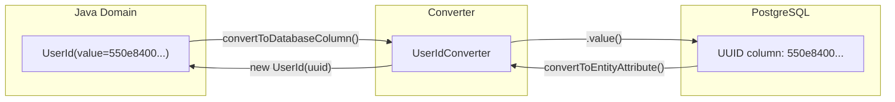
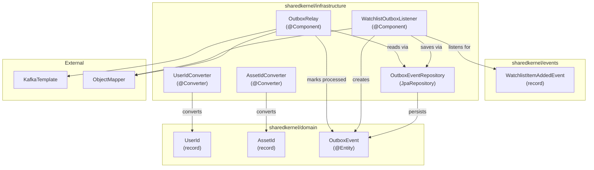

# MarketCanvas Engineering Handbook

## Part 4: The Shared Kernel

---

## Chapter 14: What is a Shared Kernel?

### 14.1 The Problem

In a modular system, bounded contexts must be independent. But they also need to agree on certain fundamental concepts:
- What does a user identity look like?
- What does an asset identity look like?
- What is the shape of domain events that cross boundaries?

If each module defined its own `UserId`, you'd have `watchlist.UserId` and `marketdata.UserId` — identical classes duplicated, eventually diverging and causing bugs.

### 14.2 The Solution: Shared Kernel

A **Shared Kernel** is a small, carefully curated set of types that all bounded contexts may depend on. It is:
- **Minimal** — only types that genuinely need to be shared
- **Stable** — changes to the shared kernel affect all modules
- **Owned collectively** — changes require agreement from all module owners

**Real-world analogy:** In a hospital, each department (cardiology, neurology, pediatrics) is independent. But they all share the patient ID format, the medical record structure, and the allergy alert system. These shared elements form the hospital's "shared kernel."

### 14.3 What MarketCanvas Puts in the Shared Kernel

```
sharedkernel/
├── domain/
│   ├── UserId.java          ← Identity type used by ALL modules
│   ├── AssetId.java         ← Identity type used by ALL modules
│   └── OutboxEvent.java     ← Infrastructure entity (Outbox Pattern)
├── events/
│   └── WatchlistItemAddedEvent.java  ← Event contract between modules
└── infrastructure/
    ├── AssetIdConverter.java        ← JPA bridge for AssetId
    ├── UserIdConverter.java         ← JPA bridge for UserId
    ├── OutboxEventRepository.java   ← Repository for outbox table
    ├── OutboxRelay.java             ← Scheduled Kafka publisher
    └── WatchlistOutboxListener.java ← Transactional event listener
```

---

## Chapter 15: JPA AttributeConverters

### 15.1 The Problem: Value Objects vs. Database Columns

Our domain uses `UserId` and `AssetId` — rich Java objects. But PostgreSQL doesn't know what a `UserId` is. It only understands primitive column types: `UUID`, `VARCHAR`, `INTEGER`, `TIMESTAMP`, etc.

We need a **bridge** that converts between the domain type and the database type.

### 15.2 What is an AttributeConverter?

A JPA `AttributeConverter<X, Y>` is an interface with two methods:
- `convertToDatabaseColumn(X)` → converts a Java object to a database column type
- `convertToEntityAttribute(Y)` → converts a database column value back to a Java object

### 15.3 `UserIdConverter` — Complete Walkthrough

```java
// File: src/main/java/org/workshop/marketcanvas/sharedkernel/infrastructure/UserIdConverter.java
package org.workshop.marketcanvas.sharedkernel.infrastructure;  // Line 1

import jakarta.persistence.AttributeConverter;  // Line 3
import jakarta.persistence.Converter;  // Line 4
import org.workshop.marketcanvas.sharedkernel.domain.UserId;  // Line 5

import java.util.UUID;  // Line 7

@Converter(autoApply = true)  // Line 9
public class UserIdConverter  // Line 10
implements AttributeConverter<UserId, UUID> {  // Line 11

    @Override
    public UUID convertToDatabaseColumn(UserId attribute) {  // Line 13
        return attribute == null ? null : attribute.value();  // Line 15
    }

    @Override
    public UserId convertToEntityAttribute(UUID dbData) {  // Line 19
        return dbData == null ? null : new UserId(dbData);  // Line 21
    }
}
```

#### Line-by-Line

**Line 9: `@Converter(autoApply = true)`** — This is the key annotation. `autoApply = true` means Hibernate will automatically use this converter for **every field of type `UserId` in every entity**, without requiring `@Convert` on each field. Without this, you'd need to annotate every `UserId` field:
```java
// Without autoApply:
@Convert(converter = UserIdConverter.class)
private UserId ownerId;  // Must annotate EVERY field

// With autoApply = true:
private UserId ownerId;  // Converter applied automatically
```

**Line 11: `implements AttributeConverter<UserId, UUID>`** — The generic types declare:
- `UserId` — the Java type (domain side)
- `UUID` — the database column type (PostgreSQL side)

**Line 13-15: `convertToDatabaseColumn`** — When Hibernate writes a `Watchlist` to the database, it calls this method for the `ownerId` field. If the `UserId` is not null, it extracts the raw `UUID` using `attribute.value()`.

**Line 19-21: `convertToEntityAttribute`** — When Hibernate reads a row from the database, it calls this method to convert the raw `UUID` column value back into a `UserId` value object.



### 15.4 `AssetIdConverter` — Identical Pattern

```java
// File: src/main/java/org/workshop/marketcanvas/sharedkernel/infrastructure/AssetIdConverter.java
@Converter(autoApply = true)
public class AssetIdConverter
implements AttributeConverter<AssetId, UUID> {
    @Override
    public UUID convertToDatabaseColumn(AssetId attribute) {
        return attribute == null ? null : attribute.value();
    }

    @Override
    public AssetId convertToEntityAttribute(UUID dbData) {
        return dbData == null ? null : new AssetId(dbData);
    }
}
```

The structure mirrors `UserIdConverter` exactly. Every new value object that wraps a primitive type needs its own converter following this pattern.

---

## Chapter 16: The OutboxEvent Entity

### 16.1 Purpose

The `OutboxEvent` entity represents a **pending message** that needs to be published to Kafka. It lives in the same database as business data, enabling **atomic writes** (covered in depth in Part 6).

### 16.2 Complete Walkthrough

```java
// File: src/main/java/org/workshop/marketcanvas/sharedkernel/domain/OutboxEvent.java
package org.workshop.marketcanvas.sharedkernel.domain;

import jakarta.persistence.Entity;
import jakarta.persistence.Id;
import jakarta.persistence.Lob;
import jakarta.persistence.Table;
import lombok.*;

import java.time.Instant;
import java.util.UUID;

@Entity                                      // JPA entity → database table
@Table(name = "outbox_events")               // Explicit table name
@Setter                                      // Lombok: generates setters (needed for processed flag)
@Getter                                      // Lombok: generates getters
@NoArgsConstructor(access = AccessLevel.PROTECTED)  // JPA requires no-arg constructor
@AllArgsConstructor                          // Used by WatchlistOutboxListener to create instances
public class OutboxEvent {

    @Id
    private UUID id;                         // Unique event identifier

    private String aggregateType;            // e.g., "Watchlist"
    private String aggregateId;              // e.g., watchlist UUID as string
    private String eventType;                // e.g., "WatchlistItemAddedEvent"

    @Lob
    private String payload;                  // JSON-serialized domain event

    private Instant createdAt = Instant.now();  // When the event was created
    private boolean processed = false;       // Has this event been sent to Kafka?
}
```

#### Field-by-Field Analysis

| Field | Type | Column | Purpose |
|-------|------|--------|---------|
| `id` | `UUID` | PK | Unique identifier for this outbox event |
| `aggregateType` | `String` | VARCHAR | Which aggregate produced this event ("Watchlist") |
| `aggregateId` | `String` | VARCHAR | The ID of the specific aggregate instance |
| `eventType` | `String` | VARCHAR | The class name of the domain event |
| `payload` | `String` | TEXT/LOB | The full JSON representation of the domain event |
| `createdAt` | `Instant` | TIMESTAMP | When the event was created (for ordering) |
| `processed` | `boolean` | BOOLEAN | Whether the Outbox Relay has published this to Kafka |

**`@Lob` (Line 28)** — Marks the `payload` field as a **Large Object**. Without this, Hibernate would use `VARCHAR(255)` which is too small for JSON payloads. With `@Lob`, Hibernate uses `TEXT` (PostgreSQL) or `CLOB` (other databases).

**`@NoArgsConstructor(access = AccessLevel.PROTECTED)`** — JPA needs a no-arg constructor, but we don't want application code to create `OutboxEvent` instances without all fields. `PROTECTED` access lets Hibernate call it but hides it from other classes.

**`@Setter`** — Normally avoided in domain entities, but the OutboxRelay needs to call `event.setProcessed(true)` after publishing to Kafka. This is an infrastructure entity, not a domain entity, so the trade-off is acceptable.

### 16.3 Generated Database Table

```sql
CREATE TABLE outbox_events (
    id              UUID PRIMARY KEY,
    aggregate_type  VARCHAR(255),
    aggregate_id    VARCHAR(255),
    event_type      VARCHAR(255),
    payload         TEXT,           -- @Lob maps to TEXT in PostgreSQL
    created_at      TIMESTAMP,
    processed       BOOLEAN DEFAULT FALSE
);
```

---

## Chapter 17: The OutboxEventRepository

### 17.1 What is Spring Data JPA?

Spring Data JPA generates **repository implementations automatically** from interface declarations. You declare methods using a naming convention, and Spring generates the SQL:

```java
// File: src/main/java/org/workshop/marketcanvas/sharedkernel/infrastructure/OutboxEventRepository.java
package org.workshop.marketcanvas.sharedkernel.infrastructure;

import org.springframework.data.jpa.repository.JpaRepository;
import org.workshop.marketcanvas.sharedkernel.domain.OutboxEvent;

import java.util.List;
import java.util.UUID;

public interface OutboxEventRepository
        extends JpaRepository<OutboxEvent, UUID> {

    List<OutboxEvent> findTop100ByProcessedFalseOrderByCreatedAt();
}
```

### 17.2 How Spring Data Parses Method Names

The method `findTop100ByProcessedFalseOrderByCreatedAt()` is parsed as:

| Part | Meaning | SQL Equivalent |
|------|---------|----------------|
| `find` | SELECT query | `SELECT *` |
| `Top100` | Limit to 100 results | `LIMIT 100` |
| `By` | WHERE clause follows | `WHERE` |
| `Processed` | Field name | `processed` |
| `False` | Value = false | `= FALSE` |
| `OrderBy` | ORDER BY clause | `ORDER BY` |
| `CreatedAt` | Field name | `created_at ASC` |

Generated SQL:
```sql
SELECT * FROM outbox_events
WHERE processed = FALSE
ORDER BY created_at ASC
LIMIT 100;
```

### 17.3 Inherited Methods from `JpaRepository`

`JpaRepository<OutboxEvent, UUID>` provides these methods for free:

| Method | SQL |
|--------|-----|
| `save(entity)` | INSERT or UPDATE |
| `findById(id)` | SELECT WHERE id = ? |
| `findAll()` | SELECT * |
| `deleteById(id)` | DELETE WHERE id = ? |
| `count()` | SELECT COUNT(*) |
| `existsById(id)` | SELECT EXISTS |

---

## Chapter 18: Dependency Map of the Shared Kernel



---

*Continue to Part 5: Event-Driven Architecture & Apache Kafka →*
