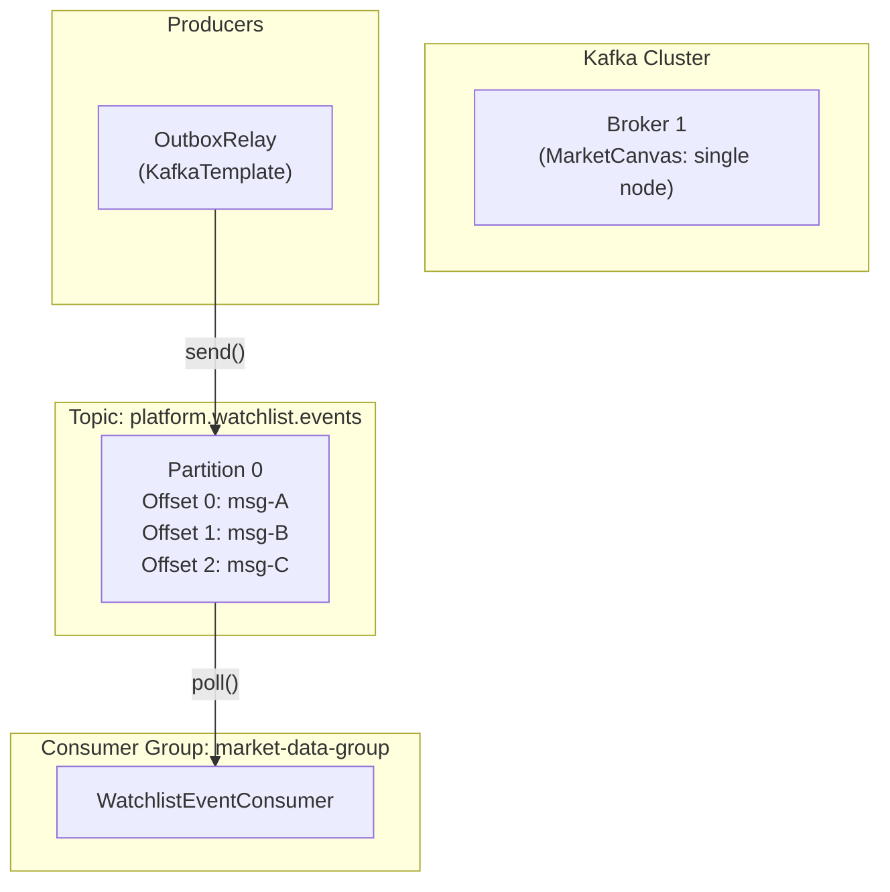
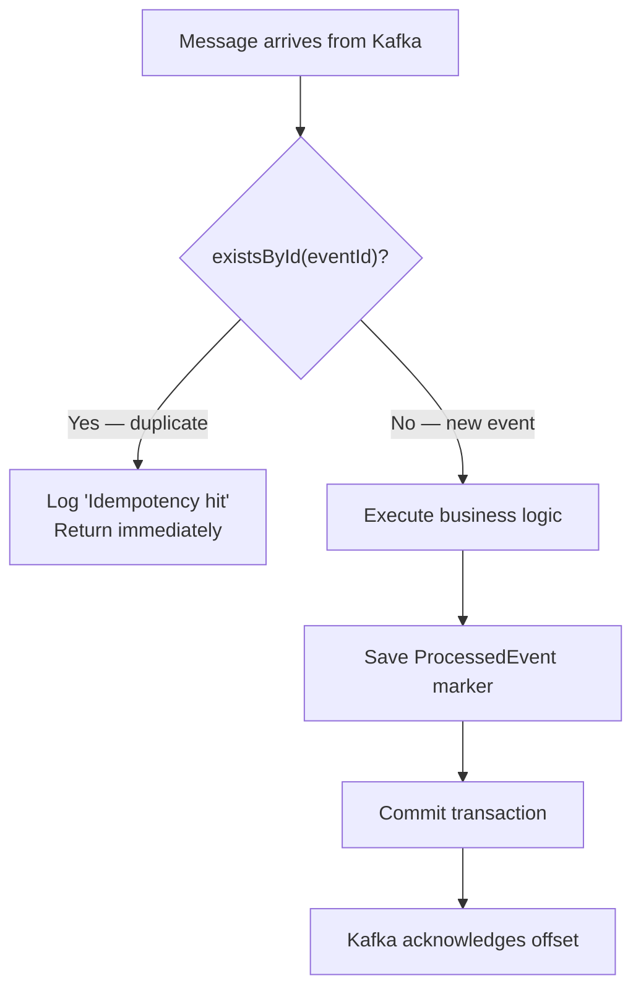
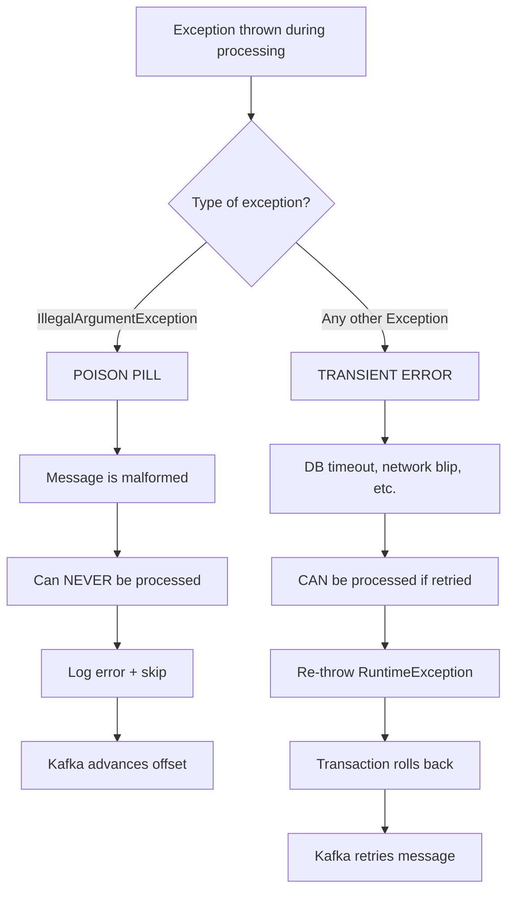

# MarketCanvas Engineering Handbook

## Part 5: Event-Driven Architecture & Apache Kafka

---

## Chapter 19: Messaging Fundamentals

### 19.1 Synchronous vs. Asynchronous Communication

**Synchronous:** The caller sends a request and **waits** for a response before continuing. Like a phone call — you speak, wait for an answer, then continue.

```
Service A ──request──→ Service B
Service A ←─response── Service B
Service A continues...
```

**Asynchronous:** The caller sends a message and **continues immediately** without waiting. Like sending an email — you send it and move on. The recipient processes it when ready.

```
Service A ──message──→ Message Broker ──deliver──→ Service B
Service A continues immediately...
```

### 19.2 Why Asynchronous?

| Problem | Synchronous | Asynchronous |
|---------|------------|--------------|
| Service B is slow | Service A is blocked | Service A continues |
| Service B is down | Service A fails | Message queued, delivered later |
| Traffic spike | Both services overwhelmed | Broker absorbs the spike |
| Coupling | A knows about B | A knows about the broker |

### 19.3 Queue vs. Publish/Subscribe (Pub/Sub)

**Queue (Point-to-Point):** Each message is consumed by **exactly one** consumer. Like a task assignment system — one worker picks up each task.

**Pub/Sub (Publish/Subscribe):** Each message is delivered to **all** subscribers. Like a radio broadcast — everyone tuned in hears the message.

**Kafka combines both:** Through **consumer groups**, Kafka supports both patterns:
- Multiple consumer groups = pub/sub (each group gets all messages)
- Multiple consumers in one group = queue (each message goes to one consumer)

---

## Chapter 20: Apache Kafka Internals

### 20.1 What is Kafka?

Apache Kafka is a **distributed event streaming platform** — a persistent, ordered, replayable message log. Created at LinkedIn in 2011 to handle trillions of messages per day.

### 20.2 Core Concepts



#### Broker
A **broker** is a Kafka server process that stores and serves messages. MarketCanvas uses a single broker for local development. Production systems use 3+ brokers for fault tolerance.

#### Topic
A **topic** is a named stream of messages. Think of it as a "channel" or "category." MarketCanvas has one topic:

| Topic | Purpose | Producers | Consumers |
|-------|---------|-----------|-----------|
| `platform.watchlist.events` | Watchlist domain events | OutboxRelay | WatchlistEventConsumer |

#### Partition
A **partition** is an ordered, immutable sequence of messages within a topic. Each message gets a sequential **offset** (position number). Partitions enable:
- **Parallelism** — multiple consumers read different partitions simultaneously
- **Ordering** — messages within a partition are strictly ordered

MarketCanvas uses the default single partition. In production, you'd partition by `watchlistId` to ensure all events for one watchlist are processed in order.

#### Offset
An **offset** is a sequential integer assigned to each message in a partition. Consumers track their position by remembering the last offset they processed:

```
Partition 0: [msg-0] [msg-1] [msg-2] [msg-3] [msg-4] [msg-5]
                                        ↑
                          Consumer's current offset = 3
                          (has processed 0, 1, 2)
```

#### Consumer Group
A **consumer group** is a set of consumers that cooperate to consume a topic. Each partition is assigned to exactly one consumer in the group:

```
Topic with 3 partitions:
Partition 0 → Consumer A (in group "market-data-group")
Partition 1 → Consumer B (in group "market-data-group")
Partition 2 → Consumer A (in group "market-data-group")
```

MarketCanvas uses `groupId = "market-data-group"` for its consumer.

### 20.3 Delivery Guarantees

Kafka provides three delivery semantics:

| Guarantee | Meaning | Risk |
|-----------|---------|------|
| **At-most-once** | Message may be lost, never duplicated | Data loss |
| **At-least-once** ← MarketCanvas | Message is never lost, may be duplicated | Duplicate processing |
| **Exactly-once** | Message is never lost, never duplicated | Highest complexity |

MarketCanvas uses **at-least-once** delivery from Kafka, combined with an **idempotent consumer** to achieve effectively exactly-once processing.

### 20.4 KRaft Mode — No More ZooKeeper

Historically, Kafka required **Apache ZooKeeper** — a separate service for:
- Broker registration
- Leader election
- Configuration management

As of Kafka 3.3, **KRaft mode** replaces ZooKeeper with a built-in consensus protocol. Benefits:
- One fewer service to deploy
- Faster broker startup
- Simpler Docker Compose setup

MarketCanvas Docker Compose configuration:
```yaml
kafka:
  image: apache/kafka:3.9.2
  environment:
    KAFKA_NODE_ID: 1
    KAFKA_PROCESS_ROLES: broker,controller    # Single node acts as both
    KAFKA_LISTENERS: PLAINTEXT://0.0.0.0:9092,CONTROLLER://0.0.0.0:9093
    KAFKA_ADVERTISED_LISTENERS: PLAINTEXT://localhost:9092
    KAFKA_CONTROLLER_LISTENER_NAMES: CONTROLLER
    KAFKA_CONTROLLER_QUORUM_VOTERS: 1@localhost:9093
    KAFKA_OFFSETS_TOPIC_REPLICATION_FACTOR: 1       # Single-node: can't replicate
    KAFKA_TRANSACTION_STATE_LOG_REPLICATION_FACTOR: 1
    KAFKA_TRANSACTION_STATE_LOG_MIN_ISR: 1
```

---

## Chapter 21: The Kafka Consumer — `WatchlistEventConsumer`

### 21.1 Complete Code Walkthrough

```java
// File: src/main/java/org/workshop/marketcanvas/marketdata/application/messaging/WatchlistEventConsumer.java
package org.workshop.marketcanvas.marketdata.application.messaging;

import jakarta.transaction.Transactional;
import lombok.RequiredArgsConstructor;
import lombok.extern.slf4j.Slf4j;
import org.apache.kafka.clients.consumer.ConsumerRecord;
import org.springframework.kafka.annotation.KafkaListener;
import org.springframework.stereotype.Component;
import org.workshop.marketcanvas.marketdata.infrastructure.messaging.ProcessedEvent;
import org.workshop.marketcanvas.marketdata.infrastructure.messaging.ProcessedEventRepository;
import tools.jackson.databind.JsonNode;
import tools.jackson.databind.ObjectMapper;

import java.time.Instant;
import java.util.UUID;

@Component                 // Spring bean
@RequiredArgsConstructor   // Constructor injection
@Slf4j                     // Lombok: creates `private static final Logger log = ...`
public class WatchlistEventConsumer {
    private final ProcessedEventRepository processedEventRepository;
    private final ObjectMapper objectMapper;

    @KafkaListener(topics = "platform.watchlist.events", groupId = "market-data-group")
    @Transactional
    public void consume(ConsumerRecord<String,String> record){
```

**`@KafkaListener`** — This annotation tells Spring Kafka:
1. Create a Kafka consumer in consumer group `"market-data-group"`
2. Subscribe to topic `"platform.watchlist.events"`
3. When a message arrives, deserialize it and call this method
4. Pass the raw `ConsumerRecord` containing the key, value, offset, partition, etc.

**`@Transactional`** — Wraps the entire method in a database transaction. This is crucial: the idempotency check (`existsById`) and the marker save (`save(ProcessedEvent)`) must be atomic.

**`ConsumerRecord<String, String>`** — The raw Kafka message. `String, String` means both the key and value are strings (matching our serializer/deserializer configuration).

```java
        try {
            // Step 1: Parse the outer envelope
            JsonNode envelope = objectMapper.readTree(record.value());
            UUID eventId = UUID.fromString(envelope.get("eventId").asText());

            // Step 2: Parse the nested payload (double-encoded JSON)
            JsonNode payload = objectMapper.readTree(envelope.get("payload").asText());
            String assetId = payload.get("assetId").asText();
```

The message format is an **envelope** created by the OutboxRelay:
```json
{
  "eventId": "a1b2c3d4-...",
  "payload": "{\"watchlistId\":\"...\",\"assetId\":\"...\",\"timestamp\":\"...\"}"
}
```

Note that `payload` is a **string containing JSON** (double-encoded). That's why we call `readTree()` twice — once for the envelope, once for the payload string.

```java
            // Step 3: Idempotency check
            if(processedEventRepository.existsById(eventId)){
                log.info("Idempotency hit: Ignored duplicate event [{}]", eventId);
                return;
            }

            // Step 4: Business logic
            log.info("Market Data reacting to new watchlist asset: [{}]. Initializing data fetch...", assetId);

            // Step 5: Save idempotency marker
            processedEventRepository.save(new ProcessedEvent(eventId, Instant.now()));
            log.info("Successfully processed and recorded event [{}]", eventId);
```

**Steps 3-5** implement the **Idempotent Consumer Pattern**:



```java
        }catch(IllegalArgumentException e){
            // POISON PILL — log and skip
            log.error("Poison Pill detected! Unparseable message skipped. Payload: {}", record.value(), e);

        }catch (Exception e) {
            // TRANSIENT ERROR — re-throw for Kafka retry
            log.error("Transient error while processing event. Triggering Kafka retry.", e);
            throw new RuntimeException("Kafka retry triggered", e);
        }
    }
}
```

### 21.2 Two-Tier Exception Handling

This is **ADR-008** — one of the most important architectural decisions in the consumer:



| Error Type | Example | Action | Why |
|-----------|---------|--------|-----|
| Poison Pill | Invalid JSON, missing fields | Catch & skip | Retrying would loop forever |
| Transient | DB connection timeout | Throw & retry | Will succeed after infrastructure recovers |

---

## Chapter 22: The ProcessedEvent Entity

### 22.1 Purpose
Records which Kafka events have been successfully processed. Prevents duplicate processing when Kafka redelivers messages.

```java
// File: src/main/java/org/workshop/marketcanvas/marketdata/infrastructure/messaging/ProcessedEvent.java
@Entity
@Table(name = "processed_events")
@Getter
@NoArgsConstructor
@AllArgsConstructor
public class ProcessedEvent {

    @Id
    private UUID eventId;       // Same as OutboxEvent.id — links producer to consumer

    private Instant processedAt;  // When this event was successfully processed
}
```

Generated table:
```sql
CREATE TABLE processed_events (
    event_id     UUID PRIMARY KEY,
    processed_at TIMESTAMP
);
```

### 22.2 Why This Works for Exactly-Once Processing

The `ProcessedEvent` save and the business logic run in the **same `@Transactional` boundary**:

1. Message arrives → parse → check `existsById(eventId)`
2. If not found → execute business logic → `save(new ProcessedEvent(eventId, now()))`
3. Transaction commits → both business changes AND the marker are persisted atomically
4. If anything fails → transaction rolls back → marker is NOT saved → Kafka retries → repeat from step 1

This guarantees that business logic runs **exactly once** per event, even though Kafka delivers at-least-once.

---

## Chapter 23: Kafka Message Schema

### 23.1 The Envelope Pattern

Messages on the `platform.watchlist.events` topic follow this schema:

```json
{
  "eventId": "a1b2c3d4-e5f6-7890-abcd-ef1234567890",
  "payload": "{\"watchlistId\":\"11111111-...\",\"assetId\":\"22222222-...\",\"timestamp\":\"2026-07-12T10:30:00Z\"}"
}
```

| Field | Type | Source | Purpose |
|-------|------|--------|---------|
| `eventId` | UUID string | `OutboxEvent.id` | Unique message identifier for idempotency |
| `payload` | JSON string | Serialized domain event | The actual event data (double-encoded) |

### 23.2 Why Double-Encoded JSON?

The `payload` is a JSON string **inside** a JSON object. This happens because:
1. `WatchlistOutboxListener` serializes the domain event to a JSON string: `mapper.writeValueAsString(event)`
2. This string is stored in `OutboxEvent.payload` (a `String` field)
3. `OutboxRelay` puts this string into an `ObjectNode` with `envelope.put("payload", event.getPayload())`
4. `put()` treats the payload as a plain string, not as JSON, so it gets escaped

The consumer handles this by parsing twice: `readTree(record.value())` for the envelope, then `readTree(envelope.get("payload").asText())` for the nested event.

> [!TIP]
> A future improvement would be to use `envelope.putRawValue()` or `set()` with a pre-parsed `JsonNode` to avoid double-encoding. This would simplify the consumer.

---

*Continue to Part 6: The Transactional Outbox Pattern →*
