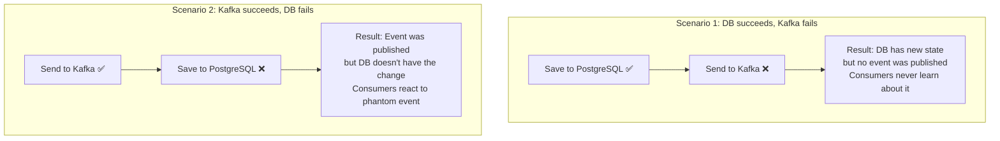
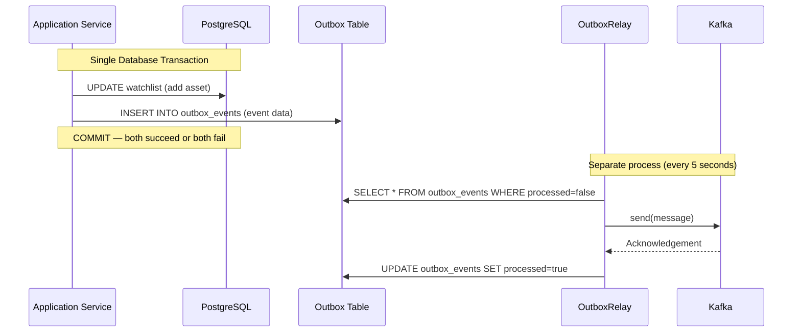
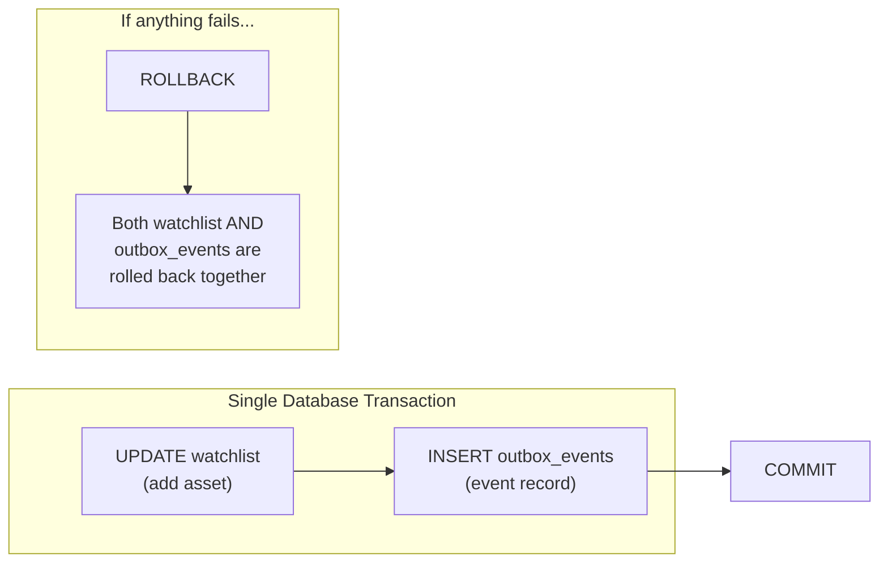
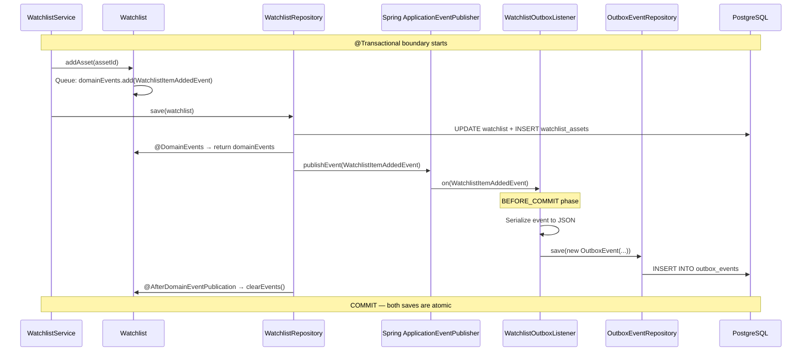
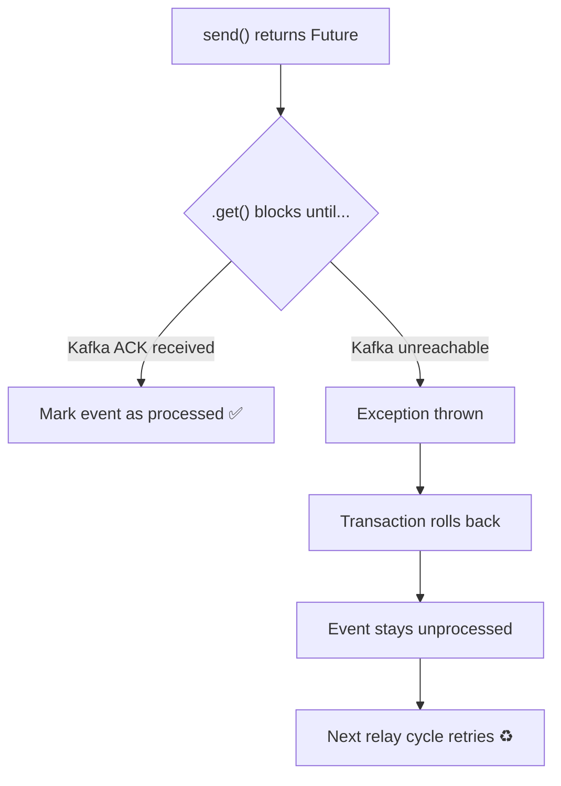

# MarketCanvas Engineering Handbook

## Part 6: The Transactional Outbox Pattern

---

## Chapter 24: The Dual-Write Problem

### 24.1 What is the Dual-Write Problem?

Imagine you need to do two things when an asset is added to a watchlist:
1. Save the updated watchlist to **PostgreSQL**
2. Send an event to **Kafka**

These are two separate systems. What happens if one succeeds and the other fails?



Both scenarios leave the system in an **inconsistent state**. This is the Dual-Write Problem — you cannot atomically write to two different systems without a distributed transaction.

### 24.2 Why Not Use Distributed Transactions?

Distributed transactions (like XA/2PC — Two-Phase Commit) coordinate writes across systems. But they:
- Are **extremely slow** — require coordination between all participants
- **Reduce availability** — if any participant is down, the entire transaction fails
- Are **not supported by Kafka** — Kafka has its own transactional model that doesn't integrate with JPA
- **Violate the CAP theorem** trade-offs preferred by modern systems

### 24.3 The Outbox Pattern — The Solution

Instead of writing to two systems, write everything to **one system** (the database) in a single transaction:



**Key insight:** The business data and the event record are saved in the **same database transaction**. They are guaranteed to be consistent. A background process later reads the outbox table and publishes to Kafka.

---

## Chapter 25: The WatchlistOutboxListener

### 25.1 Purpose

The `WatchlistOutboxListener` intercepts domain events published by the `Watchlist` aggregate and converts them into `OutboxEvent` database rows — all within the same transaction.

### 25.2 Complete Walkthrough

```java
// File: src/main/java/org/workshop/marketcanvas/sharedkernel/infrastructure/WatchlistOutboxListener.java
package org.workshop.marketcanvas.sharedkernel.infrastructure;

import lombok.RequiredArgsConstructor;
import org.springframework.stereotype.Component;
import org.springframework.transaction.event.TransactionPhase;
import org.springframework.transaction.event.TransactionalEventListener;
import org.workshop.marketcanvas.sharedkernel.domain.OutboxEvent;
import org.workshop.marketcanvas.sharedkernel.events.WatchlistItemAddedEvent;
import tools.jackson.databind.ObjectMapper;
import java.time.Instant;
import java.util.UUID;

@Component
@RequiredArgsConstructor
public class WatchlistOutboxListener {
    private final ObjectMapper mapper;              // Jackson JSON serializer
    private final OutboxEventRepository repository; // Outbox table access

    @TransactionalEventListener(
            phase = TransactionPhase.BEFORE_COMMIT   // Critical: same transaction!
    )
    public void on(WatchlistItemAddedEvent event)
    {
        try{
            OutboxEvent outboxEvent = new OutboxEvent(
                    UUID.randomUUID(),                         // Unique event ID
                    "Watchlist",                                // Aggregate type
                    event.watchlistId().toString(),            // Aggregate ID
                    event.getClass().getSimpleName(),          // "WatchlistItemAddedEvent"
                    mapper.writeValueAsString(event),          // JSON payload
                    Instant.now(),                              // Creation timestamp
                    false                                       // Not yet processed
            );
            repository.save(outboxEvent);
        } catch (Exception e) {
            throw new RuntimeException("System error: Failed to serialize domain event", e);
        }
    }
}
```

### 25.3 Critical Detail: `TransactionPhase.BEFORE_COMMIT`

This is the **most important line** in the entire Outbox Pattern implementation:

```java
@TransactionalEventListener(phase = TransactionPhase.BEFORE_COMMIT)
```

Spring provides four transaction phases:

| Phase | When it Runs | Can Modify DB? | Used Here? |
|-------|-------------|----------------|------------|
| `BEFORE_COMMIT` | Before the transaction commits | ✅ Yes — same TX | ✅ |
| `AFTER_COMMIT` | After the transaction commits | ❌ New TX needed | ❌ |
| `AFTER_ROLLBACK` | After the transaction rolls back | ❌ | ❌ |
| `AFTER_COMPLETION` | After commit or rollback | ❌ | ❌ |

**Why `BEFORE_COMMIT`?** Because we need the `OutboxEvent` save to be part of the **same transaction** as the `Watchlist` save:



If we used `AFTER_COMMIT`:
1. Watchlist save commits ✅
2. Listener tries to save OutboxEvent... but the original TX is done
3. A new transaction would be needed
4. If that fails → event is lost → **dual-write problem returns**

### 25.4 How the Event Chain Flows



---

## Chapter 26: The OutboxRelay

### 26.1 Purpose

The OutboxRelay is a **scheduled background task** that:
1. Polls the `outbox_events` table for unprocessed events
2. Publishes each event to Kafka
3. Marks the event as processed

### 26.2 Complete Walkthrough

```java
// File: src/main/java/org/workshop/marketcanvas/sharedkernel/infrastructure/OutboxRelay.java
package org.workshop.marketcanvas.sharedkernel.infrastructure;

import jakarta.transaction.Transactional;
import lombok.RequiredArgsConstructor;
import org.springframework.kafka.core.KafkaTemplate;
import org.springframework.scheduling.annotation.Scheduled;
import org.springframework.stereotype.Component;
import org.workshop.marketcanvas.sharedkernel.domain.OutboxEvent;
import tools.jackson.databind.ObjectMapper;
import tools.jackson.databind.node.ObjectNode;

import java.util.List;

@Component
@RequiredArgsConstructor
public class OutboxRelay {

    private final OutboxEventRepository repository;
    private final ObjectMapper objectMapper;
    private final KafkaTemplate<String, String> kafkaTemplate;

    @Scheduled(fixedDelay = 5000)  // Run every 5 seconds
    @Transactional                 // Entire method is one DB transaction
    public void publish() throws Exception {

        // Step 1: Fetch up to 100 unprocessed events, oldest first
        List<OutboxEvent> events =
                repository.findTop100ByProcessedFalseOrderByCreatedAt();

        // Step 2: Process each event
        for (OutboxEvent event : events) {
            // Build the envelope JSON
            ObjectNode envelope = objectMapper.createObjectNode();
            envelope.put("eventId", event.getId().toString());
            envelope.put("payload", event.getPayload());

            // Serialize envelope to string
            String kafkaMessage = objectMapper.writeValueAsString(envelope);

            // Send to Kafka and BLOCK until acknowledged
            kafkaTemplate
                    .send("platform.watchlist.events", kafkaMessage)
                    .get();  // .get() blocks until Kafka confirms receipt

            // Mark as processed (within the same transaction)
            event.setProcessed(true);
        }
    }
}
```

### 26.3 Key Design Decisions

#### `@Scheduled(fixedDelay = 5000)`

| Property | Value | Meaning |
|----------|-------|---------|
| `fixedDelay` | 5000ms | Wait 5 seconds **after the previous run completes** before starting the next |
| vs. `fixedRate` | — | Would run every 5 seconds regardless of completion time (risk: overlap) |

**Trade-off:** 5 seconds of latency vs. database polling load. In production, this can be reduced to 1 second or replaced with **Change Data Capture (CDC)** using Debezium for near-real-time delivery.

#### `.get()` — Blocking Kafka Send

```java
kafkaTemplate.send("platform.watchlist.events", kafkaMessage).get();
```

`KafkaTemplate.send()` returns a `CompletableFuture`. Calling `.get()` **blocks the current thread** until Kafka acknowledges the message. This is intentional:



Without `.get()`:
1. `send()` returns immediately (non-blocking)
2. Code continues to `event.setProcessed(true)`
3. Transaction commits → event marked as processed
4. Kafka send fails later → **event is lost** (marked processed but never delivered)

#### `findTop100ByProcessedFalseOrderByCreatedAt()`

- **Top100** — Batch processing. Don't load all events at once (could be thousands after an outage).
- **OrderByCreatedAt** — Process oldest first (FIFO order).
- **ProcessedFalse** — Only fetch events that haven't been sent yet.

---

## Chapter 27: Failure Scenarios

### 27.1 Application Crashes After DB Commit, Before Kafka Send

```
1. OutboxEvent saved to DB ✅
2. Application crashes 💥
3. OutboxRelay never ran
4. → Event sits in outbox_events with processed=false
5. Application restarts
6. OutboxRelay picks up the event on next poll ✅
7. Event is published to Kafka ✅
```

**Result:** No event loss. At-least-once delivery guaranteed.

### 27.2 Kafka is Down

```
1. OutboxRelay polls: finds unprocessed events
2. kafkaTemplate.send().get() throws exception ❌
3. Transaction rolls back → events stay unprocessed
4. Next relay cycle (5 seconds later) tries again
5. Kafka comes back online
6. Events are published successfully ✅
```

**Result:** Events are delayed but never lost.

### 27.3 Database is Down

```
1. HTTP request arrives
2. WatchlistService.addAssetToWatchlist() starts transaction
3. DB query fails → exception thrown
4. Transaction never started → nothing saved
5. HTTP response: 500 Internal Server Error
```

**Result:** Client receives error, can retry. No partial state.

### 27.4 Comparison with Alternatives

| Approach | Consistency | Latency | Complexity |
|----------|------------|---------|------------|
| **Outbox Pattern (this project)** | ✅ Atomic | ~5s (polling) | Medium |
| Direct Kafka send (after commit) | ❌ Dual-write risk | ~0ms | Low |
| CDC with Debezium | ✅ Atomic | ~100ms | High (WAL config) |
| Spring Modulith externalization | ✅ Atomic | ~100ms | Low (planned) |

---

*Continue to Part 7: Database, JPA & PostgreSQL →*
