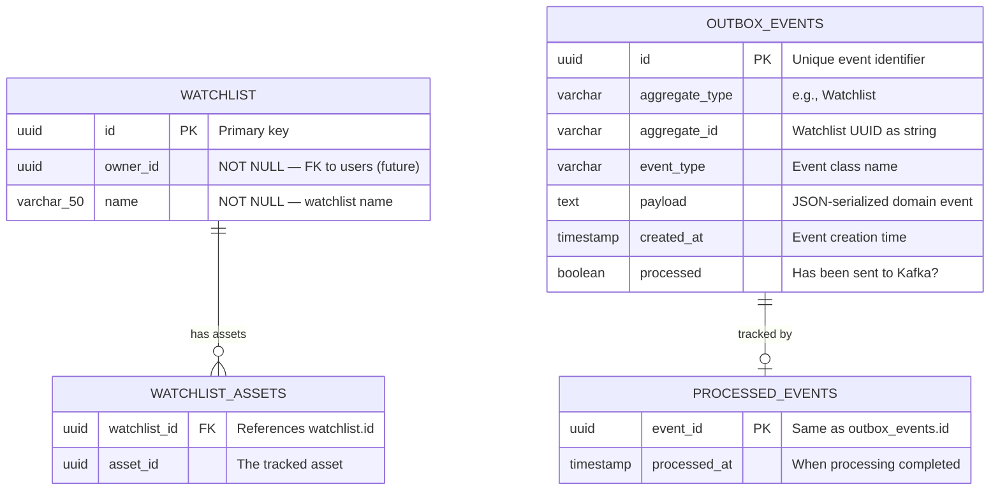

# MarketCanvas Engineering Handbook

## Part 7: Database, JPA & PostgreSQL

---

## Chapter 28: ACID Properties — The Foundation of Data Integrity

### 28.1 What is a Transaction?

A **transaction** is a sequence of database operations treated as a single unit. Either ALL operations succeed, or NONE do. There is no partial state.

**Real-world analogy:** Transferring $100 from Account A to Account B requires two operations: (1) subtract $100 from A, (2) add $100 to B. If operation 1 succeeds but operation 2 fails, $100 vanishes. A transaction ensures both happen or neither happens.

### 28.2 The ACID Properties

| Property | Meaning | How PostgreSQL Provides It |
|----------|---------|---------------------------|
| **Atomicity** | All operations succeed or all fail | Transaction rollback on error |
| **Consistency** | Data always satisfies all constraints | CHECK, NOT NULL, FOREIGN KEY |
| **Isolation** | Concurrent transactions don't interfere | MVCC (Multi-Version Concurrency Control) |
| **Durability** | Committed data survives crashes | Write-Ahead Log (WAL) |

### 28.3 Why ACID Matters for MarketCanvas

The Outbox Pattern **depends** on Atomicity:

```sql
BEGIN TRANSACTION;
  UPDATE watchlist SET ...;                    -- Business state change
  INSERT INTO watchlist_assets VALUES (...);   -- Asset collection update
  INSERT INTO outbox_events VALUES (...);      -- Event record
COMMIT;  -- All three succeed, or all three fail
```

Without ACID, the outbox event could be saved while the watchlist update fails — or vice versa.

### 28.4 MVCC — How PostgreSQL Handles Concurrent Access

**Multi-Version Concurrency Control (MVCC)** means PostgreSQL keeps **multiple versions** of each row. Readers see a snapshot from when their transaction started. Writers create new row versions without blocking readers.

```
Transaction A (started at T1):
  → Sees watchlist with 5 assets (snapshot at T1)

Transaction B (started at T2):
  → Adds asset → watchlist now has 6 assets
  → Commits

Transaction A:
  → Still sees 5 assets (its snapshot hasn't changed)
  → Eventually commits or starts a new query to see 6
```

This is why MarketCanvas can have the OutboxRelay reading `outbox_events` while the WatchlistService is simultaneously writing new events — they don't block each other.

---

## Chapter 29: Object-Relational Mapping (ORM) with Hibernate

### 29.1 What is ORM?

**Object-Relational Mapping** is a technique that converts between Java objects and database rows. Without ORM, you write raw SQL:

```java
// Without ORM — manual SQL
String sql = "INSERT INTO watchlist (id, owner_id, name) VALUES (?, ?, ?)";
PreparedStatement stmt = connection.prepareStatement(sql);
stmt.setObject(1, watchlist.getId());
stmt.setObject(2, watchlist.getOwnerId().value());
stmt.setString(3, watchlist.getName());
stmt.executeUpdate();
```

With ORM (Hibernate):
```java
// With ORM — automatic
watchlistRepository.save(watchlist);  // Hibernate generates the SQL
```

### 29.2 JPA vs. Hibernate vs. Spring Data JPA

| Layer | What It Is | Role |
|-------|-----------|------|
| **JPA** | Java Persistence API | A specification (interface) defining how ORM should work |
| **Hibernate** | JPA implementation | The actual library that does the work |
| **Spring Data JPA** | Spring abstraction | Auto-generates repositories from interfaces |

You write code against JPA annotations (`@Entity`, `@Id`, `@Column`). Hibernate interprets them. Spring Data JPA removes the need to write DAO implementations.

---

## Chapter 30: Entity-Relationship Diagram



### 30.1 Table Details

#### `watchlist`
| Column | Type | Constraint | Source |
|--------|------|-----------|--------|
| `id` | `UUID` | PRIMARY KEY | `@Id` on `Watchlist.id` |
| `owner_id` | `UUID` | NOT NULL | `@Column(nullable = false)` on `Watchlist.ownerId` |
| `name` | `VARCHAR(50)` | NOT NULL | `@Column(nullable = false, length = 50)` |

#### `watchlist_assets`
| Column | Type | Constraint | Source |
|--------|------|-----------|--------|
| `watchlist_id` | `UUID` | FOREIGN KEY → `watchlist.id` | `@JoinColumn(name = "watchlist_id")` |
| `asset_id` | `UUID` | — | `@Column(name = "asset_id")` |

This table is created by `@ElementCollection` — it doesn't have its own entity class.

#### `outbox_events`
| Column | Type | Constraint | Source |
|--------|------|-----------|--------|
| `id` | `UUID` | PRIMARY KEY | `@Id` on `OutboxEvent.id` |
| `aggregate_type` | `VARCHAR(255)` | — | `OutboxEvent.aggregateType` |
| `aggregate_id` | `VARCHAR(255)` | — | `OutboxEvent.aggregateId` |
| `event_type` | `VARCHAR(255)` | — | `OutboxEvent.eventType` |
| `payload` | `TEXT` | — | `@Lob` on `OutboxEvent.payload` |
| `created_at` | `TIMESTAMP` | — | `OutboxEvent.createdAt` |
| `processed` | `BOOLEAN` | DEFAULT FALSE | `OutboxEvent.processed` |

#### `processed_events`
| Column | Type | Constraint | Source |
|--------|------|-----------|--------|
| `event_id` | `UUID` | PRIMARY KEY | `@Id` on `ProcessedEvent.eventId` |
| `processed_at` | `TIMESTAMP` | — | `ProcessedEvent.processedAt` |

### 30.2 Schema Generation: `ddl-auto: update`

MarketCanvas uses Hibernate's automatic schema management:

```yaml
spring.jpa.hibernate.ddl-auto: update
```

| Value | Behavior | Safe for Production? |
|-------|----------|---------------------|
| `none` | Do nothing | ✅ Safest |
| `validate` | Verify schema matches entities | ✅ Recommended |
| `update` | Create/alter tables to match entities | ⚠️ Development only |
| `create` | Drop and recreate all tables | ❌ Data loss |
| `create-drop` | Create on startup, drop on shutdown | ❌ Testing only |

> [!CAUTION]
> `ddl-auto: update` must be replaced with **Flyway** database migrations before production. `update` can make irreversible schema changes and never drops columns, leading to schema drift.

---

## Chapter 31: JPA Annotations Reference

Every JPA annotation used in MarketCanvas:

| Annotation | Location | Purpose |
|-----------|----------|---------|
| `@Entity` | `Watchlist`, `OutboxEvent`, `ProcessedEvent` | Marks class as a database table |
| `@Table(name = "...")` | `OutboxEvent`, `ProcessedEvent` | Explicit table name |
| `@Id` | All entities | Primary key field |
| `@Column(nullable, length)` | `Watchlist.ownerId`, `Watchlist.name` | Column constraints |
| `@ElementCollection` | `Watchlist.assets` | Maps collection to separate table |
| `@CollectionTable` | `Watchlist.assets` | Configures the collection table |
| `@JoinColumn` | `Watchlist.assets` | Foreign key column name |
| `@Lob` | `OutboxEvent.payload` | Large text field (TEXT/CLOB) |
| `@Transient` | `Watchlist.domainEvents` | Field NOT persisted to database |
| `@Converter(autoApply)` | `UserIdConverter`, `AssetIdConverter` | Auto-convert value objects |

---

## Chapter 32: Spring Data JPA Repositories

### 32.1 How Interface-Based Repositories Work

You declare an interface. Spring generates the implementation at startup using a **JDK Dynamic Proxy**:

```java
// What you write:
public interface WatchlistRepository extends JpaRepository<Watchlist, UUID> {
}

// What Spring generates (conceptually):
public class WatchlistRepositoryImpl implements WatchlistRepository {
    private final EntityManager em;

    @Override
    public Watchlist save(Watchlist entity) {
        if (entity.getId() == null) {
            em.persist(entity);
        } else {
            em.merge(entity);
        }
        // Publish @DomainEvents
        return entity;
    }

    @Override
    public Optional<Watchlist> findById(UUID id) {
        return Optional.ofNullable(em.find(Watchlist.class, id));
    }
    // ... all other JpaRepository methods
}
```

### 32.2 Repository Summary

| Repository | Entity | Key Methods | Module |
|-----------|--------|-------------|--------|
| `WatchlistRepository` | `Watchlist` | Inherited (`save`, `findById`) | watchlist |
| `OutboxEventRepository` | `OutboxEvent` | `findTop100ByProcessedFalseOrderByCreatedAt()` | sharedkernel |
| `ProcessedEventRepository` | `ProcessedEvent` | Inherited (`save`, `existsById`) | marketdata |

---

## Chapter 33: Connection Pooling — HikariCP

### 33.1 What is Connection Pooling?

Creating a database connection is expensive (~100ms). If every request creates a new connection, performance suffers. A **connection pool** pre-creates and reuses connections.

**HikariCP** is Spring Boot's default connection pool. It's the fastest Java connection pool, maintaining a set of open connections that are borrowed and returned:

```
Application Thread 1 → borrow connection → execute SQL → return connection
Application Thread 2 → borrow connection → execute SQL → return connection
Application Thread 3 → (all connections busy → wait in queue)
```

Spring Boot auto-configures HikariCP from `spring.datasource.*` properties. Default pool size: 10 connections.

### 33.2 `open-in-view: false`

```yaml
spring.jpa.open-in-view: false
```

**Open Session in View (OSIV)** is a pattern where the Hibernate session stays open throughout the entire HTTP request lifecycle — including the view/serialization phase. This allows lazy-loaded collections to be fetched during JSON serialization.

MarketCanvas explicitly disables this because:
- It holds database connections longer than necessary
- It hides N+1 query problems
- It couples the view layer to the persistence layer
- It's considered an anti-pattern by the Spring team (they log a warning if it's enabled)

---

*Continue to Part 8: REST API, Security & Request Flow →*
