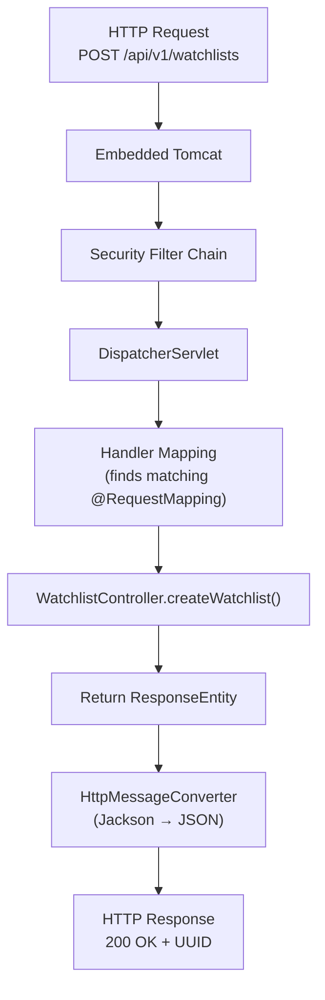
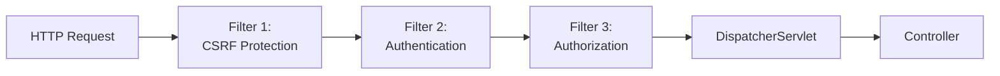
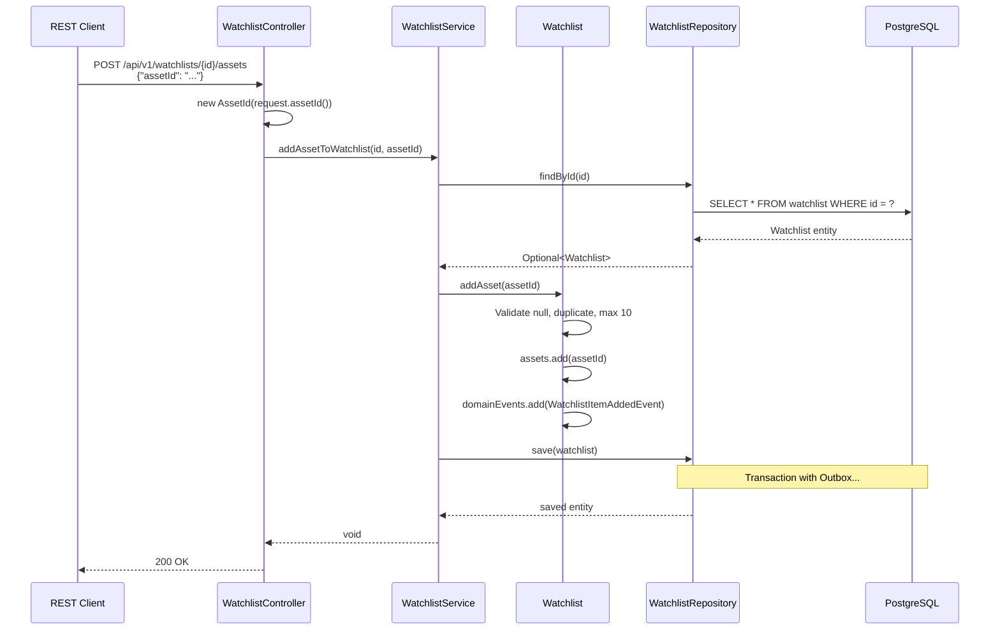

# MarketCanvas Engineering Handbook

## Part 8: REST API, Security & Request Flow

---

## Chapter 34: HTTP and REST — From First Principles

### 34.1 What is HTTP?

**HyperText Transfer Protocol (HTTP)** is the communication protocol of the web. It follows a **request-response** model:

```
Client ──HTTP Request──→ Server
Client ←─HTTP Response── Server
```

Every HTTP request has:
- **Method** — what action to perform (GET, POST, PUT, DELETE)
- **URL** — what resource to act on
- **Headers** — metadata (content type, authentication)
- **Body** — data payload (for POST, PUT)

### 34.2 What is REST?

**Representational State Transfer (REST)** is an architectural style for designing web APIs. Created by Roy Fielding in his 2000 PhD dissertation. Key principles:

| Principle | Meaning | MarketCanvas Example |
|-----------|---------|---------------------|
| Resources | Everything is a resource identified by a URL | `/api/v1/watchlists` |
| HTTP Methods | Use standard methods for CRUD | POST = Create |
| Stateless | Each request is independent | No server-side session |
| Representations | Resources can be represented as JSON, XML, etc. | JSON |

### 34.3 HTTP Methods Used in MarketCanvas

| Method | Semantics | Idempotent? | MarketCanvas Usage |
|--------|-----------|------------|-------------------|
| `POST` | Create a resource | No | Create watchlist, add asset |
| `GET` | Read a resource | Yes | (Not yet implemented) |
| `PUT` | Replace a resource | Yes | (Not yet implemented) |
| `DELETE` | Remove a resource | Yes | (Not yet implemented) |

---

## Chapter 35: Spring MVC — How HTTP Requests Are Handled

### 35.1 The DispatcherServlet

Spring MVC uses a single **DispatcherServlet** that receives ALL HTTP requests and routes them to the appropriate controller method:



### 35.2 Annotations That Power Routing

| Annotation | Purpose | Example |
|-----------|---------|---------|
| `@RestController` | Marks class as HTTP handler + auto-serializes responses | `WatchlistController` |
| `@RequestMapping("/api/v1/watchlists")` | Base URL path for all methods in this controller | All endpoints start with this |
| `@PostMapping` | Maps HTTP POST to this method | `createWatchlist()` |
| `@PostMapping("/{id}/assets")` | POST with path variable | `addAsset()` |
| `@RequestBody` | Deserialize request body from JSON | `CreateWatchlistRequest` |
| `@PathVariable` | Extract value from URL path | `UUID id` from `/{id}/assets` |

---

## Chapter 36: The WatchlistController — Complete Walkthrough

```java
// File: src/main/java/org/workshop/marketcanvas/watchlist/infrastructure/WatchlistController.java
package org.workshop.marketcanvas.watchlist.infrastructure;

import lombok.RequiredArgsConstructor;
import org.springframework.http.ResponseEntity;
import org.springframework.web.bind.annotation.*;
import org.workshop.marketcanvas.sharedkernel.domain.AssetId;
import org.workshop.marketcanvas.sharedkernel.domain.UserId;
import org.workshop.marketcanvas.watchlist.application.WatchlistService;

import java.util.UUID;

@RequiredArgsConstructor                    // Constructor injection
@RestController                             // HTTP handler + JSON serialization
@RequestMapping("/api/v1/watchlists")       // Base URL path
public class WatchlistController {
    private final WatchlistService watchlistService;  // Injected by Spring

    @PostMapping                            // POST /api/v1/watchlists
    public ResponseEntity<UUID> createWatchlist(
            @RequestBody CreateWatchlistRequest watchlistRequest  // JSON → Java object
    ){
        UserId owner = new UserId(watchlistRequest.ownerId());  // DTO → Value Object
        UUID id = watchlistService.createWatchlist(owner, watchlistRequest.name());
        return ResponseEntity.ok(id);       // 200 OK with UUID in body
    }

    @PostMapping("/{id}/assets")            // POST /api/v1/watchlists/{id}/assets
    public ResponseEntity<Void> addAsset(
            @PathVariable UUID id,           // Extract {id} from URL
            @RequestBody AddAssetRequest request  // JSON → Java object
    ){
        AssetId asset = new AssetId(request.assetId());  // DTO → Value Object
        watchlistService.addAssetToWatchlist(id, asset);
        return ResponseEntity.ok().build(); // 200 OK with empty body
    }
}
```

### 36.1 Controller Design Principles

The controller is intentionally **thin**. It does exactly three things:
1. **Convert** HTTP primitives (JSON body, path variables) to domain types (Value Objects)
2. **Delegate** to the Application Service
3. **Convert** the result back to an HTTP response

It contains **zero business logic**. All rules (asset limits, name validation) live in the `Watchlist` aggregate.

### 36.2 Request DTOs

```java
// File: CreateWatchlistRequest.java
public record CreateWatchlistRequest(UUID ownerId, String name) {}

// File: AddAssetRequest.java
public record AddAssetRequest(UUID assetId) {}
```

These are Java records used as **Data Transfer Objects (DTOs)**. Jackson (the JSON library) automatically:
1. Reads the JSON request body
2. Matches JSON field names to record component names
3. Calls the record constructor

```json
// JSON request body:
{ "ownerId": "550e8400-...", "name": "Tech Stocks" }

// Jackson creates:
new CreateWatchlistRequest(
    UUID.fromString("550e8400-..."),
    "Tech Stocks"
)
```

---

## Chapter 37: Spring Security

### 37.1 What is Application Security?

Application security protects against:
- **Unauthorized access** — users accessing resources they shouldn't
- **Authentication bypass** — accessing the system without logging in
- **Cross-Site Request Forgery (CSRF)** — malicious sites making requests on behalf of logged-in users
- **Injection attacks** — SQL injection, XSS

### 37.2 The Security Filter Chain

Spring Security works by inserting a chain of **filters** before any request reaches the controller:



Each filter can:
- **Pass** the request to the next filter
- **Reject** the request with an error response (401, 403)
- **Modify** the request (add security context)

### 37.3 SecurityConfig — Complete Walkthrough

```java
// File: src/main/java/org/workshop/marketcanvas/SecurityConfig.java
package org.workshop.marketcanvas;

import org.springframework.context.annotation.Bean;
import org.springframework.context.annotation.Configuration;
import org.springframework.security.config.annotation.web.builders.HttpSecurity;
import org.springframework.security.web.SecurityFilterChain;

@Configuration                             // This is a bean factory
public class SecurityConfig {

    @Bean                                  // Registers the return value as a Spring bean
    public SecurityFilterChain filterChain(HttpSecurity http) throws Exception {
        http
            .csrf(csrf -> csrf.disable())          // Disable CSRF protection
            .authorizeHttpRequests(auth -> auth
                .requestMatchers("/api/**").permitAll()  // Allow all API requests
                .anyRequest().authenticated()       // Everything else requires auth
            );
        return http.build();               // Build the filter chain
    }
}
```

#### Line-by-Line

**`.csrf(csrf -> csrf.disable())`** — Disables CSRF protection. CSRF is an attack where a malicious website makes requests to your server using a logged-in user's browser cookies. REST APIs are typically **stateless** (no cookies/sessions), so CSRF doesn't apply. This is safe for MarketCanvas because:
- No browser sessions
- Authentication will use JWT tokens (in headers, not cookies)

**`.requestMatchers("/api/**").permitAll()`** — Any URL starting with `/api/` is accessible **without authentication**. This is a **development-only** configuration.

**`.anyRequest().authenticated()`** — Everything else (actuator endpoints, admin pages) requires authentication. Since no authentication provider is configured yet, these endpoints return 401.

> [!WARNING]
> This security configuration is for **development only**. Production requires:
> - OAuth2/OIDC authentication (Google, Apple, Microsoft)
> - JWT tokens with short expiry
> - Role-based access control (FREE_USER, PRO_USER, TEAM_ADMIN, PLATFORM_ADMIN)
> - Rate limiting

---

## Chapter 38: API Documentation

### 38.1 Endpoint: Create Watchlist

| Property | Value |
|----------|-------|
| **Method** | `POST` |
| **URL** | `/api/v1/watchlists` |
| **Authentication** | None (development) |
| **Content-Type** | `application/json` |

**Request Body:**
```json
{
  "ownerId": "550e8400-e29b-41d4-a716-446655440000",
  "name": "Tech Stocks"
}
```

| Field | Type | Required | Validation |
|-------|------|----------|-----------|
| `ownerId` | UUID | Yes | Must not be null (enforced by factory method) |
| `name` | String | Yes | 1-50 characters, not blank (enforced by aggregate) |

**Success Response:**
```
HTTP/1.1 200 OK
Content-Type: application/json

"7c9e6679-7425-40de-944b-e07fc1f90ae7"
```

**Error Responses:**

| Status | Cause | Body |
|--------|-------|------|
| 400 | Invalid JSON | Spring default error |
| 500 | Null ownerId or blank name | Stack trace (needs global exception handler) |

**Example cURL (Windows PowerShell):**
```powershell
curl.exe -X POST http://localhost:8080/api/v1/watchlists `
  -H "Content-Type: application/json" `
  -d "{\"ownerId\": \"550e8400-e29b-41d4-a716-446655440000\", \"name\": \"Tech Stocks\"}"
```

### 38.2 Endpoint: Add Asset to Watchlist

| Property | Value |
|----------|-------|
| **Method** | `POST` |
| **URL** | `/api/v1/watchlists/{watchlistId}/assets` |
| **Authentication** | None (development) |
| **Content-Type** | `application/json` |

**Path Parameters:**

| Parameter | Type | Description |
|-----------|------|-------------|
| `watchlistId` | UUID | The watchlist to add the asset to |

**Request Body:**
```json
{
  "assetId": "8a3b4c5d-6e7f-8a9b-0c1d-2e3f4a5b6c7d"
}
```

**Success Response:**
```
HTTP/1.1 200 OK
(empty body)
```

**Error Responses:**

| Status | Cause |
|--------|-------|
| 500 | Watchlist not found |
| 500 | Asset already at maximum (10) |
| 500 | Null assetId |

**Sequence Diagram:**



> [!TIP]
> **Future Improvement:** Add a `@RestControllerAdvice` global exception handler to convert domain exceptions to proper HTTP status codes (404 for "not found", 409 for "limit exceeded", 422 for validation errors) instead of returning 500.

---

*Continue to Part 9: Testing, DevOps & Infrastructure →*
