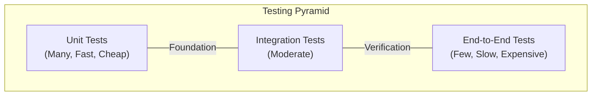
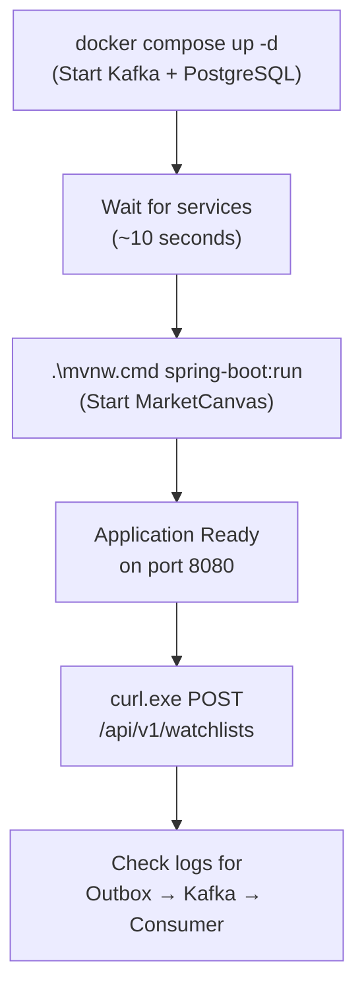

# MarketCanvas Engineering Handbook

## Part 9: Testing, DevOps & Infrastructure

---

## Chapter 39: Testing Philosophy

### 39.1 The Testing Pyramid



| Layer | Tests What | Speed | MarketCanvas Status |
|-------|-----------|-------|-------------------|
| Unit | Domain logic in isolation | ~ms | ✅ `WatchlistTest` |
| Architecture | Package boundaries | ~ms | ✅ `ArchitectureEnforcementTest` |
| Integration | JPA, Kafka, Spring context | ~seconds | `MarketCanvasApplicationTests` (context load) |
| End-to-End | Full HTTP → Kafka flow | ~seconds | ✅ Manual (cURL verified) |

### 39.2 Testing Conventions

| Convention | Rule |
|-----------|------|
| Test location | Same base package, `src/test` directory |
| Unit test naming | `ClassNameTest` |
| Integration test naming | `ClassNameIT` (planned) |
| Test aggregates via | Public API only (factory methods + behavior methods) |
| `@SpringBootTest` | Integration tests only — never for unit tests |

---

## Chapter 40: Unit Testing — `WatchlistTest`

### 40.1 What is a Unit Test?

A **unit test** verifies a single piece of logic in isolation. It:
- **Does not** start Spring
- **Does not** connect to a database
- **Does not** use Kafka
- **Does** test pure Java logic
- Runs in **milliseconds**

### 40.2 Complete Walkthrough

```java
// File: src/test/java/org/workshop/marketcanvas/WatchlistTest.java
package org.workshop.marketcanvas;

import org.junit.jupiter.api.Test;
import org.workshop.marketcanvas.sharedkernel.domain.AssetId;
import org.workshop.marketcanvas.sharedkernel.domain.UserId;
import org.workshop.marketcanvas.watchlist.domain.Watchlist;

import java.util.UUID;

import static org.junit.jupiter.api.Assertions.assertEquals;
import static org.junit.jupiter.api.Assertions.assertThrows;

public class WatchlistTest {

    @Test
    void addAsset_throwsException_whenAddingEleventhAsset() {
        // 1. ARRANGE: Create the Watchlist with dummy IDs
        UserId dummyOwnerId = new UserId(UUID.randomUUID());
        Watchlist watchlist = Watchlist.create(dummyOwnerId, "Watch list 1");

        // Fill the watchlist to its maximum capacity (10 assets)
        for (int i = 0; i < 10; i++) {
            watchlist.addAsset(new AssetId(UUID.randomUUID()));
        }

        // 2. ACT & ASSERT: The 11th attempt must throw
        IllegalStateException exception = assertThrows(
                IllegalStateException.class,
                () -> watchlist.addAsset(new AssetId(UUID.randomUUID())),
                "Expected addAsset to throw, but it didn't"
        );

        // 3. VERIFY: Exact message to ensure we caught the right error
        assertEquals(
            "Free-Tier Watchlists can hold a maximum of 10 Assets",
            exception.getMessage()
        );
    }
}
```

#### Pattern: Arrange-Act-Assert (AAA)

| Phase | Lines | What Happens |
|-------|-------|-------------|
| **Arrange** | 18-23 | Create test fixtures: a watchlist filled to max capacity |
| **Act** | 26-29 | Attempt the 11th asset addition |
| **Assert** | 26-33 | Verify `IllegalStateException` with correct message |

#### Key Design Decisions

1. **Uses `Watchlist.create()` factory method** — not a constructor. Tests interact with the aggregate through its public API.
2. **Uses real `UserId` and `AssetId`** — no mocks needed because value objects are simple.
3. **Verifies exact error message** — ensures we caught the *right* exception, not a coincidental one.
4. **No Spring context** — pure JUnit 5. Runs in <10ms.

---

## Chapter 41: Architecture Enforcement — ArchUnit

### 41.1 What is ArchUnit?

**ArchUnit** is a Java library that lets you write **architectural rules as unit tests**. If a developer violates a rule (e.g., imports a class from another module), the test fails — the code cannot be merged.

### 41.2 Why Enforce Architecture with Tests?

Without enforcement, architectural boundaries erode over time:

```
Week 1: "I'll just import one class from watchlist in marketdata..."
Week 4: "There are 15 cross-module imports now..."
Week 12: "These modules are so coupled we can't extract them"
```

ArchUnit makes violations **impossible to merge**.

### 41.3 Complete Walkthrough

```java
// File: src/test/java/org/workshop/marketcanvas/ArchitectureEnforcementTest.java
package org.workshop.marketcanvas;

import com.tngtech.archunit.junit.AnalyzeClasses;
import com.tngtech.archunit.junit.ArchTest;
import com.tngtech.archunit.lang.ArchRule;
import static com.tngtech.archunit.library.Architectures.layeredArchitecture;

@AnalyzeClasses(packages = "org.workshop.marketcanvas")
public class ArchitectureEnforcementTest {

    @ArchTest
    static final ArchRule moduleShouldBeIndependent = layeredArchitecture()
            .consideringAllDependencies()
            .layer("User").definedBy("..user..")
            .layer("Watchlist").definedBy("..watchlist..")
            .layer("MarketData").definedBy("..marketdata..")
            .layer("SharedKernel").definedBy("..sharedkernel..")
            .whereLayer("Watchlist").mayOnlyAccessLayers("SharedKernel")
            .whereLayer("User").mayOnlyAccessLayers("SharedKernel")
            .whereLayer("MarketData").mayOnlyAccessLayers("SharedKernel")
            .withOptionalLayers(true);
}
```

#### Line-by-Line

**`@AnalyzeClasses(packages = "org.workshop.marketcanvas")`** — Tells ArchUnit to scan ALL compiled classes under this package. It analyzes the bytecode, finding every `import` statement and method call.

**`layeredArchitecture()`** — Defines an architecture where "layers" (modules) have restricted dependencies.

**`.layer("Watchlist").definedBy("..watchlist..")`** — Any class whose package path contains `watchlist` belongs to the "Watchlist" layer. The `..` syntax means "any sub-package."

**`.whereLayer("Watchlist").mayOnlyAccessLayers("SharedKernel")`** — Classes in the Watchlist module may ONLY import classes from SharedKernel. Importing from `marketdata` or `user` would **fail the test**.

**`.withOptionalLayers(true)`** — If a defined layer has no classes yet (e.g., `user` module is empty), don't fail.

#### What Violations Look Like

If someone adds this import to `WatchlistService`:
```java
import org.workshop.marketcanvas.marketdata.application.messaging.WatchlistEventConsumer;
```

ArchUnit reports:
```
Architecture Violation: Layer 'Watchlist' is not allowed to access layer 'MarketData'!
  Field: WatchlistService.consumer has type WatchlistEventConsumer
```

---

## Chapter 42: Docker — From First Principles

### 42.1 What is Docker?

Docker is a **containerization platform**. A container is a lightweight, isolated environment that packages an application with all its dependencies.

**Real-world analogy:** A shipping container. Before containers, cargo was loaded loose — different shapes, sizes, handling requirements. Containers standardized shipping: everything fits in the same box, loads on any ship, any truck. Docker does the same for software.

### 42.2 Container vs. Virtual Machine

| Feature | Container | Virtual Machine |
|---------|-----------|----------------|
| Startup time | Seconds | Minutes |
| Size | MBs | GBs |
| OS | Shares host kernel | Full OS copy |
| Isolation | Process-level | Hardware-level |
| Performance | Near-native | 5-20% overhead |

### 42.3 Images vs. Containers

- **Image** — A read-only template (like a blueprint)
- **Container** — A running instance of an image (like a house built from the blueprint)

```
postgres:16 (image) → investment-platform-db (container)
apache/kafka:3.9.2 (image) → kafka (container)
```

---

## Chapter 43: Docker Compose — Complete Walkthrough

```yaml
# File: docker-compose.yml

services:                                    # Define services to run

  kafka:                                     # Service name
    image: apache/kafka:3.9.2               # Official Apache Kafka image
    container_name: kafka                    # Explicit container name
    ports:
      - "9092:9092"                          # Map host:9092 → container:9092
    environment:
      KAFKA_NODE_ID: 1                       # Unique ID for this broker
      KAFKA_PROCESS_ROLES: broker,controller # Single node: both roles
      KAFKA_LISTENERS: PLAINTEXT://0.0.0.0:9092,CONTROLLER://0.0.0.0:9093
      KAFKA_ADVERTISED_LISTENERS: PLAINTEXT://localhost:9092
      KAFKA_CONTROLLER_LISTENER_NAMES: CONTROLLER
      KAFKA_CONTROLLER_QUORUM_VOTERS: 1@localhost:9093
      KAFKA_OFFSETS_TOPIC_REPLICATION_FACTOR: 1
      KAFKA_TRANSACTION_STATE_LOG_REPLICATION_FACTOR: 1
      KAFKA_TRANSACTION_STATE_LOG_MIN_ISR: 1

  postgres:                                  # Service name
    image: postgres:16                       # Official PostgreSQL 16 image
    container_name: investment-platform-db
    restart: unless-stopped                  # Auto-restart on crash
    environment:
      POSTGRES_DB: investment_platform       # Database name
      POSTGRES_USER: postgres                # Username
      POSTGRES_PASSWORD: postgres            # Password
    ports:
      - "5433:5432"                          # Host:5433 → Container:5432
    volumes:
      - postgres-data:/var/lib/postgresql/data  # Persist data

volumes:
  postgres-data:                             # Named volume for persistence
```

#### Key Configuration Details

**Port mapping `5433:5432`** — The PostgreSQL container internally listens on port 5432 (the standard). But on the host machine, port 5432 is occupied by a native Windows PostgreSQL installation. So Docker maps host port **5433** to container port 5432. The application connects to `localhost:5433`.

**`restart: unless-stopped`** — If the PostgreSQL container crashes, Docker automatically restarts it. It only stays stopped if manually stopped with `docker stop`.

**Named volume `postgres-data`** — Without a volume, all data inside the container is lost when the container is removed. The named volume persists data on the host filesystem, surviving container restarts and recreations.

### 43.1 Docker Compose Commands

| Command | Purpose |
|---------|---------|
| `docker compose up -d` | Start all services in background |
| `docker compose down` | Stop and remove all containers |
| `docker compose logs -f kafka` | Follow Kafka logs |
| `docker compose ps` | List running containers |
| `docker compose down -v` | Stop and **delete all data** (volumes) |

---

## Chapter 44: Maven Build System

### 44.1 The Maven Wrapper

MarketCanvas includes `mvnw` (Unix) and `mvnw.cmd` (Windows) — scripts that download the correct Maven version automatically:

```powershell
# Build the project
.\mvnw.cmd clean package

# Run tests only
.\mvnw.cmd test

# Skip tests (faster build)
.\mvnw.cmd clean package -DskipTests

# Run the application
.\mvnw.cmd spring-boot:run
```

### 44.2 Build Plugins

**`spring-boot-maven-plugin`** — Creates an executable JAR that embeds Tomcat. Excludes Lombok from the production artifact (annotation processing only needed at compile time).

**`maven-compiler-plugin`** — Configured for Java 21 with Lombok as an annotation processor for both main and test compilation.

### 44.3 Local Development Workflow



---

*Continue to Part 10: Design Patterns, Performance & Evolution →*
