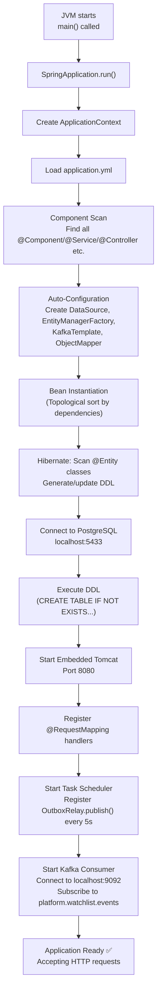
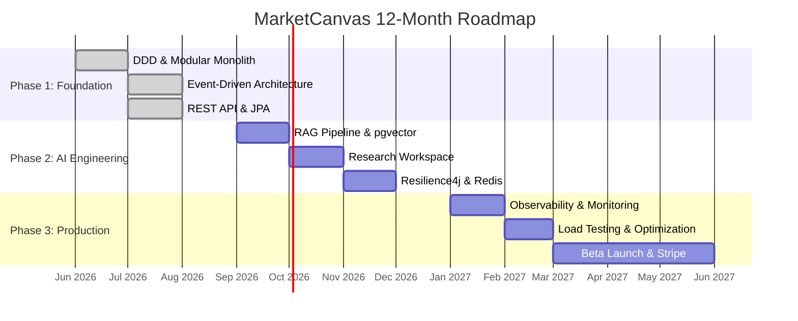

# MarketCanvas Engineering Handbook

## Part 10: Design Patterns, Performance & Evolution

---

## Chapter 45: Design Patterns Catalog

Every design pattern used in MarketCanvas, documented from first principles.

### 45.1 Factory Method Pattern

| Property | Value |
|----------|-------|
| **GoF Category** | Creational |
| **Intent** | Define an interface for creating an object, but let subclasses decide which class to instantiate |
| **Problem it solves** | Prevents invalid object creation; centralizes construction logic |

**History:** Documented by the "Gang of Four" (Gamma, Helm, Johnson, Vlissides) in 1994's *Design Patterns* book. One of the most widely used patterns in enterprise software.

**How MarketCanvas uses it:**

```java
// Watchlist.java — Factory Method
public static Watchlist create(UserId ownerId, String name) {
    if (ownerId == null) {
        throw new IllegalArgumentException("Owner ID cannot be null");
    }
    return new Watchlist(UUID.randomUUID(), ownerId, name);
}
```

The constructor is `private`. The ONLY way to create a `Watchlist` is through `create()`. This guarantees:
- `ownerId` is never null
- `name` is validated (via `rename()` call in constructor)
- `id` is always a fresh UUID

**Alternative:** Public constructor → no invariant protection, any code can create invalid objects.

**Interview Q:** *"Why use a factory method instead of a public constructor?"*
**A:** Factory methods can enforce preconditions, generate IDs, and return different subtypes. Constructors can only throw exceptions — they can't return an existing instance or a different type.

---

### 45.2 Observer Pattern (Event Listener)

| Property | Value |
|----------|-------|
| **GoF Category** | Behavioral |
| **Intent** | Define a one-to-many dependency so that when one object changes state, all dependents are notified |
| **Problem it solves** | Decouples the event producer from consumers |

**How MarketCanvas uses it:**

```
Producer:  Watchlist aggregate → queues WatchlistItemAddedEvent
Mediator:  Spring ApplicationEventPublisher
Observer:  WatchlistOutboxListener → @TransactionalEventListener
```

The `Watchlist` aggregate doesn't know about the `WatchlistOutboxListener`. It doesn't know about Kafka. It only knows how to queue events. Spring's event system connects producer to consumer.

**Interview Q:** *"What's the difference between Observer and Pub/Sub?"*
**A:** Observer is typically synchronous and in-process. Pub/Sub adds a broker (like Kafka) for async, cross-process communication. MarketCanvas uses both: Spring events (Observer) for in-process, Kafka (Pub/Sub) for cross-module.

---

### 45.3 Repository Pattern

| Property | Value |
|----------|-------|
| **Origin** | Eric Evans, *Domain-Driven Design* (2003) |
| **Intent** | Mediate between the domain and data mapping layers using a collection-like interface |
| **Problem it solves** | Separates domain logic from persistence concerns |

**How MarketCanvas uses it:**

```java
public interface WatchlistRepository extends JpaRepository<Watchlist, UUID> {}
```

Domain code interacts with `WatchlistRepository` as if it were a collection: `save()`, `findById()`, `findAll()`. The implementation (Hibernate + Spring Data JPA proxy) is hidden.

**Interview Q:** *"Why not inject `EntityManager` directly?"*
**A:** `EntityManager` is a JPA infrastructure concern. The domain layer shouldn't know about JPA. Repositories provide a domain-friendly abstraction that can be swapped (e.g., from JPA to MongoDB) without changing domain code.

---

### 45.4 Transactional Outbox Pattern

| Property | Value |
|----------|-------|
| **Origin** | Chris Richardson, *Microservices Patterns* (2018) |
| **Intent** | Reliably publish events to a message broker using the database as an intermediary |
| **Problem it solves** | The Dual-Write Problem |

**Implementation summary:**
1. Domain event → `@TransactionalEventListener(BEFORE_COMMIT)` → `OutboxEvent` saved in same TX
2. `@Scheduled` relay → polls DB → sends to Kafka → marks processed

**Interview Q:** *"What happens if the relay crashes after sending to Kafka but before marking processed?"*
**A:** The event will be sent again on next poll. This is "at-least-once" delivery. The consumer handles this via the Idempotent Consumer pattern.

---

### 45.5 Idempotent Consumer Pattern

| Property | Value |
|----------|-------|
| **Origin** | Enterprise Integration Patterns (Hohpe & Woolf, 2003) |
| **Intent** | Ensure a message is processed exactly once, even if delivered multiple times |
| **Problem it solves** | Duplicate message delivery in at-least-once systems |

**Implementation:**
```java
if(processedEventRepository.existsById(eventId)) {
    log.info("Idempotency hit: Ignored duplicate event [{}]", eventId);
    return;  // Skip — already processed
}
// ... process event ...
processedEventRepository.save(new ProcessedEvent(eventId, Instant.now()));
```

**Interview Q:** *"What if the DB check and save aren't atomic?"*
**A:** They ARE atomic — both run in the same `@Transactional` boundary. If the save fails, the check record also rolls back, so the event will be retried.

---

### 45.6 Value Object Pattern

| Property | Value |
|----------|-------|
| **Origin** | Eric Evans, *Domain-Driven Design* (2003) |
| **Intent** | Represent a concept with no identity, defined only by its attributes |
| **Problem it solves** | Type safety, self-validation, eliminating primitive obsession |

**Implementation:** Java `record` types with compact constructor validation.

---

## Chapter 46: Application Boot Sequence

When `MarketCanvasApplication.main()` runs, this is the complete startup sequence:



### 46.1 Graceful Shutdown

When the application receives a shutdown signal (SIGTERM, Ctrl+C):

1. Stop accepting new HTTP requests
2. Complete in-flight HTTP requests
3. Stop the Kafka consumer (commit offsets)
4. Stop the task scheduler (OutboxRelay)
5. Close database connections (HikariCP pool)
6. Destroy all beans (`@PreDestroy` methods)
7. JVM exits

---

## Chapter 47: Architecture Decision Records (ADR) Summary

| ADR | Decision | Status | Key Rationale |
|-----|----------|--------|---------------|
| 001 | Modular Monolith over Microservices | Active | Team size 1, domain boundaries being discovered |
| 002 | PostgreSQL over MySQL | Active | pgvector + TimescaleDB extensions needed |
| 003 | Transactional Outbox over direct Kafka | Active | Solves dual-write problem |
| 004 | Kafka KRaft over ZooKeeper | Active | Modern standard, simpler setup |
| 005 | Spring Events → Kafka migration | Active | Gradual, low-risk transition |
| 006 | Idempotent Consumer via DB table | Active | Reliable, works with any downstream store |
| 007 | Package-by-domain over package-by-layer | Active | Cohesion, future extraction |
| 008 | Two-tier exception handling | Active | Poison pills vs transient errors |

---

## Chapter 48: Technical Debt Inventory

| Item | Severity | Impact | Effort |
|------|----------|--------|--------|
| `ddl-auto: update` | 🔴 Critical (pre-prod) | Schema drift, data loss risk | Low — add Flyway |
| No global exception handler | 🟡 Medium | 500 errors instead of 400/404/409 | Low |
| `processed_events` unbounded growth | 🟡 Medium | Table grows forever | Low — add cleanup job |
| No Kafka DLQ | 🟡 Medium | Poison pills retry forever | Medium |
| Security permits all `/api/**` | 🔴 Critical (pre-prod) | No authentication | Medium |
| No Kafka consumer tests | 🟡 Medium | Consumer logic untested | Medium |
| Hardcoded Kafka topic strings | 🟢 Low | Scattered string literals | Low |
| Double-encoded JSON payload | 🟢 Low | Extra parse step in consumer | Low |

---

## Chapter 49: Security Considerations

### 49.1 Current State
- CSRF disabled (appropriate for stateless REST API)
- All `/api/**` endpoints publicly accessible (development only)
- No authentication or authorization
- Credentials in `application.yml` (not externalized)

### 49.2 Production Requirements

| Control | Implementation Plan |
|---------|-------------------|
| Authentication | OAuth2/OIDC with Google, Apple, Microsoft |
| Authorization | RBAC: FREE_USER, PRO_USER, TEAM_ADMIN, PLATFORM_ADMIN |
| Token | JWT with short expiry, refresh token rotation |
| Input validation | Jakarta Bean Validation (`@Valid`, `@NotNull`, `@Size`) |
| SQL injection | Prevented by JPA/Hibernate parameterized queries |
| Secrets | Environment variables or secrets manager |
| Rate limiting | Spring Cloud Gateway or Resilience4j |
| Audit logging | Domain event log provides natural audit trail |

---

## Chapter 50: Project Evolution Roadmap



---

## Chapter 51: Glossary

| Term | Definition |
|------|-----------|
| **Aggregate Root** | A cluster of domain objects treated as a single unit. External code can only interact through the root |
| **ApplicationContext** | Spring's IoC container that holds all beans |
| **At-Least-Once** | Delivery guarantee where messages are never lost but may be duplicated |
| **Bean** | An object managed by the Spring IoC container |
| **Bounded Context** | A boundary within which a specific domain model applies |
| **CSRF** | Cross-Site Request Forgery — an attack where a malicious site makes requests using your session |
| **Dead Letter Queue** | A topic for messages that fail processing after maximum retries |
| **Domain Event** | An immutable record of something that happened in the domain |
| **Dual-Write Problem** | The impossibility of atomically writing to two different systems |
| **Factory Method** | A static method that creates and returns an object, enforcing invariants |
| **HikariCP** | Spring Boot's default database connection pool |
| **Idempotent** | Producing the same result regardless of how many times an operation is performed |
| **IoC** | Inversion of Control — the framework creates and manages objects, not your code |
| **JPA** | Java Persistence API — the ORM specification |
| **KRaft** | Kafka's built-in consensus protocol, replacing ZooKeeper |
| **Lombok** | Compile-time annotation processor that generates Java boilerplate |
| **MVCC** | Multi-Version Concurrency Control — PostgreSQL's method for handling concurrent access |
| **Outbox Pattern** | Saves events in the same DB transaction as business data; a relay publishes to the broker |
| **Poison Pill** | A malformed message that can never be processed |
| **Record** | Java's immutable data carrier class (since Java 16) |
| **Shared Kernel** | A small set of common types that all bounded contexts may depend on |
| **Spring Data JPA** | Auto-generates repository implementations from interface declarations |
| **Spring Modulith** | Library for building Modular Monoliths with boundary enforcement |
| **Transient** | (1) A temporary error that will succeed if retried. (2) A JPA field not persisted to DB |
| **Value Object** | An object with no identity, defined by its attributes, immutable |

---

## Summary

This 10-part handbook has covered every aspect of the MarketCanvas codebase:

| Part | What You Learned |
|------|-----------------|
| 1 | Project vision, technology stack, system architecture |
| 2 | Spring Boot internals, IoC, dependency injection, auto-configuration |
| 3 | Domain-Driven Design: aggregates, value objects, domain events |
| 4 | Shared Kernel: converters, outbox entity, repositories |
| 5 | Kafka internals, consumer implementation, idempotency |
| 6 | Transactional Outbox Pattern, dual-write problem, failure scenarios |
| 7 | PostgreSQL, ACID, JPA, Hibernate, entity-relationship diagram |
| 8 | REST API, Spring Security, complete endpoint documentation |
| 9 | JUnit, ArchUnit, Docker, Docker Compose, Maven |
| 10 | Design patterns, boot sequence, ADRs, roadmap, glossary |

Every class has been walked through line by line. Every architectural decision has been justified. Every technology has been explained from first principles. A new engineer reading this handbook should be able to understand, debug, and extend the MarketCanvas platform without needing another person to explain it.

---

*End of MarketCanvas Engineering Handbook*
